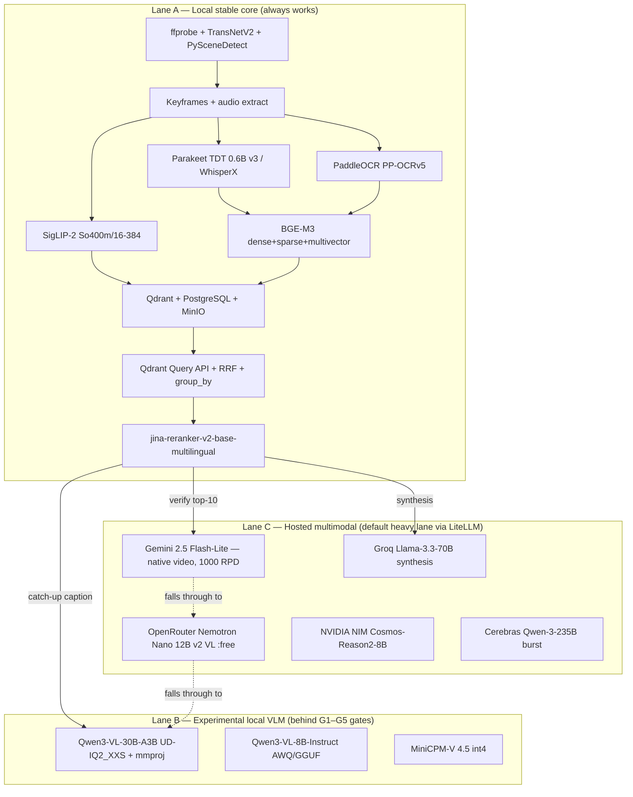
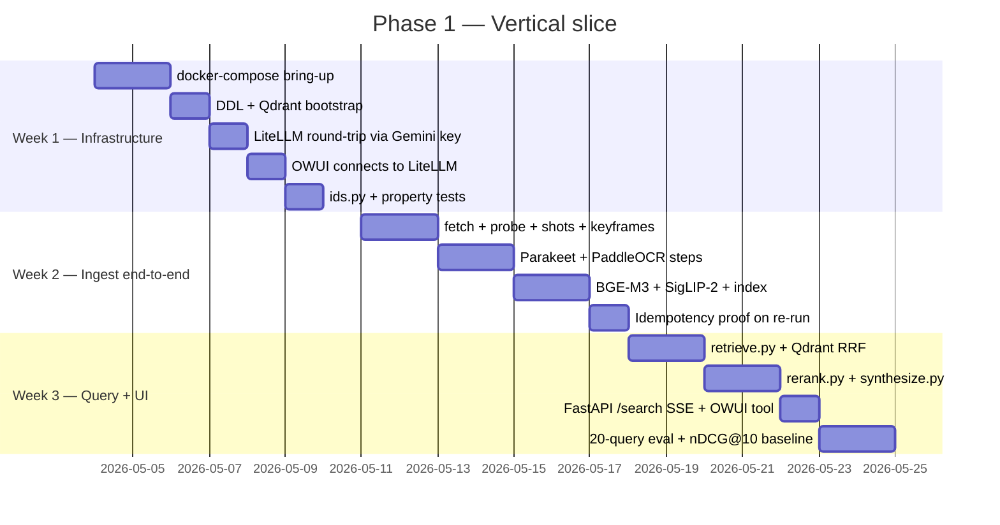

# ARCHITECTURE.md — Local-first multimodal video search engine

**Version**: 2026-04-18 (final merged + meme-first Phase 0 folded in)
**Status**: Implementation-ready — Phase 0 freeze artifacts locked; meme-searcher Phase 0 is the first build step
**Audience**: engineers building this POC; future maintainers; agent workflows executing the checklist

> **2026-04-18 update — meme-first Phase 0.** The previous "Phase 0" was an infra-only bootstrap. It has been superseded by a **meme-first Phase 0** that builds a complete image-only search product (Section 24) before any video-specific code is written. The previous §24 (Phase 1 week-by-week) has moved to §25, and the subsequent sections renumber by one. Per-phase deep-dives live in `docs/PHASE_0_PLAN.md` … `docs/PHASE_5_PLAN.md` and their matching `docs/PHASE_X_TODO.md` files.

---

## 0. How to read this document

This is the single authoritative plan for the POC. It is the merged product of four iterations of review and one pass of hands-on model verification. Every earlier plan has been superseded by what follows.

The document has three parts that you should read in order:

1. Sections 1–12 describe **what we are building and why**. Each decision carries a short rationale so future-you (or someone else) understands not just what was chosen but what it was chosen *over*.
2. Sections 13–23 are **engineering artifacts ready to copy into the repository**: the PostgreSQL DDL, the Qdrant collection config, the LiteLLM gateway config, the Docker Compose service list, and the Prefect flow skeleton. These are the Phase 0 freeze artifacts.
3. Sections 24–28 are **execution**: §24 the image-only Phase 0 meme searcher (the first build step), §25 the week-by-week Phase 1 schedule, §26 the phase-gated roadmap through Phase 5, §27 the risk register, and §28 a strict prioritized checklist that doubles as a to-do list.

If you want a single starting point, jump to Section 28 — the prioritized checklist — and begin at Priority 0 → Priority 0A (meme searcher) → Priority 1.

---

## 1. Executive summary

We are building a single-node proof of concept that indexes thousands of hours of video (multiple terabytes) on a workstation with an RTX 4060 Ti 16 GB and returns timestamped, grounded, ranked clip results in response to natural-language, OCR, visual, and compositional queries. The system must work standalone without any hosted API, but it is allowed to use hosted APIs through a single gateway for heavy vision-language work. Any free-tier assumptions are treated as runtime configuration and budget estimates, not architectural guarantees.

The architecture has **three execution lanes and four operational layers**. The three lanes are a mandatory local stable core (Lane A), an optional experimental local vision-language model (Lane B), and a default hosted multimodal lane (Lane C) for captioning and long-context synthesis. The four layers are offline ingest, hybrid retrieval, rerank/verify, and synthesis. Lanes and layers are orthogonal: any layer can be served by any lane as long as Lane A always works on its own.

Three headline findings from the research that shape this plan deserve to be called out up front.

First, **we do not use Qwen3.6 as the primary vision model**. Earlier drafts conflated Qwen3.6 and Qwen3-VL. Qwen3.6 is multimodal on paper, but the Qwen ecosystem still positions Qwen3-VL as the dedicated vision-language family, with mature GGUF quants, ready-to-use `mmproj` vision projector files, and proven llama.cpp support since late October 2025. Qwen3.6-35B-A3B is our controller and synthesis model; Qwen3-VL is our local vision model.

Second, **the speculative `YTan2000/Qwen3.6-35B-A3B-TQ3_4S` is rejected**. TurboQuant as a concept has a published paper (Zandieh et al., arXiv 2504.19874, ICLR 2026) but that paper is about *KV-cache* quantization, not weight quantization. The `TQ3_4S` GGUF is a single-maintainer weight-format extension that requires a custom llama.cpp fork and is not loadable on vLLM, Ollama, or stock llama.cpp. The mainstream Unsloth Dynamic 2.0 GGUFs already provide everything useful at well-supported quants.

Third, **a single 16 GB consumer card is enough for this POC** if we respect two rules: we never run Lane B captioning while bulk Lane A ingest is on the GPU, and we do not try to keep two heavy models resident simultaneously. The `make ingest-mode` / `make serve-mode` toggle in the Makefile enforces this.

Latency is not a constraint for this POC. Queries may take minutes. Ingest may take days. Correctness, reproducibility, and recoverability are the constraints that matter.

---

## 2. Goals and non-goals

The system must ingest large video corpora from local disk, S3-compatible storage, and supported streaming URLs (via `yt-dlp`); it must support search by exact spoken phrases, OCR text, semantic paraphrases, image-by-example, temporal or sequence-aware prompts, and compositional queries like *find the scene where X happens after Y and a label is visible*. Every result returns a ranked segment with timestamp boundaries, a preview thumbnail, a short explanation of why the segment matched, and optionally a synthesized answer grounded in segment citations. The system must be reindexable without downtime, resumable after crashes, and usable even when every hosted provider is unreachable.

The system is **not** trying to be low-latency, to serve live streams, to support multi-tenant hosting, to depend on any one hosted provider, or to deploy the full NVIDIA VSS stack. NVIDIA VSS is included as a reference architecture and an optional benchmark lane, not as a mandatory runtime. Production hardening, multi-GPU serving, and Kubernetes manifests are Phase 5 work, out of scope for the first vertical slice.

---

## 3. High-level architecture

### 3.1 Three execution lanes

**Lane A is the local stable core** and is mandatory. It handles fetch and probe, dual segmentation, keyframe extraction, ASR, OCR, text and visual embeddings, Qdrant indexing, retrieval, local cross-encoder reranking, and all metadata, evaluation, and feedback bookkeeping. Lane A must work when every hosted provider is offline. If Lane A breaks, the system breaks, so it is protected aggressively and has no dependency on any model that cannot be downloaded to local disk and run without network access.

**Lane B is the experimental local vision-language model lane** and is optional. It exists for offline captioning, local vision verification on retrieved keyframes, and catch-up when hosted quotas are exhausted. A model only enters Lane B after passing five validation gates (load, VRAM under load, quality, throughput, long-run stability). If no candidate passes, Lane B stays empty and Lane C absorbs all vision work; nothing else in the architecture depends on Lane B being populated.

**Lane C is the hosted multimodal lane** and is the *default* heavy lane for captioning, top-k VLM verification, judge models, and long-context synthesis. Every hosted call passes through a LiteLLM gateway with per-provider budgets, circuit breakers, and fallback chains. Lane C is useful but not trusted to be stable forever; provider quotas are treated as runtime configuration, never architectural assumption.



### 3.2 Four operational layers

The four layers are **offline ingest**, **hybrid retrieval**, **rerank and verify**, and **synthesis**. Layer 1 ingest fetches, probes, segments, extracts keyframes, runs ASR and OCR, produces embeddings, optionally generates captions, and writes authoritative rows to Postgres and vectors to Qdrant. Layer 2 hybrid retrieval encodes a query, runs Qdrant's multi-prefetch over dense, sparse, and (optionally) visual fields, fuses with server-side Reciprocal Rank Fusion, applies payload filters, and groups by `video_id` so a single video cannot dominate results. Layer 3 rerank runs a local cross-encoder over the top ~100, optionally rescores with a ColBERT-style multivector MAX_SIM, and optionally sends the top five to a VLM for "does this frame match the query?" verification. Layer 4 synthesis composes an answer grounded in retrieved evidence, streams via Server-Sent Events, and always includes citation markers back to segment IDs and timestamps.

The single core principle across all four layers is: **caption-when-cheap, retrieve-on-cheap, verify-with-VLM**. First-pass retrieval never depends on caption availability. Captions are a quality lift, not a foundation. This matters because captioning is the single most expensive operation in the pipeline and the most rate-limited when offloaded to hosted providers.

---

## 4. Frontend: Open WebUI

After evaluating a custom SvelteKit app versus Open WebUI, the final choice is **Open WebUI (OWUI)** as the primary operator and user frontend. OWUI connects to any OpenAI-compatible backend, which is exactly what LiteLLM exposes; it supports tools, functions, pipelines, and RAG-style workflows; it is self-hosted via Docker with first-class Helm charts for future Kubernetes deployments; and it already provides a model-centric UX for side-by-side model comparison and tool calls. Building a custom frontend would duplicate work that OWUI does better.

A small custom developer-only UI may still be useful for inspecting raw retrieval internals (per-stage scores, candidate lists before rerank, RRF weights), but it is *not* the primary interface. The production path is: user → OWUI → LiteLLM → (hosted provider or local vLLM) for model calls, with OWUI calling our FastAPI service as an OpenAI-compatible tool endpoint for the specialized `/search`, `/ingest`, `/eval`, and `/feedback` logic.

### 4.1 Security note — required version pin

Open WebUI had a high-severity vulnerability (CVE-2025-64496) in the Direct Connections feature. Per NVD, affected versions are those before `0.6.35`; the fix landed in `0.6.35`. In practice, this repo now pins OWUI to `v0.9.1`, keeps Direct Connections disabled, only connects OWUI to the internal LiteLLM proxy, and restricts `workspace.tools` permission to explicit operator accounts. This is an operational rule, not a suggestion.

---

## 5. Service topology

The POC runs as a Docker Compose stack on one machine. Every service is independently containerized so the same topology maps one-to-one onto Kubernetes Deployments and StatefulSets when Phase 5 arrives. The full service list is `postgres` (PG 17, single instance, multi-database so `vidsearch`, `litellm`, `langfuse`, and `prefect` each get their own logical database but share one engine), `redis` or `valkey` (Valkey 8, password-protected, 1 GB memory cap, `allkeys-lru`), `minio` (S3-compatible object storage), `qdrant` (Qdrant 1.13 or newer), `litellm` (the provider-agnostic gateway), `prefect-server` (orchestration control plane on port 4200), `prefect-worker` (Python process worker, GPU-attached, runs ingest flows), `api` (our FastAPI service), `open-webui` (the frontend), and optionally `vllm` for Lane B serving when it is enabled. Observability comes in via an optional Compose profile (`--profile observability`) that adds `langfuse-web`, `langfuse-worker`, and `clickhouse`.

### 5.1 The single-GPU rule

The RTX 4060 Ti cannot host both heavy Lane A ingest (Parakeet ASR, PaddleOCR, SigLIP-2, BGE-M3) and a resident Lane B vLLM server simultaneously. The Makefile enforces this with two modes. `make ingest-mode` stops any running `vllm` container and starts the Prefect ingest worker with `gpu-asr` and `gpu-embed` concurrency tags enabled. `make serve-mode` stops the ingest worker and starts `vllm` with Lane B weights loaded. Lane B captioning slots happen between ingest batches. This is a deliberate POC limitation with a documented exit (Phase 5 adds a second GPU for serving).

---

## 6. Storage architecture

**PostgreSQL 18** is the authoritative store for every piece of state that is not a vector: videos, segments, jobs, ingest step status, the model version registry, evaluation queries and runs, human and LLM judgments, and user feedback. Postgres is the source of truth; the vector store and object store are both rebuildable from Postgres rows alone. SQLite was explicitly rejected because we need concurrent writers, JSONB and full-text search, transactional schema evolution, and the cross-database co-tenant pattern.

**MinIO** stores everything that is a binary artifact: source video copies, remuxed videos, extracted audio tracks, keyframes, transcript JSON artifacts, OCR artifacts, optional captions and summaries, Qdrant snapshots, and backups. For a single-node POC, MinIO is overkill relative to a plain filesystem, but it gives us S3 semantics now so Phase 5 migration to AWS/GCS/R2 is a credentials change.

**Qdrant** stores named vectors and payloads for retrieval. The choice is locked because Qdrant is the only engine that ships named vectors (so dense, sparse, and visual vectors coexist per point), server-side multi-stage prefetch with RRF fusion, sparse vector support with BM25-style IDF modifiers, multivector fields with late-interaction MAX_SIM comparators, and both scalar and binary quantization — all in one system.

---

## 7. Segment ID scheme

All segment IDs are **content-addressed UUIDs** derived from a BLAKE3 hash of the video SHA-256, segment start time in milliseconds, segment end time in milliseconds, and the segmentation version string. This is the single most important mechanical choice in the whole pipeline because it gives us idempotency for free. Re-running ingest on the same video bytes produces identical segment IDs; every upsert into Postgres and Qdrant becomes a no-op on repeat runs. Bumping the `SEG_VER` constant produces a disjoint ID space, enabling parallel old and new collections during alias-cutover reindexing.

```python
import blake3, struct, uuid

SEG_VER = "shots-v1"  # or "window-v1"; bump to invalidate and trigger clean rebuild

def segment_id(video_sha256: bytes, start_ms: int, end_ms: int, seg_ver: str) -> uuid.UUID:
    # 32 raw bytes of SHA-256 (not hex), then 16 bytes of big-endian timestamp pair,
    # then the segmentation version string. 128-bit truncation has birthday collisions
    # at ~2^64 segments, which is zero practical risk.
    h = blake3.blake3()
    h.update(video_sha256)
    h.update(struct.pack(">QQ", start_ms, end_ms))
    h.update(seg_ver.encode("utf-8"))
    return uuid.UUID(bytes=h.digest(length=16))
```

A SERIAL auto-increment primary key was explicitly rejected because it destroys this property. If Postgres assigns a new integer every time, re-ingesting the same video from a crash creates duplicate rows and our "run the flow twice, it just works" guarantee evaporates.

---

## 8. Segmentation strategy

**Dual segmentation is a hard requirement**, not an option. The system computes and indexes two parallel segment families for every video: shot-derived segments (from TransNetV2 with optional PySceneDetect refinement) and overlapping fixed windows (8–12 seconds with 2–4 second overlap). Shots preserve visual coherence for queries like *show me the scene with the red car*; windows improve recall for speech or semantic moments that cross cut boundaries, which happens surprisingly often in interviews, narration-over-b-roll, and anything with quick cuts.

The cost optimization that makes this tractable: **visual embeddings are computed only on shot keyframes**. Window segments reference the nearest shot's visual vector through a payload link rather than computing a fresh SigLIP-2 embedding. This roughly halves the heaviest part of Lane A ingest without meaningful recall loss, because shots and windows overlap spatially more than they differ and the visual signal is coarse anyway. Text-dense vectors are computed for both families; multivector ColBERT vectors are shot-only.

---

## 9. Ingest pipeline

Every ingest step writes its state to `ops.ingest_steps (video_sha, step, state)` and is skipped if the row already reads `done`. Step outputs are content-addressed in MinIO under deterministic paths. Concurrency control uses Prefect's global concurrency limits: `gpu-asr=1`, `gpu-embed=2`, `cpu` unlimited, `io=16`. The full pipeline has twelve steps.

**Step 1 — fetch.** The URI scheme determines the fetcher: `file://` is a passthrough, `s3://` downloads via boto3, and `https://` uses `yt-dlp` for YouTube and Vimeo or a plain HTTP GET otherwise. All downloads land under `inbox/<sha256>.<ext>` in MinIO with the deterministic key, so repeated fetches are cache hits.

**Step 2 — probe.** Run `ffprobe`. If it fails or returns no streams, attempt a repair remux with `ffmpeg -i input -c copy -f matroska remux.mkv` and probe again. Persistent failures route to `ops.jobs.error` with a structured reason and surface in the operator dashboard.

**Step 3 — shots.** Run TransNetV2 over the full video, then apply optional PySceneDetect merging to clean up over-segmentation at rapid cuts.

**Step 4 — windows.** Derive overlapping 8–12 second windows from the video duration.

**Step 5 — keyframes.** Extract one canonical keyframe per shot and per window. The canonical keyframe for a shot is the middle I-frame; for a window it is the middle frame.

**Step 6 — ASR.** Primary ASR is NVIDIA Parakeet TDT 0.6B v3, chosen because it covers 25 European languages, auto-detects the audio language, produces word-level and segment-level timestamps, and is substantially faster than Whisper on comparable hardware. WhisperX large-v3 is the fallback, triggered when the language is unsupported by Parakeet, when confidence falls below 0.4 over a rolling 30-second window, or when diarization is explicitly requested.

**Step 7 — OCR.** PaddleOCR PP-OCRv5 runs on each canonical keyframe. OCR text always lands in Postgres (for surface recall through the `pg_trgm` trigram index), but OCR with confidence below 0.6 is *excluded* from the text concatenation sent to the embedder. This is how we keep PaddleOCR noise out of BGE-M3 sparse and dense vectors without losing the ability to surface low-confidence text through other retrieval paths.

**Step 8 — text embeddings.** BGE-M3 computes three representations in a single model pass: a 1024-dimensional dense vector, a sparse (BM25-style) vector with IDF modifier, and a multivector ColBERT representation for late-interaction rescoring. Text inputs are concatenated from `asr_text`, `ocr_text` (high-confidence only), and `caption_text` (when present).

**Step 9 — visual embeddings.** SigLIP-2 So400m/16-384 produces 1152-dimensional visual embeddings on shot keyframes only.

**Step 10 — optional captions.** This step is non-blocking. Captions improve quality; a caption failure never fails the video. Lane C is primary through the LiteLLM `vertical_caption` model group (Gemini 2.5 Flash-Lite → OpenRouter Nemotron Nano 12B v2 VL :free → Groq Llama-4-Scout on pre-sampled frames → local Lane B Qwen3-VL as last resort). The rate-aware caption backfill scheduler (see Section 16) runs this step in batches that respect per-provider RPD windows.

**Step 11 — index.** Upsert all three named vectors (`text-dense`, `text-sparse`, `visual`) and the multivector `text-colbert` into Qdrant, with payload fields for `video_id`, `segmentation_version`, `kind`, `start_ms`, `end_ms`, `language`, `has_ocr`, `has_speech`, and `published_ts`.

**Step 12 — publish.** Commit `core.segments` rows, mark `ops.jobs(state='done')`, and the video is searchable.

---

## 10. Query pipeline

A query flows through the four layers as follows. Layer 2 parses the intent (language, time window, modality filter, whether a visual search is needed) with small rules plus an optional zero-shot classifier call through Lane C, then encodes the text with BGE-M3 and optionally the image with SigLIP-2. Qdrant's Query API runs three prefetches — `text-dense limit=200`, `text-sparse limit=200`, and (when an image or explicitly visual intent is present) `visual limit=200` — fuses them server-side with Reciprocal Rank Fusion, applies payload filters, and groups by `video_id` with `group_size=3` and `limit=50`. The `group_by` is critical: without it, a video with thousands of segments dominates top-k on any query that touches its content.

Layer 3 reranks the 50 fused candidates down to 30 using `jina-reranker-v2-base-multilingual`, a fast multilingual cross-encoder. The optional multivector step runs a Qdrant nested query with `text-colbert` and MAX_SIM rescoring on the top 30. The optional VLM verify step takes the top 5, pulls the keyframe from MinIO, and sends `(keyframe, query)` through LiteLLM's `verify` model group (default: Gemini 2.5 Flash) asking "does this frame match the query?" with a relevance score; candidates scoring below 0.4 are filtered out.

Layer 4 synthesis assembles the remaining top-K as grounded context and streams a cited answer through LiteLLM's `synthesis-long` group (default: Groq Llama-3.3-70B with Qwen3.6-35B-A3B as local fallback through vLLM). The answer cites segment IDs and timestamps using a stable markdown format that the OWUI client parses into clickable timeline chips.

---

## 11. Model roles — the critical correction

The single most important correction over earlier drafts is the **separation of Qwen3.6 from Qwen3-VL**. Qwen3.6-35B-A3B is our **controller and synthesis model**: it handles query rewriting, query decomposition, tool selection, answer generation, and evidence synthesis. Qwen3-VL is our **primary local vision model family** for Lane B.

Qwen3.6 has vision capabilities in its official model card, and a future build could collapse vision and synthesis onto a single model. For the POC today, two practical realities make the split cleaner. First, Qwen3-VL has a mature GGUF ecosystem with ready-to-use `mmproj` vision projector files (for the Unsloth 30B GGUF path, the current projector artifact is `mmproj-BF16.gguf` at about 1.09 GB), while the Qwen3.6 GGUF ecosystem is weighted toward text. Second, Qwen's own product documentation continues to position Qwen3-VL as the dedicated vision-language family with explicit emphasis on OCR, spatial reasoning, video understanding, and long-context multimodal perception — which is exactly what we need.

### 11.1 Lane B candidates

The stretch candidate for 16 GB is **`unsloth/Qwen3-VL-30B-A3B-Instruct-GGUF` at `UD-IQ2_XXS`**. The text weights are 10.3 GB; adding the current Unsloth projector file `mmproj-BF16.gguf` (~1.09 GB) plus KV cache at Q8 quantization for 8K context (~0.5 GB) plus CUDA/activation overhead leaves meaningful headroom under the 16 GB ceiling. This is the strongest plausible local VLM experiment on consumer hardware, but it is still an aggressive community quant and must not be trusted without validation. Do not reach for UD-Q3_K_XL (13.8 GB) or UD-Q4_K_XL (17.7 GB) — those leave no mmproj+KV headroom or exceed VRAM outright.

The safe fallback is **Qwen3-VL-8B-Instruct**, either via `cyankiwi/Qwen3-VL-8B-Instruct-AWQ-4bit` on vLLM 0.11+ with `--quantization awq_marlin --gpu-memory-utilization 0.85`, or via `unsloth/Qwen3-VL-8B-Instruct-GGUF:UD-Q4_K_XL` plus `mmproj-F16.gguf` on llama.cpp builds dated October 30, 2025 or later. Expected VRAM is 9–11 GB, which leaves substantial headroom for the ASR/embedding models to coexist.

The video-efficiency experiment is **MiniCPM-V 4.5 int4**, available through `openbmb/MiniCPM-V-4_5-int4` via Transformers. Its 3D-Resampler compresses 6 frames into 64 tokens (a 96× reduction), which enables long-video captioning at 10 FPS without context blowup. The GGUF conversion path was broken in late 2025; verify current status before depending on it. The MiniCPM Model License is custom, so review commercial terms before production use.

**Explicitly rejected**: `YTan2000/Qwen3.6-35B-A3B-TQ3_4S` (requires custom `turbo-tan/llama.cpp-tq3` fork, single maintainer, closed tooling, no third-party benchmarks, mixed reception for the predecessor TQ3_4S on Qwen3.5-27B); `NVIDIA Nemotron Nano 12B v2 VL` for local deployment (NVFP4 variant needs Blackwell architecture, FP8 is ~13 GB with no headroom, no llama.cpp VLM path — use the hosted version only); Pixtral-12B (image-only, no video); LLaVA-OneVision and NeXT (outclassed by Qwen3-VL and MiniCPM-V 4.5 in early 2026).

### 11.2 Lane C hosted chain

For video captioning, the primary is Gemini 2.5 Flash-Lite because it accepts native video input, has a 1M token context, runs at roughly 258 tokens per second of video, and at the time of validation exposed a free tier of 1,000 requests per day. That makes one key **roughly** capable of around 83 hours of captioned video per day under the chunking assumptions in this document; treat that as a planning estimate, not a guarantee. Fallback 1 is OpenRouter's `nvidia/nemotron-nano-12b-v2-vl:free` (1,000 RPD with a $10 top-up, 50 RPD without). Fallback 2 is Groq's `meta-llama/llama-4-scout-17b-16e-instruct` running on pre-sampled frames. Last-resort fallback is the local Lane B Qwen3-VL model.

For long-context synthesis, the primary is `groq/llama-3.3-70b-versatile` (30 RPM, 1,000 RPD, 12K TPM). Fallbacks are NVIDIA NIM's `meta/llama-3.3-70b-instruct` and Cerebras's `qwen-3-235b` (1M tokens/day free, 64K context). The local emergency fallback is a vLLM-hosted Qwen3-30B-A3B or the Qwen3.6-35B-A3B UD quants for heavier lifting.

For the judge model used in evaluation, the primary is `gemini/gemini-2.5-pro` (100 RPD free), with `gemini-2.5-flash` and `cerebras/gpt-oss-120b` as fallbacks. Keeping the judge family distinct from the generator family is a deliberate anti-bias measure.

---

## 12. Lane B validation gates (G1–G5)

A Lane B model is only promoted to the production model list after passing all five gates. The validation set is frozen under `eval/lane_b/` and consists of 200 keyframes uniformly sampled across the corpus plus 50 short video clips (10–30 seconds each) for video-native captioning, with hosted baseline captions from Gemini 2.5 Flash cached as a reference once.

**G1 — Loads.** The model downloads, the runtime instantiates, and one caption returns in under 10 minutes from cold start with no OOM at idle load.

**G2 — VRAM under load.** Captioning 50 keyframes back-to-back at batch size 1, 8K context, temperature 0.7 keeps peak `nvidia-smi` reading at 14.5 GB or below, preserving 1.5 GB of headroom for coexistence with the ASR and embedding models during mixed-mode operation.

**G3 — Quality.** Captioning all 200 validation keyframes, judged by Gemini 2.5 Pro against the hosted baseline on relevance, factual fidelity, and hallucination rate, the model scores non-inferior on relevance for at least 70% of keyframes and shows a hallucination rate at or below 10%.

**G4 — Throughput.** A 50-clip video batch sustains at least 5 captions per minute for at least 30 consecutive minutes.

**G5 — Stability.** A 10,000-caption stress loop with deliberate context-length spikes completes with zero OOM events, zero CUDA illegal memory errors, and zero hangs lasting more than 5 minutes.

---

## 13. PostgreSQL DDL

The full Postgres schema lives in `infra/postgres/001_schema.sql` and is applied by an init container on first boot. Four schemas — `core`, `ops`, `eval`, `feedback` — separate concerns cleanly. Two extensions are required: `pgcrypto` for UUID generation and `pg_trgm` for OCR/transcript trigram indexes that enable fuzzy text search as a surface recall path.

```sql
CREATE SCHEMA IF NOT EXISTS core;
CREATE SCHEMA IF NOT EXISTS eval;
CREATE SCHEMA IF NOT EXISTS feedback;
CREATE SCHEMA IF NOT EXISTS ops;
CREATE EXTENSION IF NOT EXISTS pgcrypto;
CREATE EXTENSION IF NOT EXISTS pg_trgm;

-- Videos: one row per unique SHA-256 of source bytes.
-- source_uri can change (re-upload, new location); sha256 is the stable identity.
CREATE TABLE core.videos (
    video_id         TEXT PRIMARY KEY,
    sha256           BYTEA NOT NULL UNIQUE,
    source_uri       TEXT NOT NULL,
    title            TEXT,
    duration_ms      BIGINT,
    width            INT, height INT, fps NUMERIC(6,3),
    container        TEXT, vcodec TEXT, acodec TEXT,
    audio_languages  TEXT[],
    published_ts     TIMESTAMPTZ,
    ingested_at      TIMESTAMPTZ NOT NULL DEFAULT now(),
    metadata         JSONB NOT NULL DEFAULT '{}'::jsonb
);
CREATE INDEX videos_sha256_idx     ON core.videos (sha256);
CREATE INDEX videos_published_idx  ON core.videos (published_ts);
CREATE INDEX videos_metadata_gin   ON core.videos USING gin (metadata jsonb_path_ops);

-- Segments: both shot and window segmentations coexist, distinguished by
-- segmentation_version. segment_id is content-addressed; never serial.
CREATE TABLE core.segments (
    segment_id            UUID PRIMARY KEY,
    video_id              TEXT NOT NULL REFERENCES core.videos(video_id) ON DELETE CASCADE,
    segmentation_version  TEXT NOT NULL,
    kind                  TEXT NOT NULL CHECK (kind IN ('shot','window')),
    start_ms              BIGINT NOT NULL,
    end_ms                BIGINT NOT NULL,
    shot_idx              INT,
    keyframe_uri          TEXT,
    asr_text              TEXT,
    asr_lang              TEXT,
    asr_confidence        REAL,
    ocr_text              TEXT,
    ocr_boxes             JSONB,   -- per-box confidence lives here
    caption_text          TEXT,
    caption_model         TEXT,
    caption_prompt_ver    TEXT,
    has_speech            BOOL NOT NULL DEFAULT FALSE,
    has_ocr               BOOL NOT NULL DEFAULT FALSE,
    created_at            TIMESTAMPTZ NOT NULL DEFAULT now(),
    UNIQUE (video_id, segmentation_version, start_ms, end_ms)
);
CREATE INDEX segments_video_idx       ON core.segments (video_id);
CREATE INDEX segments_segver_idx      ON core.segments (segmentation_version);
CREATE INDEX segments_asr_trgm        ON core.segments USING gin (asr_text gin_trgm_ops);
CREATE INDEX segments_ocr_trgm        ON core.segments USING gin (ocr_text gin_trgm_ops);
CREATE INDEX segments_caption_trgm    ON core.segments USING gin (caption_text gin_trgm_ops);
CREATE INDEX segments_has_speech_idx  ON core.segments (has_speech) WHERE has_speech;
CREATE INDEX segments_has_ocr_idx     ON core.segments (has_ocr)    WHERE has_ocr;

-- ops.jobs: one row per ingest request.
CREATE TABLE ops.jobs (
    job_id       UUID PRIMARY KEY DEFAULT gen_random_uuid(),
    video_id     TEXT REFERENCES core.videos(video_id) ON DELETE CASCADE,
    flow_run_id  TEXT,
    state        TEXT NOT NULL CHECK (state IN ('pending','running','done','failed','cancelled')),
    submitted_at TIMESTAMPTZ NOT NULL DEFAULT now(),
    finished_at  TIMESTAMPTZ,
    error        TEXT
);
CREATE INDEX jobs_state_idx ON ops.jobs (state);

-- ops.ingest_steps: idempotency gate for each step.
CREATE TABLE ops.ingest_steps (
    video_sha   BYTEA NOT NULL,
    step        TEXT NOT NULL,
    state       TEXT NOT NULL CHECK (state IN ('pending','running','done','failed')),
    attempts    INT NOT NULL DEFAULT 0,
    meta        JSONB NOT NULL DEFAULT '{}'::jsonb,
    updated_at  TIMESTAMPTZ NOT NULL DEFAULT now(),
    PRIMARY KEY (video_sha, step)
);

-- ops.model_versions: registry of every active model in the pipeline.
-- Changing a row here is what triggers reindexes.
CREATE TABLE ops.model_versions (
    model_key    TEXT PRIMARY KEY,
    family       TEXT NOT NULL,
    version      TEXT NOT NULL,
    revision     TEXT,
    activated_at TIMESTAMPTZ NOT NULL DEFAULT now(),
    config       JSONB NOT NULL DEFAULT '{}'::jsonb
);

-- eval.* : evaluation harness. Queries, gold judgments, runs, per-run results.
CREATE TABLE eval.queries (
    query_id   UUID PRIMARY KEY DEFAULT gen_random_uuid(),
    text       TEXT NOT NULL,
    image_uri  TEXT,
    intent     TEXT NOT NULL CHECK (intent IN ('lookup','semantic','visual','temporal','compositional')),
    notes      TEXT,
    created_at TIMESTAMPTZ NOT NULL DEFAULT now()
);

CREATE TABLE eval.qrels (
    query_id   UUID NOT NULL REFERENCES eval.queries(query_id),
    segment_id UUID NOT NULL REFERENCES core.segments(segment_id),
    grade      SMALLINT NOT NULL CHECK (grade BETWEEN 0 AND 3),
    judge      TEXT NOT NULL,
    created_at TIMESTAMPTZ NOT NULL DEFAULT now(),
    PRIMARY KEY (query_id, segment_id, judge)
);

CREATE TABLE eval.runs (
    run_id      UUID PRIMARY KEY DEFAULT gen_random_uuid(),
    config_hash TEXT NOT NULL,   -- sha256 of canonicalised pipeline config
    started_at  TIMESTAMPTZ NOT NULL DEFAULT now(),
    finished_at TIMESTAMPTZ,
    notes       TEXT
);

CREATE TABLE eval.run_results (
    run_id     UUID NOT NULL REFERENCES eval.runs(run_id) ON DELETE CASCADE,
    query_id   UUID NOT NULL REFERENCES eval.queries(query_id),
    segment_id UUID NOT NULL REFERENCES core.segments(segment_id),
    rank       INT NOT NULL,
    score      DOUBLE PRECISION NOT NULL,
    PRIMARY KEY (run_id, query_id, rank)
);

CREATE TABLE eval.metrics (
    run_id     UUID NOT NULL REFERENCES eval.runs(run_id) ON DELETE CASCADE,
    metric     TEXT NOT NULL,
    value      DOUBLE PRECISION NOT NULL,
    PRIMARY KEY (run_id, metric)
);

-- feedback.events: thumbs up/down, clicks, dwell, reported_wrong.
CREATE TABLE feedback.events (
    event_id   UUID PRIMARY KEY DEFAULT gen_random_uuid(),
    query_text TEXT NOT NULL,
    segment_id UUID REFERENCES core.segments(segment_id),
    signal     TEXT NOT NULL CHECK (signal IN ('thumbs_up','thumbs_down','clicked','dwell','reported_wrong')),
    value      DOUBLE PRECISION,
    user_token TEXT,
    created_at TIMESTAMPTZ NOT NULL DEFAULT now()
);
CREATE INDEX feedback_segment_idx ON feedback.events (segment_id);
CREATE INDEX feedback_query_idx   ON feedback.events USING gin (query_text gin_trgm_ops);
```

---

## 14. Qdrant collection design

The Qdrant collection is created by `infra/qdrant/bootstrap.py` on first boot. The physical collection name is versioned (`video_segments_v1`); all reads and writes in application code go through the alias `video_segments`. When a new embedding model lands in `ops.model_versions`, the reindex job populates `video_segments_v2` in parallel, then atomically swaps the alias.

The collection has three named dense vector fields plus one sparse field. `text-dense` is BGE-M3 dense (1024-dimensional, cosine distance) with scalar int8 quantization that keeps the quantized vectors in RAM while the full-precision vectors sit on disk for optional rescoring — this is roughly 4× memory reduction with less than half a percent of recall loss. `text-colbert` is BGE-M3 multivector output (1024-dimensional per token, cosine) with MAX_SIM comparator and no HNSW graph; it is used exclusively as a second-stage rescorer on shortlisted candidates. `visual` is SigLIP-2 So400m/16-384 (1152-dimensional, cosine) with binary quantization and `always_ram=true` for roughly 32× memory reduction; at query time an oversampling factor of 3 is used for rescoring against full-precision binary vectors.

The sparse field `text-sparse` uses BGE-M3 sparse output with the IDF modifier enabled, which turns raw term-frequency scores into a proper BM25-style ranking. Without IDF, sparse retrieval is nearly useless because common terms drown out discriminative ones. Payload indexes are created up front on `video_id`, `language`, `modality`, `segmentation_version`, `has_ocr`, `has_speech`, `published_ts`, and `duration_ms` because Qdrant's filterable-HNSW only uses payload indexes built before the first upsert.

```python
from qdrant_client import QdrantClient, models

c = QdrantClient(url="http://qdrant:6333")

c.create_collection(
    "video_segments_v1",
    vectors_config={
        "text-dense": models.VectorParams(
            size=1024, distance=models.Distance.COSINE, on_disk=True,
            hnsw_config=models.HnswConfigDiff(m=32, ef_construct=256),
            quantization_config=models.ScalarQuantization(
                scalar=models.ScalarQuantizationConfig(
                    type=models.ScalarType.INT8,
                    quantile=0.99,
                    always_ram=True))),
        "text-colbert": models.VectorParams(
            size=1024, distance=models.Distance.COSINE, on_disk=True,
            multivector_config=models.MultiVectorConfig(
                comparator=models.MultiVectorComparator.MAX_SIM),
            hnsw_config=models.HnswConfigDiff(m=0)),  # rescorer only; no graph
        "visual": models.VectorParams(
            size=1152, distance=models.Distance.COSINE, on_disk=True,
            hnsw_config=models.HnswConfigDiff(m=16, ef_construct=128),
            quantization_config=models.BinaryQuantization(
                binary=models.BinaryQuantizationConfig(always_ram=True))),
    },
    sparse_vectors_config={
        "text-sparse": models.SparseVectorParams(
            modifier=models.Modifier.IDF,                 # BM25-style scoring
            index=models.SparseIndexParams(on_disk=True)),
    },
    on_disk_payload=True,
    optimizers_config=models.OptimizersConfigDiff(
        default_segment_number=2, indexing_threshold=20000),
)

for field, t in [("video_id","keyword"),("language","keyword"),("modality","keyword"),
                 ("segmentation_version","keyword"),("has_ocr","bool"),("has_speech","bool"),
                 ("published_ts","integer"),("duration_ms","integer")]:
    c.create_payload_index("video_segments_v1", field,
                           getattr(models.PayloadSchemaType, t.upper()))

c.update_collection_aliases(change_aliases_operations=[
    models.CreateAliasOperation(create_alias=models.CreateAlias(
        collection_name="video_segments_v1", alias_name="video_segments"))])
```

A hybrid query with server-side RRF and grouping looks like this:

```python
c.query_points(
    collection_name="video_segments",           # the alias, never the physical name
    prefetch=[
        models.Prefetch(query=dense_vec,  using="text-dense",  limit=200),
        models.Prefetch(query=sparse_vec, using="text-sparse", limit=200),
        models.Prefetch(query=visual_vec, using="visual",      limit=200),  # optional
    ],
    query=models.FusionQuery(fusion=models.Fusion.RRF),
    group_by="video_id", group_size=3, limit=50,
    query_filter=models.Filter(must=[
        models.FieldCondition(key="segmentation_version",
                              match=models.MatchValue(value="shots-v1"))]),
)
```

---

## 15. LiteLLM gateway configuration

`infra/litellm/config.yaml` is the single file that holds all hosted provider configuration. It is validated by `litellm --config infra/litellm/config.yaml --check` as part of Phase 0 exit.

```yaml
model_list:
  # --- vertical_caption model group ---
  - model_name: vertical_caption
    litellm_params:
      model: gemini/gemini-2.5-flash-lite
      api_key: os.environ/GEMINI_API_KEY
      rpm: 15
      cooldown_time: 60
    model_info: { id: caption-gemini-flash-lite }

  - model_name: vertical_caption
    litellm_params:
      model: openrouter/nvidia/nemotron-nano-12b-v2-vl:free
      api_key: os.environ/OPENROUTER_API_KEY
      api_base: https://openrouter.ai/api/v1
      rpm: 20
      cooldown_time: 120
    model_info: { id: caption-or-nemotron-free }

  - model_name: vertical_caption
    litellm_params:
      model: openai/Qwen/Qwen3-VL-8B-Instruct       # local vLLM, OpenAI-compatible
      api_base: http://vllm:8000/v1
      api_key: "dummy"
      rpm: 120
    model_info: { id: caption-vllm-qwen3vl-8b }

  # synthesis-long, verify, judge groups follow the same pattern; see repo for full file.

router_settings:
  routing_strategy: simple-shuffle
  num_retries: 2
  enable_pre_call_checks: true
  redis_host: redis
  redis_port: 6379
  redis_password: os.environ/REDIS_PASSWORD
  retry_policy:
    RateLimitErrorRetries: 0       # 429 on free tiers → advance fallback immediately
    TimeoutErrorRetries: 2
    InternalServerErrorRetries: 3
  allowed_fails_policy:
    RateLimitErrorAllowedFails: 100   # don't cool down free tiers on routine 429
    TimeoutErrorAllowedFails: 3

litellm_settings:
  drop_params: true
  success_callback: ["langfuse"]       # flat-file JSON fallback if Langfuse is down
  failure_callback: ["langfuse"]
  cache: true
  cache_params:
    type: redis-semantic
    host: redis
    port: 6379
    password: os.environ/REDIS_PASSWORD
    similarity_threshold: 0.92
    redis_semantic_cache_embedding_model: cache-embedding
    namespace: vidsearch.v1

general_settings:
  master_key: os.environ/LITELLM_MASTER_KEY
  database_url: os.environ/DATABASE_URL
  store_model_in_db: true
```

Virtual keys are created post-boot via `POST /key/generate` with `team_alias: "ingest-phase1"` and `max_budget: 25.0, budget_duration: "30d"`, so a runaway ingest cannot burn through eventual paid spend even if someone upgrades a key.

---

## 16. Rate-aware caption backfill scheduler

The single operational element that makes "thousands of hours of captioned video" tractable on free tiers is a scheduler that understands per-provider daily budgets. It lives in `vidsearch/flows/caption_backfill.py` and runs as a long-lived Prefect flow.

The scheduler uses two Redis structures. A durable sorted set `caption:queue` holds segment IDs to be captioned, scored by priority (recent ingest first, then oldest pending). A per-day hash `quota:<provider>:<YYYY-MM-DD>` counts calls with a TTL that expires at the next UTC midnight. Before each submission, the scheduler iterates through the ordered LiteLLM provider chain, checks the Redis counter, atomically increments it on hit, or moves to the next deployment. When every provider in a chain is exhausted, the flow sleeps until the next UTC midnight reset.

```python
# vidsearch/flows/caption_backfill.py (sketch)
@flow(name="caption-backfill")
def backfill():
    while segments := redis.zpopmin("caption:queue", 100):
        for sid, _ in segments:
            provider = pick_provider_with_budget([
                "caption-gemini-flash-lite",   # 1000 RPD free
                "caption-or-nemotron-free",    # 1000 RPD with $10 top-up, 50 without
                "caption-groq-scout",          # 1000 RPD, 30 RPM
                "caption-vllm-qwen3vl-8b",     # local, no RPD
            ])
            if provider is None:
                sleep_until_next_utc_midnight()
                continue
            submit_caption.submit(sid, provider)
```

Running the numbers: one Gemini key at the then-current 1,000 RPD with typical 5-minute video chunks sustains **approximately** 83 hours of captioned video per day. Stacked across the full provider chain, the design target is roughly 4,290 captions per day on free tiers, which would put 2,000 hours of corpus at about 24 days of wall-clock. Treat these as operational estimates that must be revalidated in config and dashboards, not guaranteed service levels.

---

## 17. Evaluation subsystem

Evaluation is a first-class subsystem from day one, not an afterthought. The query set lives in `vidsearch/eval/queries.yaml` and is versioned in git. Phase 1 ships 20 queries; Phase 3 grows to 100. Queries are balanced across five intent classes: **lookup** (specific moment, exact phrase, OCR text, named entity), **semantic** (conceptually similar, paraphrases, "the part where…"), **visual** (visually similar, object, scene, logo, environment), **temporal** (moments in a time range or sequence, "after X happens"), and **compositional** (multiple constraints combined).

Each query has 5–20 graded segments at grades 0–3. Initial judgments come from Gemini 2.5 Pro (the LLM judge), with a top-decile human spot check for calibration. Both judges are stored in `eval.qrels.judge` so we can compute LLM-judge bias separately and correct it over time.

Metrics computed per run include `nDCG@10`, `nDCG@20`, `recall@100`, `MRR`, `answer-faithfulness` (a pairwise judge score on synthesis answers against cited segments), `latency_p50/p95`, and `cost_per_query` derived from LiteLLM spend telemetry. All land in `eval.metrics` with a `config_hash` (SHA-256 of the canonicalised pipeline config including model versions, RRF prefetch sizes, rerank model choice, and prompt versions). CI runs the eval set against a frozen 50-video subset on every merge to `main`; a metric regression greater than 3 percentage points blocks merge unless explicitly waived with a documented rationale.

---

## 18. Feedback subsystem

`feedback.events` captures five signals: `thumbs_up`, `thumbs_down`, `clicked`, `dwell`, and `reported_wrong`. The OWUI client emits these via `POST /feedback`. Two consumers use them.

**Online:** a Redis counter keyed by `(query_text_hash, segment_id)` nudges rerank scores on subsequent identical queries. This is simple memoization with temporal decay, not a true learning loop.

**Offline:** a weekly job joins `feedback.events` with `eval.run_results`, dumps a JSONL training set, and fine-tunes `jina-reranker-v2-base-multilingual` via LoRA. The new reranker is registered in `ops.model_versions` as a candidate and only promoted to production if it beats the incumbent on the graded query set.

Reported-wrong events go to a triage queue surfaced in the developer UI.

---

## 19. Reindex and versioning

Every vector payload carries `model_version`. Every pipeline component has a row in `ops.model_versions`. Every reindex creates a new physical Qdrant collection, populates it in parallel with the old one, and atomic-swaps the alias. The old collection is kept for a 48-hour rollback window before deletion.

Partial reindexing is first-class: invalidating specific `ops.ingest_steps` keys triggers re-run of only those steps on the next flow execution, while `done` steps short-circuit. Changing the `SEG_VER` constant is the nuclear option: it invalidates every segment, forces a full rebuild, and uses the alias-cutover mechanism to make the transition zero-downtime.

---

## 20. Observability and security

For Phase 1, observability is deliberately minimal: LiteLLM's `success_callback: ["json"]` writes a flat file, Prometheus plus Grafana tracks system metrics (GPU and CPU utilization, memory pressure, queue depth, requests per second), and the Prefect UI at port 4200 shows flow state. Langfuse comes online in Phase 2 via the `--profile observability` Compose flag, adding full LLM trace capture, prompt versioning, per-model cost tracking, and evaluation dashboards.

Security is single-tenant by default. No public exposure, everything behind the workstation's local network. Artifacts at rest are expected to be on an encrypted filesystem (LUKS/BitLocker on the NVMe holding MinIO). Transcripts and OCR output are treated as potentially sensitive — some user corpora will contain personal or proprietary content, and hosted caption or judge calls route that content through external providers. The operational policy is: any hosted call is logged with provider, model, timestamp, and input hash, so the operator can audit what left the workstation.

Open WebUI is pinned to a patched stable release (`v0.9.1` in the current repo), Direct Connections is disabled, and only the internal LiteLLM service is a connected backend. This is not negotiable.

---

## 21. NVIDIA VSS integration path

NVIDIA VSS is useful as a reference architecture and an eventual benchmark lane for long-video summarization, but it is explicitly **not the runtime backbone of this POC**. The full VSS stack requires NIM containers and multi-GPU hardware well beyond a 4060 Ti 16 GB; the VSS Search workflow is still labeled alpha in NVIDIA's own documentation. The two components from the VSS ecosystem that *are* portable are the Context-Aware RAG (CA-RAG) library, which is pure Python and routes all inference to a configurable OpenAI-compatible endpoint (so it drops behind our LiteLLM without issue), and the Long Video Summarization (LVS) 3.0 microservice container, which accepts any OpenAI-compatible VLM endpoint.

The Phase 4 spike uses CA-RAG prompt templates and the LVS microservice as a benchmark against our own summarization prompts, without forcing the POC to depend on either. If CA-RAG's prompts improve evaluation metrics by a measurable margin, we port the prompts (not the runtime). If the LVS microservice produces better long-video summaries than our stack, we either adopt its approach or use it directly as an enrichment lane.

---

## 22. Repository layout

```
vidsearch/
├── README.md
├── ARCHITECTURE.md                       # this document
├── pyproject.toml                        # uv-managed, py3.12
├── uv.lock
├── .env.example
├── docker-compose.yml
├── docker-compose.gpu.yml                # overlay with NVIDIA runtime
├── docker-compose.observability.yml      # Langfuse profile
├── Makefile                              # bootstrap, ingest-mode, serve-mode, eval
├── infra/
│   ├── postgres/
│   │   ├── 001_schema.sql
│   │   ├── 002_seed_models.sql
│   │   └── migrations/                   # alembic
│   ├── qdrant/bootstrap.py
│   ├── litellm/config.yaml
│   ├── langfuse/docker-compose.fragment.yml
│   ├── open-webui/config.json
│   └── prefect/work_pool.yaml
├── vidsearch/
│   ├── config.py
│   ├── ids.py                            # segment_id() + property tests
│   ├── storage/
│   │   ├── pg.py
│   │   ├── qdrant.py
│   │   ├── minio.py
│   │   └── redis.py
│   ├── ingest/
│   │   ├── fetch.py
│   │   ├── probe.py
│   │   ├── segmentation/{transnetv2,pyscenedetect,windows}.py
│   │   ├── keyframes.py
│   │   ├── asr/{parakeet,whisperx}.py
│   │   ├── ocr/paddleocr.py
│   │   ├── embed/{bge_m3,siglip2}.py
│   │   ├── caption/{hosted,local}.py
│   │   └── indexer.py
│   ├── flows/
│   │   ├── ingest_video.py
│   │   ├── caption_backfill.py
│   │   └── reindex.py
│   ├── query/
│   │   ├── intent.py
│   │   ├── encoders.py
│   │   ├── retrieve.py
│   │   ├── rerank.py
│   │   └── synthesize.py
│   ├── api/
│   │   ├── main.py                       # FastAPI + SSE
│   │   ├── routes/{search,ingest,eval,feedback}.py
│   │   ├── contracts.py                  # Pydantic API models
│   │   └── sse.py
│   ├── eval/
│   │   ├── queries.yaml
│   │   ├── runner.py
│   │   ├── metrics.py
│   │   └── judges/{llm_judge,lane_b_validator}.py
│   └── observability/langfuse.py
├── tests/{unit,integration,e2e}/
└── docs/
    ├── decision_log.md                   # ADRs with revisit triggers
    ├── runbook.md
    ├── eval_protocol.md
    └── lane_b_validation.md
```

---

## 23. API contracts

Pydantic models in `vidsearch/api/contracts.py` freeze the shape of every `/search`, `/ingest`, `/eval`, and `/feedback` request and response. OWUI sees these as OpenAI-compatible tool endpoints.

```python
from pydantic import BaseModel
from typing import Literal
from uuid import UUID

class SegmentRecord(BaseModel):
    segment_id: UUID
    video_id: str
    segmentation_version: Literal["shots-v1", "window-v1"]
    start_ms: int
    end_ms: int
    asr_text: str | None
    ocr_text: str | None
    caption_text: str | None
    keyframe_uri: str | None
    has_speech: bool
    has_ocr: bool

class SearchFilters(BaseModel):
    language: str | None = None
    has_ocr: bool | None = None
    published_after: int | None = None
    published_before: int | None = None

class SearchRequest(BaseModel):
    query: str
    image_b64: str | None = None
    filters: SearchFilters = SearchFilters()
    top_k: int = 20

class SearchHit(BaseModel):
    segment: SegmentRecord
    score: float
    rerank_score: float | None
    highlights: list[str]

class SearchResponse(BaseModel):
    hits: list[SearchHit]
    answer: str | None
    citations: list[UUID]
```

---

## 24. Phase 0 — Meme searcher (image-only, first build step)

Phase 0 builds a complete **image-only** meme search engine and, in doing so, proves every subsystem that the video product will later depend on: Docker Compose stack, Postgres 18 schema, Qdrant hybrid retrieval with named vectors, content-addressed IDs, PaddleOCR, BGE-M3 dense + sparse text retrieval, SigLIP-2 visual retrieval, server-side RRF fusion, `jina-reranker-v2-base-multilingual` local rerank, LiteLLM gateway, Open WebUI as the frontend, a **40-query evaluation harness (10 per class × 4 classes)** with graded qrels, idempotent ingest, a backup/restore drill, and a delete/retract flow. **No video-specific code is written in Phase 0** — no ASR, no shot segmentation, no overlapping windows, no keyframe extraction for video, no caption backfill scheduler (it becomes a Phase 2 deliverable). The starting corpus is `data/meme` (~3,107 supported images); S3/object-store ingest is deferred to Phase 2+. The query contract is **text-only**; user-supplied query images are out of Phase 0 scope. The full plan is in `docs/PHASE_0_PLAN.md`; the checklist is `docs/PHASE_0_TODO.md`; those two files are the authoritative Phase 0 contract.

The Phase 0 schema uses image-specific tables (`core.images`, `core.image_items`) that are deliberately shaped to mirror the Phase 1 video tables (`core.videos`, `core.segments`) so Phase 1 becomes an **additive** migration: new tables, a new `video_segments_v1` Qdrant collection, no breaking changes to the image tables or the `memes_v1` collection. The `all_media` alias decision (whether to expose both collections under a single Qdrant alias) is deferred to Phase 3.

The Phase 0 ingest pipeline has seven steps:

1. Fetch bytes (`file://` or `https://`) by SHA-256.
2. Probe with Pillow / `imghdr`; reject non-images; recompute the canonical SHA-256.
3. Run PaddleOCR PP-OCRv5; confidence threshold 0.6; keep raw boxes.
4. Compute BGE-M3 dense + sparse vectors on concatenated OCR text (captions can be added later via Lane C, never required for first-pass retrieval).
5. Compute SigLIP-2 So400m/16-384 visual vector on the canonical image bytes.
6. Upsert `core.images` + `core.image_items` + MinIO object; idempotency is keyed on `image_id = sha256(canonical_bytes)`.
7. Upsert the Qdrant point into `memes_v1` with named vectors `text-dense`, `text-sparse`, `visual`.

The Phase 0 query pipeline reuses the full retrieval spine: BGE-M3 encode → Qdrant Query API prefetch (dense + sparse + visual) → server-side RRF → local rerank → FastAPI SSE into OWUI. `group_by` is disabled in Phase 0 (no video grouping exists yet); it becomes mandatory in Phase 1.

The Phase 0 closing gates (details in `docs/PHASE_0_PLAN.md` §9) are:

- **P0-G1 — Stack boots green.** Compose up, schema applied, alias live, LiteLLM round-trip verified, OWUI lists model groups.
- **P0-G2 — Ingest at scale.** Full `data/meme` corpus ingested (~3,107 supported images); second batch run is a full cache hit; content-addressed dedupe proven; corpus-count baseline pinned as an ADR in `docs/decision_log.md`.
- **P0-G3 — Retrieval quality.** 40-query eval (10 per class × 4 classes) baseline recorded with a `config_hash`; reranker uplift ≥ +2 pp over RRF-only.
- **P0-G4 — Frontend grounded.** OWUI renders thumbnails, image-level citations, and P95 end-to-end latency < 20 s.
- **P0-G5 — Operational safety.** Backup + restore drill logged; `/image/{id}` DELETE flow removes Postgres + Qdrant + MinIO artifacts with a tombstone in `ops.purges`.
- **P0-G6 — Transition artifact.** `docs/phase1_short_clips_transition.md` signed off; it enumerates the additive schema deltas, the Qdrant coexistence plan, and the reserved Phase 1 interfaces.

Phase 0 is **done** when all six gates close, the 40-query meme eval `nDCG@10` with the reranker on beats the RRF-only baseline by at least +2 percentage points, and no code merged during Phase 0 assumes the future existence of video segments.

---

## 25. Phase 1 — week-by-week vertical slice

Phase 1 delivers a complete vertical slice through all four layers in three weeks, and proves the architecture end to end before any scale-out work begins.



**Week 1** stands up the full Compose stack, applies the DDL, bootstraps the Qdrant collection and alias, wires at least one Gemini API key into LiteLLM, confirms a round-trip through LiteLLM's OpenAI-compatible endpoint, connects OWUI to LiteLLM as its backend, and implements the content-addressable `ids.py` with property-based tests. The demo at end of Week 1: `docker compose up -d` brings every service healthy; a `curl` call to `http://localhost:4000/v1/chat/completions` returns a Gemini caption of a hardcoded test image; OWUI at `http://localhost:3000` lists the LiteLLM model groups and can chat with them.

**Week 2** implements all twelve ingest steps for a single 5-minute test video, with captions deliberately skipped (those come in Phase 2). The end-of-week verification is a two-step idempotency proof: run `prefect deployment run ingest-video -p video_path=tests/fixtures/sample_5min.mp4` twice, then confirm the second run is fully cached via `SELECT state FROM ops.ingest_steps WHERE video_sha = ...` (all `done`), and confirm the content-addressable ID space by re-encoding the same test video at a different bitrate and ingesting it as a distinct video (different SHA-256, separate segment IDs). The demo: drop a new MP4 in `data/inbox/`, watch Prefect walk through twelve steps, then `psql -c "SELECT count(*), kind FROM core.segments GROUP BY kind"` shows both shot and window segments, and `curl qdrant:6333/collections/video_segments` shows the expected point count.

**Week 3** builds `vidsearch/query/*`, wires the FastAPI `/search` SSE endpoint, registers it as an OpenAI-compatible tool in OWUI, and runs a hand-curated 20-query evaluation set against the test corpus of 5 videos to capture a baseline `nDCG@10`. The demo: a user types a natural-language query in OWUI, watches the retrieve → rerank → synthesis pipeline stream live, clicks a citation, and the player jumps to the cited timestamp. Every component has been touched, every layer proven.

---

## 26. Phases 2–5 — execution roadmap

_Phase 0 (§24, `docs/PHASE_0_PLAN.md`) and Phase 1 (§25) must close before Phase 2 begins. Each of the remaining phases has a dedicated `docs/PHASE_N_PLAN.md` + `docs/PHASE_N_TODO.md` pair with a test strategy, verification criteria, and closing gates (`P<N>-G<n>`)._

**Phase 2 (4 weeks) — scale ingest, Lane B, caption backfill.** Ingest the full corpus. Deploy the rate-aware caption backfill scheduler. Run Lane B validation (G1–G5) on the three candidate VLMs — `Qwen3-VL-30B-A3B UD-IQ2_XXS` first, then `Qwen3-VL-8B-Instruct`, then `MiniCPM-V 4.5 int4`. Promote at most one candidate to the `vertical_caption` model group in LiteLLM. Exit criterion: at least 80% of the corpus has captions, every segment is indexed in Qdrant, and either one Lane B VLM has passed all five gates or Lane C is explicitly documented as the sole caption path for the POC.

**Phase 3 (3 weeks) — evaluation, reranker A/B, tuning.** Grow the eval query set to 100 queries balanced across the five intent classes. Run reranker A/B tests comparing `jina-reranker-v2-base-multilingual`, `BGE-reranker-v2-m3`, and the `Cohere Rerank` benchmark lane on the same candidate lists. Tune RRF prefetch sizes, rerank cutoffs, and `group_size` for the `group_by=video_id` stage. Wire CI to run the sampled eval on every merge to `main` with a `config_hash`-based regression gate. Exit criterion: `nDCG@10` hits the chosen target on the graded set, regression tests catch a deliberately broken commit, and eval runs are fully reproducible from `eval.runs.config_hash`.

**Phase 4 (4 weeks, graph work time-boxed to 2 weeks) — graph booster and VSS benchmark spike.** Stand up Apache AGE in Postgres and run LightRAG entity extraction over caption and ASR text. Add a graph-augmented retrieval mode as a third Qdrant prefetch (entity-expanded segment lookup). Spike the LVS 3.0 microservice against our own summarization prompts as a benchmark. Adopt CA-RAG's synthesis prompt scaffolds if they improve `answer-faithfulness`. Exit criterion: graph mode improves `nDCG@10` by at least 5 percentage points on entity-heavy queries, or it is shelved entirely — this is the booster contract.

**Phase 5 (3 weeks) — hardening and multi-GPU.** Add a second GPU if available and split ingest versus serving onto distinct cards. Convert Compose to a Helm chart. Add `restic` backups for Postgres and MinIO with tested restore. Implement the feedback-driven reranker fine-tuning loop. Run a chaos test that kills each service individually and confirms graceful recovery. Exit criterion: a 30-day uptime simulation passes, the operator runbook is reviewed, and the POC is operationally robust enough to hand off.

---

## 27. Risks and mitigations

| Risk | Category | Likelihood | Impact | Mitigation |
|---|---|---|---|---|
| Lane C provider deprecates a free model mid-build (Groq, Gemini have done this in the last year) | Data | High | Medium | LiteLLM fallback chain absorbs it; weekly `litellm --check` in CI flags 404s on registered deployments |
| Free-tier RPD silently throttled or cut | Compute | High | Medium | RPD-aware scheduler, per-deployment Redis counters, spillover before quota exhaustion |
| Qdrant collection corruption during reindex | Data | Low | High | Alias cutover keeps the old collection as rollback; nightly `qdrant snapshot` to MinIO; restore tested in Phase 5 |
| **GPU contention between ingest and Lane B serving** | Compute | High | Medium | Prefect global concurrency limits; `vllm` stopped during ingest via `make ingest-mode`; second GPU in Phase 5 |
| ASR fails on long-tail languages | Data | Medium | Medium | WhisperX large-v3 fallback wired from day 1; language detection drives routing |
| Every Lane B candidate fails validation | Architectural | Medium | Low | Lane C absorbs all captioning; nothing else depends on Lane B being populated |
| Future "quant promises 16GB fit" models tempting us off the mainstream runtime path | Architectural | Medium | High | `docs/decision_log.md` documents the TurboQuant rejection and trigger conditions for revisiting |
| Postgres write amplification during bulk ingest | Compute | Low | Medium | Batched `COPY` for segment writes; `ops.ingest_steps` monthly partitioning after 100M rows |
| Cohere trial 1,000 call/month cap exhausted during A/B | Data | High | Low | Cohere is benchmark-only; sampling rate throttled to ~30/day = 900/month |
| LiteLLM proxy crash takes down all hosted access | Architectural | Low | High | Stateless except for virtual key storage in Postgres; `restart=unless-stopped`; ingest idempotent |
| Free-tier ToS violation (Cohere trial used commercially) | Legal | Low | Medium | Benchmark lane only; virtual keys tagged `phase: research`; sensitive-content flag toggles Lane C |
| Disk fills from MinIO keyframes and ASR artifacts | Compute | Medium | Medium | Keyframes at JPEG Q85 (~30 KB each); ASR JSON gzipped; retention policy in `core.videos.metadata` |
| Postgres single point of failure | Architectural | Medium | High | Phase 5 adds PITR and a standby; Phases 1–4 use hourly `pg_dump` to MinIO |
| Corrupt or exotic-codec video files | Data | Medium | Low | `probe` fallback remuxes to MKV; persistent failures route to `ops.jobs.error` |
| OCR noise polluting the sparse index | Quality | High | Medium | Confidence below 0.6 excluded from embedded text but kept in `ocr_boxes` for trigram surface |
| OWUI Direct Connections CVE exploited | Security | Low after pin | Critical | `v0.9.1` pin, Direct Connections disabled, only LiteLLM as connected backend |

---

## 28. Strict prioritized checklist

This is a todo-list, ordered by strict priority. Do not skip levels. A later priority that depends on an earlier one is explicitly flagged.

### Priority 0 — Must do before writing any feature code

- [ ] Create `ARCHITECTURE.md` at the project root (this document).
- [ ] Create `docs/decision_log.md` with one ADR entry per locked choice (Postgres vs SQLite, Qdrant vs alternatives, Qwen3-VL vs Qwen3.6 role split, Prefect vs Temporal, OWUI vs custom, TurboQuant rejection).
- [ ] Create `.env.example` listing every required environment variable: `GEMINI_API_KEY`, `OPENROUTER_API_KEY`, `GROQ_API_KEY`, `NVIDIA_NIM_API_KEY`, `COHERE_API_KEY`, `CEREBRAS_API_KEY`, `LITELLM_MASTER_KEY`, `REDIS_PASSWORD`, `DATABASE_URL`, `MINIO_ROOT_USER`, `MINIO_ROOT_PASSWORD`, `QDRANT_URL`, `OPEN_WEBUI_SECRET_KEY`.
- [ ] Write `docker-compose.yml` with all required services and healthchecks.
- [ ] Stand up Postgres, Redis, MinIO, Qdrant, LiteLLM, Prefect server, Prefect worker, OWUI, and the FastAPI `api` service.
- [ ] Apply the Postgres schema from Section 13.
- [ ] Bootstrap the Qdrant collection and alias per Section 14.
- [ ] Validate the LiteLLM config: `litellm --config infra/litellm/config.yaml --check` returns green.
- [x] Pin OWUI to the latest patched stable image used by this repo (`ghcr.io/open-webui/open-webui:v0.9.1`).
- [ ] Confirm OWUI connects to LiteLLM at `http://litellm:4000/v1` as an OpenAI-compatible backend.
- [ ] Confirm LiteLLM reaches at least one hosted provider end-to-end (Gemini is easiest because it has the most generous free tier).

### Priority 0A — Phase 0 meme searcher (image-only; blocks Priority 1)

_Full plan in `docs/PHASE_0_PLAN.md`; full checklist in `docs/PHASE_0_TODO.md`; closing gates P0-G1…P0-G6._

- [ ] Apply image-only schema: `core.images`, `core.image_items`, `ops.purges` (tombstones). Keep the shape forward-compatible with the Phase 1 `core.videos` / `core.segments` tables so Phase 1 is an additive migration.
- [ ] Bootstrap Qdrant collection `memes_v1` with named vectors `text-dense` (1024d, cosine), `text-sparse` (BGE-M3 SPLADE), `visual` (1152d, cosine, SigLIP-2 So400m/16-384); create alias `memes` → `memes_v1`.
- [ ] Implement `vidsearch/ids.py` with `image_id(bytes) = sha256(canonical_bytes)` and property-based tests (determinism, collision-freeness across re-encodes, disjointness across version bumps).
- [ ] Implement single-image ingest (fetch → probe → PaddleOCR PP-OCRv5 → BGE-M3 dense+sparse on concatenated OCR text → SigLIP-2 visual → Postgres upsert → MinIO put → Qdrant upsert); re-run is a full cache hit.
- [ ] Batch ingest the `data/meme` corpus (~3,107 supported images) through Prefect with GPU concurrency capped at the single-GPU budget; prove idempotency on the full batch; pin corpus-count baseline (seen / supported / ingested / duplicate / skipped / failed) as an ADR in `docs/decision_log.md`.
- [ ] Implement `vidsearch/query/` for the image path: BGE-M3 encode → Qdrant Query API prefetch (dense + sparse + visual) → server-side RRF → local rerank with `jina-reranker-v2-base-multilingual`.
- [ ] Implement FastAPI `/search` SSE endpoint; register as an OpenAI-compatible tool in OWUI; render thumbnails + grounded citations in the OWUI response.
- [ ] Build the **40-query meme eval set — exactly 10 per class × 4 classes: `exact_text`, `fuzzy_text`, `semantic_description`, `mixed_visual_description`**; grade top-20 per query with graded labels 0..3; record baseline `nDCG@10` with a `config_hash` and the reranker uplift. Source of truth: `docs/PHASE_0_PLAN.md` §10.1.
- [ ] **Gate P0-G3:** reranker uplift ≥ +2 pp over the RRF-only baseline on the 40-query eval.
- [ ] Optional caption backfill via Lane C (`Gemini 2.5 Flash-Lite`) behind a feature flag; captions feed BGE-M3 but are **never** required for first-pass retrieval.
- [ ] Prove backup/restore drill on a scratch Compose project: `pg_dump` restore + Qdrant snapshot restore + MinIO restore; sampled eval `nDCG@10` within 1 pp of live.
- [ ] Prove delete / retract flow: `DELETE /image/{id}` removes Postgres rows + Qdrant point + MinIO object, writes tombstone row in `ops.purges`.
- [ ] Write `docs/phase1_short_clips_transition.md` — the forward-compatibility contract Phase 1 must honour (additive schema deltas, new `video_segments_v1` collection, reserved Phase 1 interfaces).

### Priority 1 — Build the stable local core (Lane A)

- [ ] Implement `vidsearch/ids.py` with the BLAKE3 `segment_id()` function and property-based tests that cover collision-freeness under re-encoding, determinism across runs, and disjointness across `SEG_VER` bumps.
- [ ] Implement `fetch` step for `file://`, `s3://`, and `https://` with `yt-dlp` for YouTube and Vimeo.
- [ ] Implement `probe` with the `ffmpeg -c copy -f matroska` remux fallback for corrupt containers.
- [ ] Implement TransNetV2 shot-boundary detection with optional PySceneDetect refinement.
- [ ] Implement overlapping 8–12 second window generation.
- [ ] Implement keyframe extraction for both shots and windows.
- [ ] Implement Parakeet TDT 0.6B v3 ASR via NeMo or an ONNX export.
- [ ] Implement WhisperX large-v3 fallback routing on language/confidence/diarization triggers.
- [ ] Implement PaddleOCR PP-OCRv5 with the 0.6 confidence threshold for embedded text.
- [ ] Implement BGE-M3 dense + sparse + multivector embeddings in a single model pass.
- [ ] Implement SigLIP-2 So400m/16-384 visual embeddings on shot keyframes only.
- [ ] Implement Postgres writes for `core.videos`, `core.segments`, and `ops.ingest_steps`.
- [ ] Implement Qdrant upserts for all three named vectors plus the multivector and sparse fields.
- [ ] Verify idempotent re-run on the same sample video: second invocation is fully cached in `ops.ingest_steps`.
- [ ] Verify content addressability: re-encoding the same video to a different bitrate produces a new SHA-256 and a disjoint segment ID space.

### Priority 2 — Make retrieval usable

- [ ] Implement `vidsearch/query/encoders.py` for BGE-M3 dense, sparse, and multivector query encoding.
- [ ] Implement optional image encoding with SigLIP-2 text tower for image-by-example.
- [ ] Implement `vidsearch/query/retrieve.py` with Qdrant Query API prefetch over `text-dense`, `text-sparse`, and optional `visual`.
- [ ] Implement RRF fusion and `group_by=video_id` with `group_size=3`.
- [ ] Implement local reranking with `jina-reranker-v2-base-multilingual`.
- [ ] Implement optional multivector rescoring via Qdrant nested query on `text-colbert`.
- [ ] Implement the FastAPI `/search` SSE endpoint.
- [ ] Register `/search` as an OpenAI-compatible tool in OWUI.

### Priority 3 — Prove usefulness with a minimal eval

- [ ] Build a 20-query evaluation set over 5–10 videos covering all five intent classes.
- [ ] Record the `nDCG@10` baseline into `eval.metrics` with a `config_hash`.
- [ ] Prove the system delivers useful retrieval **without any captions** — this is the caption-when-cheap principle in action.
- [ ] Add segment/timestamp-grounded answer synthesis through LiteLLM's `synthesis-long` model group.
- [ ] Verify citations render as clickable timeline chips in OWUI and jump-to-timestamp works.

### Priority 4 — Add the hosted heavy lane safely

- [ ] Implement LiteLLM routing groups for `vertical_caption`, `verify`, `synthesis-long`, and `judge`.
- [ ] Add Redis-backed per-provider budget counters with TTL to next UTC midnight.
- [ ] Implement the caption backfill queue in Redis ZSET.
- [ ] Implement the midnight-reset scheduler logic.
- [ ] Verify the fallback order works under forced 429 responses (test with deliberately exhausted keys).

### Priority 5 — Evaluate Lane B local VLMs

- [ ] Download `unsloth/Qwen3-VL-30B-A3B-Instruct-GGUF` at `UD-IQ2_XXS` plus `mmproj-BF16.gguf`.
- [ ] Run gates G1 through G5 on it.
- [ ] If G1–G5 fail, try `Qwen3-VL-8B-Instruct` (Unsloth Dynamic Q4_K_XL or vLLM AWQ-4bit).
- [ ] If still failing and video efficiency is the bottleneck, try MiniCPM-V 4.5 int4.
- [ ] Promote exactly one local VLM to the `vertical_caption` chain, **only if** it passes all five gates.
- [ ] Document Lane B status in `docs/lane_b_validation.md` with the validation set results.

### Priority 6 — Make quality measurable

- [ ] Expand the eval set to 100 queries across all five intent classes, balanced.
- [ ] Add LLM-judge (Gemini 2.5 Pro) plus a top-decile human spot-check calibration.
- [ ] Wire CI regression gating on `eval.runs.config_hash` with a 3-percentage-point tolerance.
- [ ] Tune RRF prefetch sizes, rerank cutoffs, and `group_size` based on eval.

### Priority 7 — Add optional boosters only after metrics exist

- [ ] Time-box a LightRAG + Apache AGE graph extraction spike to 2 weeks.
- [ ] Benchmark NVIDIA VSS long-video summarization via the LVS 3.0 microservice.
- [ ] Keep only the boosters that demonstrate measurable lift on `nDCG@10` or `answer-faithfulness`.
- [ ] Port CA-RAG synthesis prompts if they improve metrics (this is prompt work, not runtime adoption).

### Priority 8 — Operational hardening

- [ ] Add Langfuse via the `--profile observability` Compose flag.
- [ ] Add Qdrant snapshot and MinIO `restic` backup automation.
- [ ] Add a full reindex workflow exercising the alias-cutover path end-to-end.
- [ ] Add the feedback ingestion loop and reranker LoRA fine-tuning job.
- [ ] Plan second GPU acquisition and split ingest versus serving paths.
- [ ] Run a 30-day uptime simulation with synthetic ingest and query load.

---

## 29. Final implementation verdict

This plan is ready to build. Three strict caveats are already baked in.

First, **do not use Qwen3.6 as the primary vision model**. Use Qwen3-VL locally for Lane B captioning and verification. Use Qwen3.6-35B-A3B only as the controller and synthesis model. The GGUF ecosystem, the `mmproj` tooling, and Qwen's own product positioning all point in this direction.

Second, use Open WebUI as the frontend, pinned to the patched stable release used by this repo (`v0.9.1`), with Direct Connections disabled. Do not build a custom SvelteKit app as the primary user interface. A tiny custom dev UI for retrieval internals is fine, but OWUI is the production path.

Third, **treat hosted quotas as runtime configuration, not architectural assumption**. Every provider limit lives in `infra/litellm/config.yaml`, every request is counted in Redis, every fallback chain is explicit. The plan survives any individual free-tier disappearance; it survives Lane C collapsing entirely (at reduced throughput). It does not survive a choice to hard-code a specific provider's quota into application logic.

Start at Priority 0 (infra bootstrap), then Priority 0A (the Phase 0 meme searcher — the image-only product that proves every subsystem the video path will later reuse), then Priority 1 onward. The Phase 0 meme searcher is complete when all six P0-G1…P0-G6 gates close and the 50-query meme eval `nDCG@10` with reranker on beats the RRF-only baseline by at least +2 percentage points. The Phase 1 video vertical slice is complete when Priority 3 is done on top of a healthy Phase 0. Everything after is a quality improvement on a working system.
