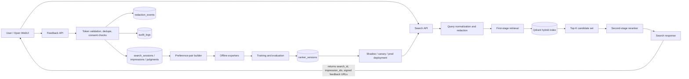
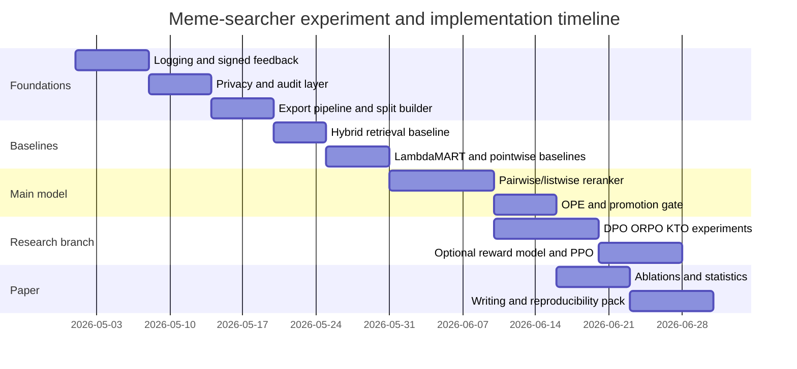

# Designing a Self-Improving Meme Retrieval System for Production and Publication

## Executive Summary

For **meme-searcher**, the strongest production architecture is **not** to begin with end-to-end PPO or a pure RLHF stack. The highest-confidence path is a **logged-feedback, retrieve-then-rerank system**: keep a fast first-stage hybrid retriever, add a second-stage reranker trained on explicit preferences and validated implicit signals, and make the entire loop auditable with immutable exposure logs, ranker versioning, counterfactual evaluation, and privacy-preserving data handling. This recommendation follows the broad arc of modern alignment and ranking work: classic RLHF pipelines are powerful but operationally complex; DPO-style offline preference learning is much simpler; and production search/recommender systems rely heavily on logged feedback, debiasing, and staged rollouts rather than direct online RL alone. citeturn26search0turn26search3turn33view0turn32view3turn32view5turn22search1

The most important engineering upgrade is to introduce a **first-class `search_id` and immutable impression log**. Without session-level exposure records, you cannot reliably derive pairwise preferences, estimate propensities, run doubly robust or IPS-style offline evaluation, or make academically credible claims about self-improvement. The literature on unbiased learning-to-rank and open bandit evaluation is very clear on this point, and the same logic applies directly to meme retrieval. citeturn32view3turn32view5turn25search0turn24search1

For the learning loop itself, I recommend a **two-track strategy**. The **production track** should center on discriminative ranking models: a strong tabular/tree baseline such as LambdaMART or a neural pointwise baseline, followed by a multimodal pairwise or listwise reranker over the top-\(K\) candidates. The **research track** should export the same logged data into SFT, DPO, ORPO, and KTO formats so that you can compare offline preference-optimization methods in the paper without betting production relevance on the most brittle stack first. This reflects the current tool ecosystem as well: official open-source post-training libraries now support SFT, reward modeling, DPO, PPO, KTO, and ORPO, but their operational complexity and data requirements differ substantially. citeturn20search7turn33view0turn32view1turn32view2turn29search0turn28search2turn7search4

The report below assumes that the repository still matches the architecture established earlier in this conversation: a local-first meme retrieval stack using Qdrant, Open WebUI integration, and the planned preference reranking loop in `docs/RLHF_FEEDBACK_LOOP_PLAN.md`. The repository itself was not publicly crawlable from this environment at the time of writing, so repo-specific statements are framed as **implementation recommendations and likely gaps** rather than a fresh line-by-line code audit.

## Assumptions and Current-State Framing

A production-grade meme search engine should be treated as a **multimodal retrieval system with online human preference supervision**, not as a chatbot alignment problem with images bolted on. The serving path should therefore follow the same pattern seen in efficient multimodal retrieval research: a **fast first stage** that cheaply narrows the corpus, followed by a **smarter reranker** that sees richer cross-modal interactions only for the top results. Cross-encoders tend to give the best relevance but are too slow for whole-corpus retrieval; hybrid bi-encoder plus cross-encoder pipelines are the practical compromise. citeturn22search1turn15search1turn15search4

That framing also fits the capabilities of a typical stack around entity["company","Qdrant","vector database company"] and Open WebUI. Qdrant’s own documentation explicitly supports **hybrid dense+sparse retrieval** and fusion methods such as **RRF**; Open WebUI supports OpenAPI-connected tools and agentic integrations, which makes it a reasonable UI/control plane but not the right place to hide core ranking logic or audit-critical state. In other words, the UI layer should trigger the retrieval stack, but the retrieval stack should own IDs, cryptographic feedback tokens, ranker versioning, and logging. citeturn15search6turn15search7

I am also assuming that compute budget, traffic, and dataset size are open-ended, as you requested. That means the design should scale **down** to a single-GPU research prototype and **up** to a more formal production deployment. This is another reason to prefer a retrieve-then-rerank design: it is compatible with low-cost experimentation, academically standard evaluation, and later acceleration with LoRA, quantization, or distributed serving when traffic grows. citeturn21search0turn21search4turn29search0turn28search2

## Literature and System Survey

### RLHF and offline preference learning

The modern RLHF lineage in language modeling runs from early human-preference reward learning through OpenAI’s summarization work and InstructGPT-style SFT → reward model → PPO pipelines. Those papers established the now-standard decomposition: collect comparisons, train a learned reward model, then optimize a policy under a KL constraint. They also made clear why RLHF became influential in practice: strong human preference gains, even when base-model scaling alone was insufficient. citeturn27search7turn27search1turn26search0turn26search3

The next major step was **Direct Preference Optimization**. DPO showed that, under a particular parameterization, the aligned policy can be learned with a **simple classification-style objective** derived from preference pairs, removing the explicit reward-model-plus-RL loop during fine-tuning. That matters directly for meme-searcher because it means you can investigate preference alignment without building the full online RL stack on day one. A recent survey also confirms how quickly DPO has become the organizing center of the direct preference-learning literature. citeturn33view0turn31view0

Two important nearby methods are **ORPO** and **KTO**. ORPO folds preference optimization into supervised fine-tuning with an odds-ratio term and is explicitly **reference-model free**, which can save memory and simplify training. KTO is especially relevant to retrieval systems because it works from **binary desirability signals** rather than requiring paired preferences for every example; the official TRL documentation emphasizes that KTO can consume unpaired good/bad signals and automatically convert paired data into that form. For a meme retrieval loop where many users will only upvote, downvote, or say “none of these,” KTO is conceptually attractive as a research branch. citeturn32view1turn36view4turn32view2turn37view0turn37view2

A cautionary note is that reward models remain useful but need their own evaluation. RewardBench was introduced precisely because reward models can be opaque and fail in ways that are not obvious from training loss alone. For your system, that implies a simple rule: if you add a reward model, treat it as a separately benchmarked component with held-out evaluation, not just as a hidden facilitator for PPO. citeturn4search4

### Learning-to-rank, counterfactual learning, and slate-aware evaluation

For ranking, the classic progression is **pointwise → pairwise → listwise**. RankNet made the pairwise formulation mainstream for learned ranking, while later work such as LambdaLoss tightened the connection between training losses and ranking metrics like NDCG. The practical lesson is still current: if the system’s output is an ordered list, optimize the model and the evaluation around ordered-list behavior, not just independent per-item classification. citeturn20search0turn20search7

Once user interaction logs enter the picture, **position bias and exposure bias** become unavoidable. Joachims, Swaminathan, and Schnabel’s work on unbiased learning-to-rank showed how propensity-weighted counterfactual estimation can debias logged feedback and even improve an operational search engine. More recent work extends that intuition to the **two-stage ranking systems** that real products actually use, which is directly relevant to meme-searcher because the serving architecture should also be two-stage. citeturn32view3turn24search1

For ranking lists rather than isolated items, **slate effects** matter. Research on slate-aware ranking argues that item interactions inside the displayed list change user behavior and that ranking should sometimes optimize the slate, not merely each candidate in isolation. Likewise, SlateQ demonstrated that slate-based reinforcement learning can be made tractable and showed live gains on entity["company","YouTube","video platform"]. For meme retrieval, that means your paper should report not only relevance metrics but also at least one **diversity/slate-quality measure**, because users often want one good meme quickly, but they also respond poorly to near-duplicates filling the top ten. citeturn38search0turn38search5turn5search5

### Deployed self-improving systems

Public evidence for deployed self-improving systems is strongest in search and recommendation. Microsoft’s unbiased LTR work explicitly reported improvements on an operational search engine. Google’s SlateQ work reported live validation on YouTube. The Open Bandit Dataset came from a real e-commerce platform, entity["company","ZOZOTOWN","fashion ecommerce company"], to make offline policy evaluation reproducible on real logged feedback. Together these examples suggest the same product recipe: **log exposures carefully, debias aggressively, validate offline first, then roll out gradually online**. citeturn32view3turn5search5turn32view5

By contrast, retrieval-augmented agents are still much earlier in their maturity curve in the public literature. Systems such as Self-RAG, RA-ISF, and SimRAG are compelling research demonstrations of retrieval, critique, and self-improvement, but the strongest public documentation is still about research architectures and benchmarks rather than about long-lived production feedback loops on the scale seen in search or recommender systems. That matters for scope: meme-searcher can absolutely borrow ideas from agentic retrieval, but its paper will be stronger if the core claim is **self-improving retrieval and reranking**, with agentic or generative judges framed as optional extensions. citeturn13search1turn13search8turn13search0

### Open-source RLHF and post-training stacks

The open-source tooling landscape is now good enough to support a rigorous academic comparison. Official libraries from entity["company","Hugging Face","ai company"], OpenRLHF, Axolotl, and entity["company","NVIDIA","semiconductor company"] cover most relevant post-training methods, including SFT, reward modeling, PPO, DPO, ORPO, and KTO. TRL is the broadest general-purpose starting point for controlled experiments; OpenRLHF is the strongest fit if you later need high-throughput distributed RL; Axolotl is practical for fast experimental fine-tuning with PEFT; and NeMo RL is relevant if you want to scale later into heavy distributed post-training. Legacy stacks such as trlX and NeMo-Aligner remain useful historical references, but they are no longer the default choice for a new project. citeturn29search0turn28search2turn7search4turn28search0turn11search1turn11search0

The following comparison synthesizes the trade-offs documented in the original ranking papers and official post-training tool documentation. It is intentionally opinionated because your system needs a recommendation, not just a taxonomy. citeturn20search0turn20search7turn33view0turn32view1turn32view2turn22search1

| Candidate method | Sample efficiency | Robustness to bias | Offline trainability | Interpretability | Implementation complexity | Recommended role in meme-searcher |
|---|---|---:|---:|---:|---:|---|
| Pointwise ranker | High | Moderate to low | Excellent | High | Low | Fast baseline; good for first publishable baseline, not final system |
| Pairwise ranker | High | Moderate | Excellent | Medium | Low to medium | **Best first production reranker** if data is sparse but preferences are explicit |
| Listwise neural / LambdaLoss | Medium | Moderate | Excellent | Medium | Medium | Strong paper-worthy reranker once logging is stable |
| LambdaMART | Very high on tabular features | Moderate | Excellent | High | Medium | **Best classical baseline** and often a hard-to-beat production baseline |
| Transformer reranker | Medium | Moderate | Good | Medium to low | Medium to high | **Best main model** for top-\(K\) reranking; strongest paper centerpiece |
| Reward model + PPO | Low to medium | Depends heavily on reward quality | Partial; online RL makes it harder | Low | High | Research branch only at first; do not make this the critical production dependency |

A second, implementation-oriented comparison is useful for the open-source training stack selection. The table below is grounded in official documentation and repositories rather than benchmark folklore. citeturn29search0turn28search2turn7search4turn28search0turn11search1

| Stack | Strengths | Weaknesses | Best use here |
|---|---|---|---|
| TRL | Broadest official support for SFT, Reward, DPO, PPO, KTO, ORPO; PEFT-friendly; straightforward scripts and docs | Less specialized for very large distributed RL than OpenRLHF | **Primary experimental framework** |
| OpenRLHF | Strong distributed PPO/RL infrastructure; supports DPO, KTO, QLoRA, high-throughput generation | More setup complexity | Use if/when you need large-scale distributed RL or heavy canary experimentation |
| Axolotl | Fast practical fine-tuning; good PEFT ergonomics; preference tuning support | Less opinionated about evaluation and serving | Rapid prototype branch for LoRA/QLoRA experiments |
| NeMo RL | Scalable post-training with Ray/Megatron ecosystem | Heavier operational footprint | Only if the project outgrows standard HF-style tooling |
| trlX / NeMo-Aligner | Useful historical references | Less attractive as a greenfield choice | Reference only |

## Gap Analysis for meme-searcher

Assuming the current repository still resembles the state described earlier in this conversation, the biggest gap is that the current preference-loop plan is still **“feedback-aware”** rather than **“counterfactually evaluable.”** That sounds subtle, but it is the difference between a clever feature and a publishable system. Best practice requires immutable exposure logs, search-level identifiers, ranker/version lineage, and exportable training snapshots; without those, preference data cannot support strong offline comparisons or defensible claims about improvement over time. citeturn32view3turn32view5turn24search1

A second gap is architectural. The best evidence in multimodal retrieval favors **retrieve fast, rerank smart**, yet many small projects try to turn the retriever itself into the whole relevance engine. For meme-searcher, that would be a mistake. The first stage should optimize recall and latency; the second stage should optimize fine-grained semantic and stylistic alignment to the query. If your current RLHF plan jumps directly from user feedback to a new ranker without clearly separating these stages, it is missing one of the strongest lessons from modern retrieval. citeturn22search1turn15search6

A third gap is data granularity. Binary thumbs up/down can be valuable, but they are not enough by themselves. A rigorous system needs to distinguish among **impression exposure**, **per-item judgment**, **search-level “none correct”**, and **derived pairwise preference**. DPO requires explicit preference pairs; KTO works well with binary desirability labels; classical LTR methods benefit from ordered impressions and calibrated negatives. If the current plan stores only a flattened feedback event, it is discarding training signal that the literature and current tooling can exploit. citeturn36view0turn37view2turn34view4

A final likely gap is governance. Modern preference pipelines need redaction, secret filtering, consent recording, opt-out and deletion support, and audit logs that survive model retraining. Without those controls, you may get a working retriever, but you will struggle to justify publication claims about reproducibility, ethics, and privacy, and you will create avoidable product risk. citeturn17search3turn17search4turn18search5turn18search4turn16search0

A useful way to summarize the likely repo-specific delta is the following.

| Area | Likely current state | Best-practice target | Why it matters |
|---|---|---|---|
| Search logging | Request/response handling without immutable exposure lineage | `search_sessions` + `impressions` + ranker version IDs | Enables reproducible training and OPE |
| Feedback | Flat endpoint with per-item reactions | Search-level, item-level, and pairwise feedback with validation | Preserves richer preference signal |
| Data exports | Ad hoc or manual | Canonical exporters for SFT, DPO, KTO, classical LTR | Makes research and production use the same data lake |
| Model management | One evolving ranker path | Registered `ranker_versions`, snapshot IDs, promotion gates | Prevents silent regressions |
| Privacy | Limited/no redaction ledger | Redaction events, audit logs, consent records, opt-out | Required for production and publication credibility |
| Evaluation | Manual spot checks or simple hit-rate views | Query-grouped splits, significance tests, latency/cost gates, OPE | Needed for defensible claims |

## Data Model and API Design

The serving topology should explicitly separate **query handling**, **candidate generation**, **reranking**, **feedback validation**, and **offline training/export**. That separation mirrors both the efficient multimodal retrieval literature and the counterfactual-ranking literature, while also fitting Qdrant’s hybrid retrieval model. citeturn22search1turn15search6turn32view5turn24search1

### Recommended schema

The schema below is intentionally normalized enough for auditability but still practical for Postgres. The design goal is that **every training example can be traced back to the exact served search**, the exact ranker that produced it, and the exact redaction/audit record that governed it. That is the single most important migration for both production reliability and academic reproducibility. citeturn32view5turn24search1turn17search3

| Table | Core columns | Key indexes / constraints | Notes |
|---|---|---|---|
| `ranker_versions` | `id UUID PK`, `name`, `stage ENUM(retriever, reranker, reward_model, policy, fusion)`, `model_family`, `base_checkpoint`, `adapter_uri`, `git_commit`, `training_snapshot_id`, `config_jsonb`, `metrics_jsonb`, `rollout_status`, `created_at`, `approved_at`, `approved_by` | unique(`name`,`git_commit`,`training_snapshot_id`) | Version registry for every online or offline model |
| `search_sessions` | `id UUID PK`, `user_hash`, `client_session_id`, `query_text_redacted`, `query_text_encrypted NULL`, `query_lang`, `context_jsonb`, `retriever_version_id FK`, `reranker_version_id FK`, `experiment_bucket`, `consent_scope`, `opt_out BOOL`, `served_at`, `deleted_at NULL` | index on `served_at`; index on `experiment_bucket`; index on `(retriever_version_id, reranker_version_id)` | The canonical `search_id` lives here |
| `impressions` | `id UUID PK`, `search_id FK`, `rank INT`, `meme_id`, `meme_content_hash`, `dense_score`, `sparse_score`, `fusion_score`, `reranker_score NULL`, `features_jsonb`, `propensity FLOAT NULL`, `is_exploration BOOL`, `displayed_at` | unique(`search_id`,`rank`); index on `meme_id`; index on `search_id` | Immutable exposure ledger |
| `judgments` | `id UUID PK`, `search_id FK`, `impression_id FK NULL`, `judgment_type ENUM(upvote,downvote,none_correct,best,worst,skip,comment)`, `label SMALLINT NULL`, `comment_redacted NULL`, `comment_encrypted NULL`, `source ENUM(inline,signed_url,admin,batch)`, `validator_version`, `is_valid BOOL`, `invalid_reason NULL`, `created_at` | partial unique for one `none_correct` per `(search_id,user_hash)`; index on `impression_id` | Keeps raw user action separate from derived preferences |
| `preference_pairs` | `id UUID PK`, `search_id FK`, `chosen_impression_id FK`, `rejected_impression_id FK`, `derivation_method ENUM(explicit_pair,best_vs_worst,positive_vs_negative,none_correct_vs_any,hard_negative)`, `pair_weight FLOAT`, `split ENUM(train,val,test)`, `created_at` | unique(`search_id`,`chosen_impression_id`,`rejected_impression_id`,`derivation_method`) | Canonical DPO/classical pairwise training unit |
| `redaction_events` | `id UUID PK`, `table_name`, `row_id`, `field_name`, `detector ENUM(pii,secret,manual,copyright)`, `action ENUM(mask,drop,encrypt,delete,hash)`, `original_sha256`, `reason`, `reviewer_hash NULL`, `created_at` | index on `(table_name,row_id)` | Required for privacy and reproducibility |
| `audit_logs` | `id BIGSERIAL PK`, `actor_type`, `actor_hash`, `action`, `object_type`, `object_id`, `request_id`, `before_hash NULL`, `after_hash NULL`, `ip_hash NULL`, `user_agent_hash NULL`, `created_at` | index on `(object_type,object_id)`; index on `created_at` | Immutable operational audit trail |

### Migration order

The safest migration path is to add this schema in **forward-compatible stages**.

1. Create `ranker_versions`.
2. Add `search_sessions` and make `/search` always emit a UUID `search_id`.
3. Add `impressions` and make every returned result carry an `impression_id`.
4. Add `judgments` and route all feedback through validated inserts.
5. Add `preference_pairs` as a derived table, produced by a deterministic batch job.
6. Add `redaction_events` and `audit_logs`.
7. Backfill historical feedback into the new schema where possible.
8. Only after backfill, enforce stricter `NOT NULL`, uniqueness, and validation constraints.

This ordering minimizes downtime and avoids the common failure mode where you try to infer lineage after more feedback has already accumulated.

### API contract changes

The API should make the retrieval state cryptographically explicit.

**`POST /search`**

Request fields should minimally include:
- `query`
- `top_k`
- `user_context` or `session_context`
- `client_session_id`
- `consent` flags

Response fields should minimally include:
- `search_id`
- `retriever_version_id`
- `reranker_version_id`
- `results[]`, each with `impression_id`, `rank`, `meme_id`, `scores`
- `feedback`, containing:
  - `signed_item_feedback_url`
  - `signed_search_feedback_url`
  - expiration timestamp
  - nonce

**`POST /feedback`**

Support three normalized shapes:
- **item judgment**: `search_id`, `impression_id`, `judgment_type`, `token`
- **pairwise preference**: `search_id`, `chosen_impression_id`, `rejected_impression_id`, `token`
- **search-level rejection**: `search_id`, `judgment_type = none_correct`, `token`, optional comment

### Signed feedback URLs

Use short-TTL HMAC or JWT tokens over:
- `search_id`
- `impression_id` or pair IDs
- allowed action
- expiry
- nonce
- optionally `user_hash`

This prevents feedback forgery, stale replay, and mismatched result IDs. The signer must live in the retrieval service, not in the UI.

### Validation rules

The validation layer should reject or quarantine:
- feedback for an expired token;
- feedback where `impression_id` does not belong to `search_id`;
- pairwise feedback where chosen and rejected are identical;
- `none_correct` combined with a simultaneous positive selection unless the flow is explicitly multi-step;
- duplicate judgments from the same `user_hash` unless you intentionally allow updates and maintain version history;
- free-text comments that fail PII or secret screening.

### `none_correct` is essential

A search-level `none_correct` signal does more than improve UX. It prevents a dangerous data pathology: if users can only react to shown items, silence becomes ambiguous between “results were fine,” “results were mediocre,” and “nothing matched.” KTO-style binary desirability training and counterfactual evaluation both benefit when the “no good option” case is represented explicitly rather than inferred from missing data. citeturn37view0turn37view2turn24search1

## Training and Evaluation Program

The most robust plan is to separate the **online ranking model** from the **paper’s alignment-comparison branch**. The online model should be a discriminative reranker; the paper can still compare DPO, ORPO, KTO, and a reward-model branch by exporting the same feedback lake into multiple training formats. This gives you a clean story: one unified data engine, several learning objectives, and a single promotion gate. citeturn33view0turn32view1turn32view2turn29search0

### Recommended serving and training stack

For serving, keep a **hybrid retriever** over image, OCR, and text/caption representations, fused in Qdrant. A sensible baseline is dense image-text embeddings plus sparse OCR/keyword search, fused by RRF. Retrieve top 100–200 candidates, then rerank the top 50–100. That is the cheapest architecture that still leaves room for high-quality reranking. citeturn15search6turn22search1turn15search1turn15search4

For the main reranker, I recommend two baselines and one target model:

- **Baseline A:** LambdaMART over engineered multimodal features.
- **Baseline B:** neural pointwise scorer over query–candidate features.
- **Target model:** transformer-based multimodal pairwise/listwise reranker over top-\(K\).

This gives you a rigorous classical baseline, a simple neural baseline, and the paper’s main contribution. citeturn20search7turn20search0turn22search1

For fine-tuning budget, use **LoRA** first and **QLoRA** when memory is tight. LoRA drastically reduces trainable parameters and memory; QLoRA makes larger models accessible under modest hardware budgets. Since your query and corpus domain are highly specialized and stylistic, adapter-based tuning is a much better first move than full fine-tuning. citeturn21search0turn21search4

If you add a reward model, use it as an **auxiliary research component**: cleaning noisy labels, scoring candidate pairs, or comparing PPO-like optimization against DPO-like optimization. Do not make reward-model-plus-PPO the sole path to shipping relevance. The complexity is much higher, and the retrieval literature suggests that frequent retraining from logged feedback plus careful evaluation is already enough to produce a strong self-improving loop. citeturn36view2turn4search4turn32view5

### Offline exporters

The canonical logging schema should feed all exporters from the same snapshot. That way, training format becomes an experimental variable rather than a data-pipeline fork.

| Exporter | Input unit | Proposed format | Main use |
|---|---|---|---|
| SFT | human-validated single candidate judgment | `prompt = query + candidate serialization`; `completion = structured relevance verdict` | Instruction-tuned judge / rationale model |
| DPO | `preference_pairs` | `prompt = query + candidate A/B`; `chosen`, `rejected` completions map to preferred and dispreferred outputs | Direct preference optimization experiments |
| KTO | `judgments` and converted pairs | `prompt = query + candidate`; `completion`; `label ∈ {desirable, undesirable}` | Binary desirability training from sparse feedback |
| Classical LTR | `impressions` + `judgments` + derived labels | tabular or tensorized features with position and propensity | Production reranker training |

The format requirements line up well with current tool support in TRL: SFT consumes prompt-completion or conversational data; DPO consumes preference datasets with `chosen` and `rejected`; reward modeling consumes preference pairs; and KTO consumes unpaired desirability labels or automatically converted pairwise data. citeturn36view5turn36view0turn34view4turn37view2

### Held-out splits

For meme retrieval, random row-wise splitting is not enough. Leakage risk is unusually high because the same meme template can appear with minor text edits, crops, or recompressions.

Use three orthogonal split rules:

1. **Time-based split**: oldest training data, newest validation/test data.
2. **Template-group split**: group by perceptual hash + OCR-text similarity + caption similarity, and keep groups in one split only.
3. **Query-cluster split**: group semantically similar queries so that “drake meme,” “drake format,” and “hotline bling meme” do not leak across train and test.

That split design will make your paper much more credible than a random split, because it tests whether the model generalizes across **new requests and new meme families**, not just memorized duplicates.

### Metrics

The paper and the production gate should both report:

- **Recall@K** for first-stage retrieval
- **MRR@10** and **NDCG@10** for final ranking
- **pairwise accuracy / preference win rate** on held-out pairs
- **template diversity@K** or intra-list diversity
- **coverage of tail memes** if the corpus is skewed
- **P95 latency** and **cost/query**
- **safety regression metrics** if moderation filters are present

If you have logged propensities, add **IPS**, **SNIPS**, or **doubly robust** offline estimates for ranking-policy comparison. The availability of OPE is one of the strongest arguments for the new schema, and it gives the paper a rigorous experimental angle beyond simple offline ranking metrics. citeturn32view5turn25search0turn24search1

### Baselines and ablations

A minimal but strong ablation matrix should include:

| Factor | Variants |
|---|---|
| Retrieval backbone | dense only / sparse only / hybrid |
| Reranker family | none / pointwise / pairwise / LambdaMART / transformer |
| Feedback type | explicit only / explicit + implicit / explicit + implicit + exploration |
| Objective | pointwise / pairwise / listwise / DPO / ORPO / KTO |
| Features | image-text only / + OCR / + caption / + template cluster / + popularity priors |
| Diversity handling | none / post-hoc MMR-like diversification / slate-aware reranking |
| Privacy filtering | off / on |
| Data recency weighting | off / on |

For statistical testing, use per-query or per-search paired comparisons with **paired randomization or bootstrap-style tests**, and pre-register that model promotion requires both a numerical gain and no significant safety/latency regression. In IR evaluation, significance testing is not cosmetic; it is part of the standard evidence bar. citeturn19search1turn19search4

## Safety, Privacy, and Governance

A self-improving meme retriever has a real governance burden because user queries and free-text comments can contain personal data, secrets, or sensitive content. NIST’s guidance on de-identification emphasizes the trade-off between utility and re-identification risk, while the ICO’s guidance makes the important distinction between **anonymization** and **pseudonymization**: pseudonymized data is still personal data. For your pipeline, that means user identifiers should be **hashed/pseudonymized**, raw text should be **redacted by default**, and any reversible mapping should be stored separately and tightly controlled. citeturn17search3turn17search4turn17search0

Data minimization should be a design default, not a post hoc legal note. The ICO’s guidance is explicit that personal data must be adequate, relevant, and limited to what is necessary. Therefore, the training lake should store **redacted query text**, optional encrypted raw text with short retention, and never more behavioral metadata than is needed for ranking analysis. The dataset builder should also support **field-level deletion** and tombstoning so that opt-outs propagate into future exports. citeturn18search5turn17search4

Consent and withdrawal have to be operationalized in the API and the logs. GDPR Article 7 requires that consent be demonstrable and that withdrawal be as easy as giving consent. In practice, that implies a simple per-session or per-account feedback-training toggle, a machine-readable `consent_scope`, and an opt-out path that both stops future collection and marks previously collected material for exclusion from later training snapshots. citeturn18search4turn18search7

Secret filtering matters just as much as PII filtering. OWASP’s guidance on secrets management stresses centralization, auditing, lifecycle control, and logging. In your context, that means comments and OCR text should be scanned for API keys, tokens, credentials, and similar high-entropy strings **before** they enter training artifacts, and the redaction action itself needs to be logged for later auditability. citeturn16search0

On the content side, I recommend separating **retrieval relevance** from **policy admissibility**. The search stack should be able to say “this meme is relevant” and “this meme is allowed” as two separate decisions, with the second one enforced by moderation rules or safety classifiers. If you include public auxiliary datasets in the paper, the Hateful Memes literature is a useful stress-test for multimodal reasoning and harmful-content sensitivity, but it should be framed as a **robustness or safety benchmark**, not as a direct relevance proxy for humor retrieval. citeturn30search2turn30search39

## Implementation Milestones and Paper Plan

The implementation plan should be staged so that each milestone can ship value independently while also producing publishable evidence. The estimates below assume one experienced engineer/researcher working full time, with occasional help on UI and infrastructure.

| Milestone | Scope | Effort | Rough days | Exit criterion |
|---|---|---:|---:|---|
| Logging foundation | `search_id`, `impressions`, `judgments`, `ranker_versions`, signed feedback URLs | Medium | 5–8 | Every served result is traceable and feedback is validated |
| Privacy and audit layer | redaction pipeline, secret scan, consent fields, opt-out path, audit logs | Medium | 4–6 | Training snapshots can be generated without raw dangerous fields |
| Export pipeline | deterministic snapshot builder for SFT/DPO/KTO/LTR + split manifests | Medium | 4–7 | One command recreates train/val/test exports |
| Baseline ranking suite | dense-only, sparse-only, hybrid, LambdaMART, pointwise neural | Medium | 5–8 | Reproducible offline leaderboard exists |
| Main reranker | multimodal pairwise/listwise reranker with LoRA/QLoRA | High | 8–14 | Beats strong baseline offline with significance |
| OPE and promotion gate | IPS/SNIPS/DR where possible, automated regression gate, shadow eval | Medium | 4–7 | New versions can be approved or rejected automatically |
| Research branch | DPO/ORPO/KTO experiments and optional reward model | High | 8–14 | Alignment-comparison section of paper is complete |
| Paper packaging | ablations, figures, ethics section, appendix, reproducibility materials | Medium | 6–10 | Draft submission-ready manuscript |

The timeline below is realistic for a first publishable version that still respects production needs.

### Proposed paper structure

A strong paper from this project would look less like a pure alignment paper and more like a **systems-and-learning paper** at the intersection of multimodal retrieval, preference learning, and production evaluation.

1. **Introduction**: motivate self-improving meme retrieval as a real multimodal IR problem with online human feedback.
2. **Related work**: RLHF and direct preference optimization; learning-to-rank and counterfactual ranking; multimodal retrieve-then-rerank; slate-aware recommendation. citeturn26search3turn33view0turn32view1turn32view2turn32view3turn22search1turn38search0
3. **System design**: searchable meme corpus, hybrid retrieval, reranking, logging, governance.
4. **Data engine**: schemas, feedback capture, pair derivation, split design, redaction/governance.
5. **Methods**: classical LTR baselines, transformer reranker, optional DPO/ORPO/KTO research branch.
6. **Experiments**: offline ranking, OPE where possible, ablations, latency/cost, qualitative error analysis.
7. **Ethics and governance**: privacy, harmful content, annotation bias, opt-out, reproducibility.
8. **Conclusion**: self-improving retrieval as a reproducible and deployable pattern.

### Proposed experiments and datasets

The paper should evaluate on:
- **the private meme-searcher logged dataset** with grouped time-aware splits;
- **a difficult public multimodal meme benchmark** such as Hateful Memes for robustness/stress testing;
- optionally **a standard text-image retrieval benchmark** as an architecture sanity check for the reranker, if you want broader retrieval comparability. citeturn30search2turn30search39turn22search1

The core experiments should answer four questions:

1. Does the logged preference loop improve offline ranking quality over time?
2. Does a pairwise/listwise reranker beat strong classical baselines such as LambdaMART?
3. Do DPO/ORPO/KTO provide additional value beyond classical reranking objectives when trained on the same feedback log?
4. Can the system improve without unacceptable regressions in latency, diversity, privacy, or safety?

### Expected contributions

If executed well, the likely novel contributions are:

- a **production-ready schema and logging design** for self-improving multimodal retrieval;
- a **unified export layer** that supports classical ranking and modern preference optimization from the same feedback corpus;
- an empirical comparison between **classical LTR objectives and offline preference-optimization methods** in a real retrieval setting;
- a reproducible methodology for **privacy-aware, audit-ready self-improving meme search**.

### Open questions and limitations

The biggest unresolved question is whether you have enough real user volume for convincing online evaluation. If traffic is low, the paper should lean more heavily on grouped offline splits, internal human preference collection, interleaving, and counterfactual evaluation rather than claiming large-scale online uplift.

A second limitation is methodological: DPO, ORPO, and KTO are native fits for **generative** post-training, while meme-searcher’s main production objective is **ranking**. That is why I recommend them as a research branch or judge-model branch, not as the sole production ranking method.

A third limitation is corpus dynamics. Memes change quickly, duplicate heavily, and depend on cultural context. Your evaluation must therefore be explicitly time-aware and template-aware, or the measured gains will almost certainly be overstated.