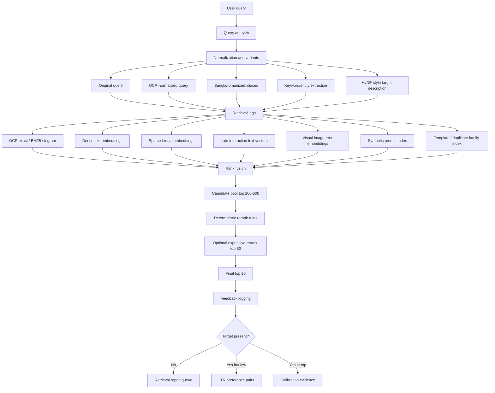
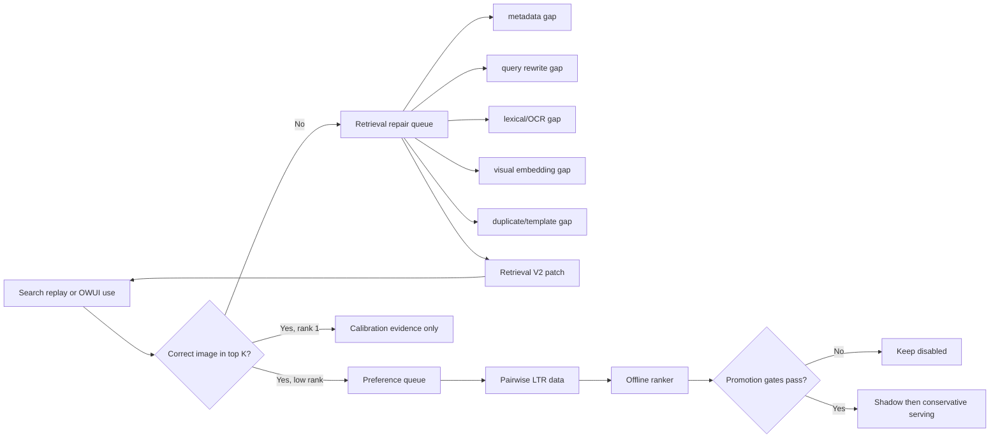

# Meme Retrieval V2 Research Plan

**Status:** Proposed implementation plan  
**Date:** 2026-04-27  
**Owner:** primary builder / OpenCode  
**Reviewers:** Codex, Claude  
**Scope:** Fix meme search target pickup before enabling any learned RLHF ranker.

## Executive Summary

The current system can run Phase 0 retrieval, collect feedback, generate preference pairs, and train an offline ranker. The post-RLHF evaluation showed that this is not enough: the learned ranker preserved aggregate recall but worsened top ordering, so it correctly stayed disabled.

The next improvement should not be "more RLHF" first. It should be **Retrieval V2**: a stronger candidate-generation and fusion layer that makes the correct image enter the slate reliably. Once the correct image is in the candidate pool, the existing feedback/LTR machinery can learn ordering. If the correct image is absent, no ranker can recover it.

The core direction from current retrieval research is:

- Use **multi-stage retrieval**, not a single embedding/vector query.
- Use **hybrid lexical + dense + late-interaction retrieval** for text-heavy meme search.
- Use **fielded indexing** instead of collapsing OCR, captions, tags, paths, and generated prompts into one text blob.
- Use **query rewriting/transliteration** for Bangla, romanized Bangla, OCR noise, and vague user phrasing.
- Use **rank fusion** to merge independent retrieval legs before reranking.
- Keep learned ranking conservative and offline until candidate recall is high.

## Why The Current Approach Fails

The current failures are not primarily caused by missing preference data. They are caused by candidate pickup and metadata mismatch.

Observed failure modes:

- The intended image is sometimes not present in the returned slate, so the feedback loop has no winner to learn from.
- Some target images are only findable when the query matches OCR or caption metadata in a very specific way.
- Bangla script, romanized Bangla, mojibake, spelling variation, punctuation, and OCR errors create multiple text surfaces for the same meme.
- Visual descriptions and meme meaning are often not the same as text embedded in the image.
- A single dense vector over a combined retrieval text loses the distinction between "this exact text appears in the image" and "a caption model guessed this topic".
- Preference training on successful examples can overfit to position bias and hurt top-1/MRR even when recall stays high.

Governing rule:

> Retrieval failures are not ranker training examples. `target_not_found` must repair candidate generation, query understanding, metadata, or corpus indexing. Only `target_found_but_low_rank` should train the learned reranker.

## Target Architecture



## Research Basis

| Area | Finding | How it applies here |
| --- | --- | --- |
| CLIP-style image-text retrieval | CLIP showed that natural language supervision can align images and text for zero-shot image retrieval. | Keep visual image-text embeddings as one retrieval leg, especially for non-textual prompts like "orange food on a tray". |
| Hybrid retrieval | Modern vector databases and search systems support combining dense and sparse retrieval because each catches different relevance signals. | Meme search must combine exact OCR text, fuzzy lexical text, dense semantics, and visual embeddings. |
| Reciprocal Rank Fusion | RRF is a robust way to combine independently ranked lists without requiring calibrated scores. | Use RRF/weighted RRF to merge OCR, dense, sparse, visual, and synthetic-prompt legs before reranking. |
| ColBERT late interaction | Late interaction preserves token-level matching while still using neural retrieval. | Useful for text-heavy memes where a few key tokens should dominate, but exact OCR is noisy. |
| BGE-M3 | BGE-M3 is multilingual and supports dense, sparse, and multi-vector retrieval modes. | Strong candidate for one unified multilingual text retrieval backbone, including Bangla and English. |
| Scene-text captioning / TextCaps | Text in images is essential for understanding many images and memes. | OCR and text-aware captions must be first-class indexed fields, not optional metadata. |
| HyDE / query expansion | Generating a hypothetical relevant document can improve retrieval for underspecified queries. | Generate "target meme descriptions" and query variants for vague prompts, but log provenance and evaluate carefully. |
| Learning-to-rank | LTR works only after candidate generation has high recall. | Keep the RLHF ranker disabled until `candidate_recall@100` and top-order gates pass on held-out data. |

Primary sources and docs to keep attached to implementation reviews:

- CLIP: <https://arxiv.org/abs/2103.00020>
- ColBERT: <https://arxiv.org/abs/2004.12832>
- BGE-M3: <https://arxiv.org/abs/2402.03216>
- Qdrant hybrid queries: <https://qdrant.tech/documentation/concepts/hybrid-queries/>
- Qdrant multivectors: <https://qdrant.tech/documentation/concepts/vectors/>
- HyDE: <https://arxiv.org/abs/2212.10496>
- TextCaps: <https://arxiv.org/abs/2003.12462>
- XGBoost learning-to-rank: <https://xgboost.readthedocs.io/en/stable/tutorials/learning_to_rank.html>
- Reciprocal Rank Fusion paper page/search anchor: <https://plg.uwaterloo.ca/~gvcormac/cormacksigir09-rrf.pdf>

## Retrieval V2 Design

### 1. Fielded Corpus Indexing

Do not rely on one `retrieval_text` field as the only searchable representation. Keep it for backwards compatibility, but add fielded representations.

Required fields per image:

- `image_id`
- `source_path`
- `sha256`
- `ocr_raw`
- `ocr_normalized`
- `ocr_language`
- `ocr_romanized_aliases`
- `caption_literal`
- `caption_semantic`
- `caption_humor_intent`
- `template_name`
- `visible_people_or_characters`
- `objects`
- `scene`
- `tags`
- `source_path_tokens`
- `synthetic_prompts`
- `near_duplicate_group_id`
- `embedding_versions`

Indexing requirement:

- Store exact/fuzzy text surfaces in Postgres FTS/trigram or an equivalent lexical index.
- Store dense vectors in Qdrant.
- Store sparse vectors if the chosen embedding backend supports them.
- Store multi-vector/late-interaction vectors only when the retrieval backend and latency budget are ready.
- Store generated prompt rows separately so one image can have many prompt embeddings.

### 2. Query Analysis And Rewriting

Every user query should be converted into a structured query plan before retrieval.

Query analysis outputs:

- `raw_query`
- `normalized_query`
- `language_script`
- `is_exact_text_like`
- `is_visual_description_like`
- `is_meme_topic_like`
- `contains_bangla`
- `contains_romanized_bangla`
- `contains_named_entity`
- `query_intent_class`
- `query_variants`

Minimum variants:

- Original text.
- Unicode-normalized text.
- OCR-normalized text with punctuation/case/spacing cleanup.
- Bangla-script or romanized-Bangla aliases when applicable.
- Keyword-only query.
- Expanded semantic description.
- HyDE-style target meme description for vague queries.

Important constraint:

- Query expansion must not replace the original query. It only adds retrieval legs. Exact/OCR matches from the original query should retain priority.

### 3. Multi-Leg Candidate Retrieval

Run multiple independent retrieval legs and merge them.

Baseline legs:

- `ocr_exact`: exact and normalized substring match on OCR.
- `ocr_fuzzy`: trigram/BM25/FTS against OCR.
- `caption_dense`: dense embedding over captions and semantic descriptions.
- `caption_sparse`: sparse lexical embedding if BGE-M3 or equivalent is available.
- `visual_clip`: image-text embedding search.
- `synthetic_prompt`: search against generated "find me a meme on ..." prompts for each image.
- `source_path_alias`: filename/path/tag/template matching.
- `duplicate_family`: near-duplicate and template-family expansion.

Candidate-depth rule:

- Each leg should return enough candidates for diagnostics, usually `top_k=100`.
- The fused candidate pool should retain `top 200-500` unique images.
- UI can still display `top 10` or `top 20`; diagnostics must preserve deeper ranks.

### 4. Rank Fusion

Use RRF or weighted RRF before any learned reranker.

Default formula:

```text
score(image) = sum(weight_leg / (k + rank_leg(image)))
```

Initial settings:

- `k = 60`
- OCR exact leg gets the highest weight for exact-text-like queries.
- Visual leg gets higher weight for visual-description-like queries.
- Synthetic-prompt leg gets high but not absolute weight, because generated prompts can hallucinate.
- Dense semantic leg gets moderate weight.
- Duplicate-family expansion should add candidates but not dominate rank 1.

Why RRF first:

- Dense scores, sparse scores, trigram scores, and visual scores are not naturally calibrated.
- RRF is robust when one leg is strong and another leg is noisy.
- RRF keeps the system explainable during failure analysis.

### 5. Deterministic Rerank Rules

Before ML reranking, implement a transparent deterministic reranker over the fused pool.

High-priority boosts:

- Exact normalized OCR phrase match.
- Strong fuzzy OCR match for exact-text-like queries.
- Synthetic prompt direct match.
- Template/tag match for known meme templates.
- Source-path alias match for curated folders or filenames.

Penalties:

- Near-duplicate crowding in top results.
- Low metadata confidence.
- Caption-only match when OCR directly contradicts the query.
- VLM hallucination-only match with no corroborating signal.

Output should include explanations:

- `matched_legs`
- `fusion_score`
- `rule_boosts`
- `rule_penalties`
- `final_score`
- `debug_rank_by_leg`

### 6. Optional Expensive Rerank

Only after candidate recall is healthy, add an optional top-50 reranker.

Possible rerankers:

- Cross-encoder text reranker over query plus OCR/caption/tag fields.
- VLM judge over query plus thumbnail and metadata.
- Lightweight LambdaMART/XGBoost ranker using the same logged features.

Constraints:

- Never let expensive rerankers reduce candidate recall.
- Keep deterministic fallback.
- Evaluate latency separately.
- Learned ranker remains disabled unless all gates pass.

## RLHF / Feedback Changes

The feedback loop should be reinterpreted as two queues.



Rules:

- `target_not_found` never generates arbitrary loser/winner pairs.
- `target_found_but_low_rank` generates pairwise preferences.
- `target_found_at_rank_1` is retained for calibration but down-weighted for training.
- Synthetic AI-agent labels must carry `labeler_model`, `prompt_generation_model`, `model_family`, and `target_pack_id`.
- Human labels and AI-agent labels must be separable in training and reports.

## Evaluation Plan

### Metrics

Candidate pickup metrics:

- `target_recall@20`
- `target_recall@50`
- `target_recall@100`
- `candidate_recall@200`
- `target_mrr`
- `top_1_hit_rate`
- per-intent target recall
- per-language target recall
- exact-text OCR miss count
- median/95p search latency

LTR metrics:

- pairwise holdout accuracy
- position-only baseline accuracy
- selected-image MRR
- selected-image top-1 rate
- changed-ranking blind review acceptance
- Phase 0 absolute eval thresholds

Failure taxonomy:

- `metadata_gap`
- `ocr_gap`
- `bangla_normalization_gap`
- `romanization_gap`
- `query_under_specified`
- `visual_embedding_gap`
- `synthetic_prompt_gap`
- `duplicate_family_confusion`
- `not_indexed`
- `corrupt_file`

### Gates

Retrieval V2 can be considered for serving only when:

- `target_recall@100 >= 0.98` on the held-out target pack.
- `target_recall@20 >= 0.90` on the held-out target pack.
- No regression in fixed Phase 0 qrels thresholds.
- No exact-text OCR misses outside top 10 on the fixed exact-text eval subset.
- Top-1 and MRR do not regress versus the currently serving baseline.
- p95 latency stays within the agreed UI budget.

LTR/ranker promotion remains blocked until:

- Candidate recall gates pass first.
- Pairwise holdout accuracy is `>= 0.60`.
- Pairwise holdout accuracy is at least `+0.05` above position-only logistic baseline.
- Selected-image MRR is `>= 0.50` and does not regress against base retrieval on the same set.
- Learned ordering does not regress Phase 0 absolute thresholds.
- 20 changed rankings pass blind manual/agent review.

## Implementation Plan

### Phase A - Failure Dashboard

Goal: make target pickup failures visible before changing retrieval.

Tasks:

- Build a script that reads existing replay artifacts and emits a unified failure dashboard.
- Report target rank buckets: `1`, `2-5`, `6-10`, `11-20`, `21-50`, `51-100`, `not_found`.
- Join each target with metadata coverage: OCR present, caption present, language, synthetic prompts present, aliases present.
- Produce per-intent and per-language failure tables.
- Write output to `artifacts/retrieval_v2/failure_dashboard.json`.

Likely files:

- `vidsearch/feedback/target_benchmark.py`
- new `vidsearch/eval/retrieval_failure_dashboard.py`

### Phase B - Fielded Metadata Schema

Goal: stop treating all text as one undifferentiated retrieval blob.

Tasks:

- Add a migration for fielded retrieval metadata.
- Backfill fields from current OCR, captions, tags, source paths, and alias repairs.
- Add provenance and version columns for each generated field.
- Keep old `retrieval_text` compatible.

Likely files:

- `infra/postgres/00x_retrieval_fields.sql`
- `vidsearch/storage/pg.py`
- `vidsearch/ingest/*`

### Phase C - Query Planner

Goal: convert raw user prompts into explicit retrieval plans.

Tasks:

- Implement query normalization and language/script detection.
- Add romanized-Bangla and Bangla-script alias expansion.
- Add exact-text intent detection.
- Add visual-description intent detection.
- Add query variant generation with provenance.
- Add tests using known misses and known successes.

Likely files:

- new `vidsearch/query/query_planner.py`
- `vidsearch/query/retrieve_images.py`
- `tests/test_query_planner.py`

### Phase D - Multi-Leg Retrieval And RRF

Goal: increase candidate pickup before ML reranking.

Tasks:

- Add retrieval-leg interface returning ranked candidates plus debug metadata.
- Implement OCR exact/fuzzy leg.
- Implement dense text leg using existing embedding infrastructure.
- Implement visual vector leg using existing image embeddings.
- Implement synthetic-prompt leg after Phase E.
- Implement weighted RRF fusion.
- Emit `debug_rank_by_leg` for every final result.

Likely files:

- `vidsearch/query/retrieve_images.py`
- new `vidsearch/query/retrieval_legs.py`
- new `vidsearch/query/rank_fusion.py`
- `vidsearch/storage/qdrant.py`

### Phase E - Synthetic Prompt Index

Goal: make images searchable by the natural prompts a human would use.

Tasks:

- For each target image, generate 5-10 natural prompts using the existing prompt-labeling instructions.
- Store prompts as first-class rows with prompt type and model provenance.
- Embed prompts separately from captions.
- Search prompt embeddings as a separate retrieval leg.
- Start with `data/meme_rlhf`, then expand to all `data/meme`.

Likely files:

- `docs/AGENT_PROMPT_LABELING_INSTRUCTIONS.md`
- `vidsearch/feedback/target_benchmark.py`
- new `vidsearch/ingest/synthetic_prompts.py`
- `infra/postgres/00x_synthetic_prompts.sql`

### Phase F - Deterministic Rerank And Explanations

Goal: improve ordering without opaque learned behavior.

Tasks:

- Add deterministic boosts/penalties over the fused candidate set.
- Add duplicate crowding control.
- Add exact OCR priority.
- Add synthetic-prompt direct-match priority.
- Return explanations in API debug mode.
- Keep production response compact by default.

Likely files:

- `vidsearch/query/retrieve_images.py`
- new `vidsearch/query/rerank_rules.py`
- `vidsearch/api/contracts.py`

### Phase G - Re-evaluate RLHF/LTR

Goal: only re-enable learning after retrieval recall is fixed.

Tasks:

- Replay `data/meme_rlhf` target prompts against Retrieval V2.
- Replay a disjoint `data/meme` holdout target pack.
- Rebuild preference pairs only from targets present in the slate.
- Train ranker offline.
- Compare base Retrieval V2 versus learned Retrieval V2.
- Keep learned ranker disabled unless gates pass.

Likely files:

- `vidsearch/feedback/train_ranker.py`
- `vidsearch/feedback/evaluate_ranker.py`
- `vidsearch/feedback/post_rlhf_verify.py`

## Concrete Next 10 Tasks

1. Create `artifacts/retrieval_v2/failure_dashboard.json` from current target replay artifacts.
2. Build `query_planner.py` with normalization, script detection, and intent classification.
3. Add tests for Bangla script, romanized Bangla, exact OCR text, visual description, and vague topic prompts.
4. Add a fielded metadata migration and backfill job.
5. Implement OCR exact/fuzzy retrieval as a separate leg.
6. Implement weighted RRF fusion over at least OCR, dense text, visual, and source-path/tag legs.
7. Generate synthetic prompts for the 290 `data/meme_rlhf` targets and index them as a separate prompt leg.
8. Replay target packs with debug leg ranks and rank buckets.
9. Tune deterministic rerank rules using only training target packs, then verify on disjoint `data/meme` holdout.
10. Re-run RLHF/LTR only after `target_recall@100 >= 0.98` and `target_recall@20 >= 0.90`.

## Non-Goals

- Do not enable the existing learned ranker for serving.
- Do not fine-tune CLIP/BGE/VLM models in this iteration.
- Do not mutate Qdrant vectors without versioning.
- Do not use target labels during live retrieval.
- Do not train from `target_not_found` as if a returned image were correct.
- Do not promote on training-set improvements alone.

## Open Questions

- Which lexical engine should be authoritative for OCR fuzzy search: Postgres FTS/trigram, Tantivy, Meilisearch, or OpenSearch?
- Should BGE-M3 replace the current text embedding model or run as an additional leg first?
- What latency budget is acceptable for optional top-50 VLM rerank?
- How many synthetic prompts per image are enough before diminishing returns?
- Should duplicate family grouping be based on perceptual hash, embedding distance, or both?

## Recommended Decision

Implement Retrieval V2 in this order:

1. Failure dashboard.
2. Query planner.
3. OCR lexical leg.
4. RRF fusion.
5. Synthetic prompt leg.
6. Deterministic rerank rules.
7. Disjoint holdout evaluation.
8. Only then revisit learned LTR.

This is the safest path because it directly addresses the system's current weakness: the correct image is not reliably entering the candidate slate or being ranked by the right evidence. RLHF remains useful, but only after candidate recall is strong enough for feedback to teach ordering instead of masking retrieval defects.
