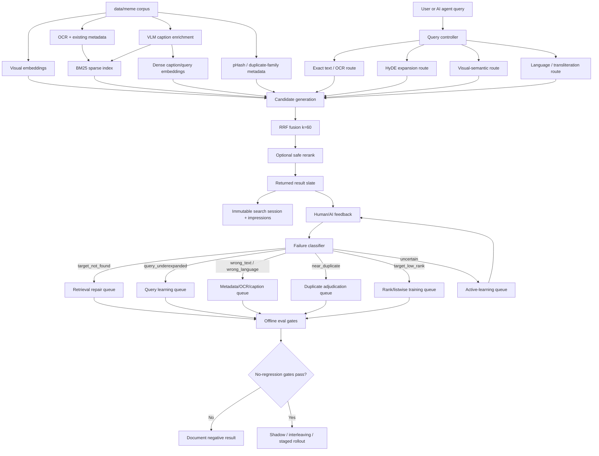
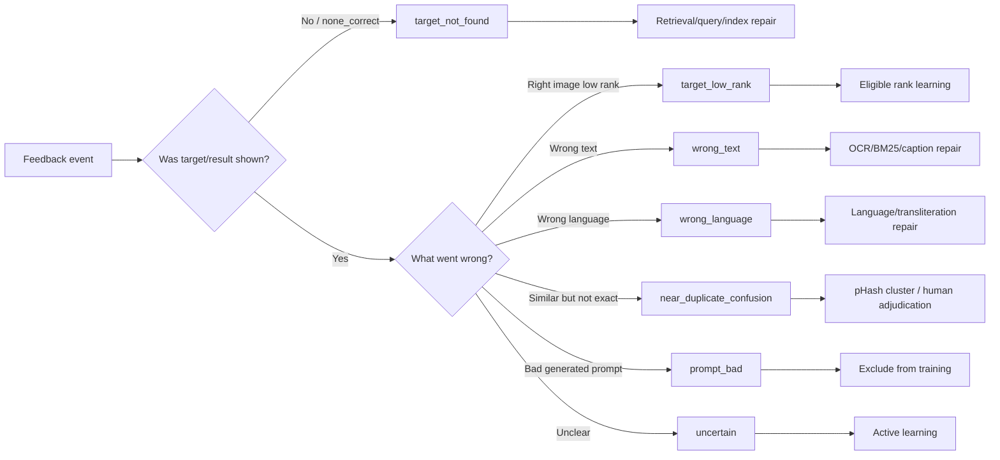
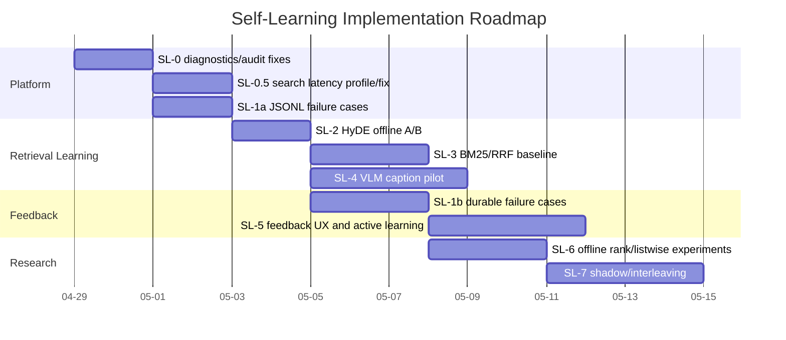

# Canonical Self-Learning Meme Search Plan

**Date:** 2026-04-29
**Status:** canonical implementation plan (single source of truth)
**Repository:** `K:\projects\video_searcher`
**Supersedes for implementation:** `archive/RLAIF_MEMERANK_TASK_HANDOFF.md`, `archive/RLAIF_MEMERANK_RESEARCH_PLAN.md`, `archive/R2_RETRIEVAL_FIRST_RLAIF_PLAN.md`, `archive/MEME_SEARCH_SELF_LEARNING_SYSTEM_PLAN.md`, and `archive/SELF_LEARNING_EXECUTION_PLAN.md`
**Background evidence:** `docs/experiments/R1_FAILED_RLHF_EXPERIMENT.md`, `docs/RLAIF/RLAIF_LITERATURE_REVIEW_AND_PRIORITY_REVISION.md`
**Derivation history:** `AGENTS_CONVERSATION.MD` Entries 56-100 (R1 design through R2 retrieval-first pivot through final approval)

> **For future readers:** This is the only implementation plan you need to read. The five superseded plans in `docs/RLAIF/archive/` are kept as historical context. The literature review document is kept as the cited evidence base. Everything actionable is below.

## 1. One-Sentence Goal

Build a local meme search system that improves from human feedback, AI feedback, and replay experiments by first classifying failures, then repairing the correct layer: query understanding, index metadata, candidate retrieval, duplicate handling, or ranking.

## 2. Non-Negotiable Lessons From R1

R1 was a preference-learning / learning-to-rank experiment, not classical PPO-based RLHF. It proved the logging and training mechanics but failed as a serving improvement.

| Metric | Base | Learned | Delta | Verdict |
| --- | ---: | ---: | ---: | --- |
| `Recall@10` | `0.95` | `0.95` | `0.00` | preserved |
| `top_1_hit_rate` | `0.925` | `0.875` | `-0.05` | failed |
| `MRR` | `0.9333333333` | `0.9125` | `-0.0208333333` | failed |

The invariant:

```text
A ranker cannot learn to rank an image that retrieval never shows.
```

Therefore:

```text
target_not_found -> retrieval/query/index repair only
target_found_low_rank -> rank learning candidate
target_at_rank_1 -> down-weighted stability evidence
near_duplicate -> deterministic cluster or human adjudication
uncertain -> active-learning queue
```

No future feedback loop may bypass this classification step.

## 3. Current Strategy

This is not "try RLHF again." The system is a closed-loop retrieval-learning system.

RLAIF/RLHF are only supervision sources. They do not define the whole architecture.

Priority order:

1. Fix diagnostics and replay latency.
2. Add minimal failure-case classification.
3. Run HyDE query-expansion A/B.
4. Add BM25/RRF candidate-generation baseline.
5. Pilot VLM caption enrichment as additive metadata.
6. Add richer UI feedback and active-learning queues.
7. Revisit rank/listwise training only from eligible target-present examples.
8. Use shadow/interleaving/exploration only after offline gates pass.

## 4. End-To-End Architecture



## 5. Feedback Routing



## 6. Data And Provenance Model

The system must remember enough to reproduce every search, label, and model artifact.

| Record | Storage first | Later durable storage | Purpose |
| --- | --- | --- | --- |
| `search_session` | Postgres | Postgres | query, route, user/session hash, timestamps |
| `search_impression` | Postgres | Postgres | shown candidate, rank, scores, metadata versions |
| `feedback_judgment` | Postgres | Postgres | select/reject/none_correct/wrong_text/etc. |
| `failure_case_v1` | JSONL | Postgres after schema stabilizes | root cause and repair route |
| `hyde_query_v1` | JSONL/cache | Postgres/cache after evaluation | query expansion provenance |
| `vlm_caption_v1` | JSONL | caption table after audit | additive caption metadata |
| `training_snapshot` | artifact + Postgres metadata | immutable artifact manifest | exact training data for any artifact |
| `eval_report` | JSON + markdown summary | committed markdown summary | metrics, gates, decision |

Required provenance on AI-generated records:

```text
model
model_family
gateway URL or provider family
prompt_version
input artifact IDs
created_at
review_status
```

Raw artifacts under `artifacts/` remain uncommitted. Important results must be summarized in markdown under `docs/experiments/results/`.

## 7. Failure Classes

| Primary class | Meaning | Repair path |
| --- | --- | --- |
| `prompt_bad` | generated prompt is invalid or answer-leaking | exclude and repair prompt generator |
| `target_not_found` | target absent from candidate slate | retrieval/query/index repair |
| `wrong_language` | query/result language mismatch | language route/transliteration |
| `query_underexpanded` | prompt too vague/short | HyDE/query rewrite |
| `wrong_text` | visible text mismatch | OCR/BM25/caption repair |
| `wrong_template` | topic matches but format/template wrong | template/family metadata |
| `near_duplicate_confusion` | visually similar but not exact | pHash/manual duplicate adjudication |
| `target_low_rank` | target present but ranked too low | rank/listwise training candidate |
| `uncertain` | insufficient evidence | active-learning/human review |

Primary-class tiebreak:

```text
prompt_bad > target_not_found > wrong_language > query_underexpanded > wrong_text > wrong_template > near_duplicate_confusion > target_low_rank > uncertain
```

Rows may carry secondary labels, but every row must have exactly one `primary_failure_class` selected by that tiebreak.

## 8. Core Schemas

### 8.1 Failure Case

```json
{
  "record_type": "failure_case_v1",
  "search_id": "uuid",
  "prompt_id": "optional",
  "target_image_id": "optional",
  "selected_image_id": "optional",
  "query": "find me meme on ...",
  "primary_failure_class": "target_not_found",
  "secondary_failure_classes": ["wrong_language"],
  "root_cause": "caption_gap|ocr_gap|query_language_gap|duplicate_confusion|candidate_depth_gap|unknown",
  "recommended_repair": "hyde|caption_enrichment|bm25_alias|duplicate_cluster|ranker_training|human_review",
  "evidence": {
    "target_rank": null,
    "candidate_count": 100,
    "query_language": "bn",
    "top_result_image_id": "..."
  },
  "provenance": {
    "classifier": "deterministic|ai|human",
    "model": null,
    "created_at": "iso"
  }
}
```

### 8.2 HyDE Query Expansion

```json
{
  "record_type": "hyde_query_v1",
  "query_hash": "sha256",
  "original_query": "find me meme on স্মরণশক্তি দুর্বল হয়ে গেছে",
  "detected_language": "bn",
  "hypothetical_caption": "A Bangla meme where the visible text says memory has become weak...",
  "transliteration_variants": ["smoronshokti durbol hoye geche"],
  "expanded_terms": ["memory weak", "forgetfulness", "Bangla meme"],
  "model": "fast",
  "model_family": "gateway-default",
  "resolved_model_id": "qwen3-8b-instruct (captured from gateway /v1/models response at request time)",
  "gateway_url_env": "LITELLM_URL",
  "prompt_version": "hyde_prompt_v1",
  "created_at": "iso"
}
```

The `resolved_model_id` field is required because the LiteLLM `fast` alias can re-resolve to a different underlying model after a gateway config change, which would silently make HyDE artifacts non-reproducible. Capture the resolved id at generation time, not the alias.

### 8.3 VLM Caption

```json
{
  "record_type": "vlm_caption_v1",
  "image_id": "...",
  "source_uri": "...",
  "caption_version": 1,
  "caption_model": "qwen3-vl-32b-wrapper",
  "caption_model_family": "qwen-vl",
  "resolved_caption_model_id": "captured from gateway /v1/models response at generation time",
  "visual_summary": "...",
  "visible_text_transcript": "...",
  "language": "bn|en|mixed|unknown",
  "transliteration": "...",
  "meme_template": "...",
  "humor_intent": "...",
  "entities": [],
  "emotions": [],
  "search_aliases": [],
  "distinguishing_captions_for_neighbors": [
    {"neighbor_image_id": "...", "neighbor_blind_id": "N1", "what_makes_this_different": "this image has Bangla text overlay; the neighbor has English caption only"}
  ],
  "quality_flags": [],
  "review_status": "raw|sample_reviewed|accepted|rejected",
  "enabled_for_retrieval": false
}
```

The `distinguishing_captions_for_neighbors` field carries contrastive labels generated against the target's top-K visual neighbors. These are the highest-leverage signal for near-duplicate disambiguation, which is a residual failure class even after VeCLIP-style enrichment. Generated once per pilot image at SL-4 time, conditioned on visual neighbors retrieved from the existing visual embedding index.

The `resolved_caption_model_id` field has the same purpose as the HyDE schema's: prevent silent non-reproducibility when the LiteLLM gateway re-aliases an underlying model.

Caption rollback flags:

```env
VIDSEARCH_USE_AI_CAPTIONS=false
VIDSEARCH_BM25_INCLUDES_AI_CAPTIONS=false
VIDSEARCH_DENSE_INCLUDES_AI_CAPTIONS=false
```

## 9. UI Feedback Contract

Open WebUI should eventually expose these result-level controls:

| Control | Backend action | Learning route |
| --- | --- | --- |
| `Use this one` | `select_best` | ranking if target shown; success evidence |
| `Not this` | `reject` | weak negative for shown result only |
| `None are right` | `none_correct` | retrieval/query/index repair |
| `Wrong text` | `wrong_text` | OCR/BM25/caption repair |
| `Wrong language` | `wrong_language` | language/transliteration repair |
| `Wrong template` | `wrong_template` | template/family metadata |
| `Near duplicate` | `near_duplicate` | duplicate adjudication |
| `More like this` | `positive_signal_v1` only if implemented | deferred from v1 |

Security and correctness:

- GET displays confirmation only.
- POST writes feedback.
- duplicate POST is idempotent.
- CSRF and rate limits remain active.
- every action records `search_id`, `impression_id` where applicable, and feedback provenance.
- `More like this` is not promotion-quality data unless implemented as a concrete `positive_signal_v1` schema.

## 10. Learning Loops

### 10.1 Observability

Goal: every query and label is replayable.

Implement first in:

```text
vidsearch/feedback/service.py
vidsearch/feedback/schema.py
vidsearch/feedback/target_benchmark.py
infra/postgres/003_feedback_loop.sql
```

### 10.2 Failure Classification

Start with JSONL artifacts, not Postgres. Promote to Postgres after two or more real experiment cycles stabilize the schema.

First module:

```text
vidsearch/feedback/failure_cases.py
```

### 10.3 Query Learning

First concrete method: HyDE through LiteLLM gateway.

Rules:

- gateway-only LLM calls
- cache by normalized query hash
- shadow/offline first
- disable for exact-text queries if exact-text regresses

### 10.4 Retrieval Repair

First concrete methods:

- BM25 over OCR/captions/aliases
- RRF with `k=60`
- VLM caption pilot as additive metadata
- transliteration aliases for Bangla/romanized prompts

### 10.5 Rank Learning

Allowed only for:

```text
target_in_top_10_not_1
target_in_top_20_not_10
human-selected target present in slate
graded relevance alternatives
```

Forbidden:

```text
target_not_found
prompt_bad
uncertain
AI-only near_duplicate
uncapped rank1-only successes
```

### 10.6 Active Learning

Initial queue score:

```text
initial_score =
  1.0 * path_disagreement
  + 1.0 * target_rank_2_to_20
  + 1.0 * undercovered_category
  + 1.0 * near_duplicate_uncertainty
  + 1.0 * language_gap
  - 1.0 * already_rank1
  - 1.0 * duplicate_target_over_cap
```

Treat these as default weights only. Recalibrate after the first full labeling cycle.

### 10.7 Online Exploration

Do not start here.

Allowed only after offline gates:

- shadow scoring
- team-draft interleaving
- one randomized swap in ranks 4-8
- exploration rate <= 2%
- exact-text initially excluded
- propensities logged

No IPS/SNIPS/DR-OPE claims before controlled exploration logs exist.

## 11. Evaluation Gates

Every candidate change must produce a markdown report.

**Holdout pack stratification (required before any A/B claim):**

The 45-target R2 holdout must contain documented minimum counts of each high-risk slice. Uniform sampling from `data/meme` is insufficient because the failure modes the system aims to fix are concentrated in specific slices. Required minimum per holdout build:

- Bangla / script-mixed examples: at least 8 of 45.
- Near-duplicate cluster examples (same pHash family, different actual targets): at least 6 of 45.
- Novel-template examples (template not represented in training split): at least 6 of 45.

If the current 45-target holdout does not satisfy these minimums, rebuild it via stratified sampling before any HyDE / BM25 / caption A/B numbers are committed to a markdown summary.

Candidate-generation metrics:

```text
pickup@10
pickup@20
pickup@50
pickup@100
target_not_found rate
median target rank
exact-text misses outside top10
language and prompt-category slices
```

Ranking metrics:

```text
top_1_hit_rate
MRR
nDCG@10
changed top result count
worse-query examples
```

Promotion gates:

```text
non-overlap top_1_hit_rate >= base
non-overlap MRR >= base
non-overlap nDCG@10 >= base
Recall@10 regression <= 1pp
exact_text misses outside top10 = 0
latency p95 within budget
rollback documented
blind review passed when rankings change
```

Default decision if any gate fails:

```text
offline-only; document as negative or diagnostic result
```

## 12. Execution Roadmap



Dates are illustrative; phase order is authoritative.

## 13. Phase Details

### SL-0: Fix R2 Diagnostics And Audit Metrics

Files:

```text
vidsearch/feedback/rank_bucket_report.py
vidsearch/feedback/prompt_balance.py
vidsearch/feedback/consensus.py
tests/test_rank_bucket_eligibility.py
docs/experiments/results/R2_RANK_BUCKET_SUMMARY_10PCT.md
```

Tasks:

- count both `target_found` and `found_selected` as found
- normalize legacy prompt categories before gates
- add deterministic stratified sample builder
- add Gwet AC2 plus Spearman/Kendall rank correlation to audit summaries
- regenerate 10% summary

Acceptance:

- found/missing header matches manual counts
- exact/fuzzy eligibility is normalized
- judge audit does not rely on Cohen's kappa alone

### SL-0.5: Profile And Fix Search Latency

Files:

```text
vidsearch/query/retrieve_images.py
vidsearch/api/main.py
vidsearch/feedback/target_benchmark.py
docs/experiments/results/SEARCH_LATENCY_PROFILE.md
```

Tasks:

- profile `/search` at limits `10`, `20`, `50`, `100`
- record per-stage timings
- identify dominant cost
- fix or document blocker

Note on structural vs tunable cost: if the dominant cost turns out to be the cross-encoder reranker over 100 candidates, model cold load, or per-hit DB roundtrips, the fix may be structural (rerank only top-K with K<100, batch-rerank across queries, or skip rerank in replay-mode) rather than a tuning change. None of these are 2-day fixes. `SEARCH_LATENCY_PROFILE.md` should include an options-and-tradeoffs analysis even if no code change ships in the same phase, so the next builder cycle can pick up the structural fix without re-profiling.

Acceptance:

- about 157-prompt stratified replay completes under 10 minutes, or a blocker is documented with options-and-tradeoffs
- no serving flag is enabled as part of the fix

### SL-1a: Minimal JSONL Failure Cases

Files:

```text
vidsearch/feedback/failure_cases.py
tests/test_failure_cases.py
docs/experiments/results/FAILURE_CASE_MINIMAL_SUMMARY.md
```

Tasks:

- define enum and tiebreak order
- implement `classify_replay_row()`
- write JSONL `failure_case_v1`
- prove `target_not_found` cannot become ranker training data

Acceptance:

- known target-not-found rows classify as retrieval repair
- schema can evolve before Postgres migration

### SL-2: HyDE Offline A/B

Files:

```text
vidsearch/query/hyde.py
vidsearch/query/query_expansion.py
tests/test_hyde_query_expansion.py
docs/experiments/results/HYDE_ABLATION_SUMMARY.md
```

Commands:

```powershell
python -m vidsearch.query.hyde generate `
  --prompts artifacts/feedback_targets/r2_prompts_train_10pct.jsonl `
  --output artifacts/query_expansion/hyde_10pct.jsonl `
  --gateway-url http://127.0.0.1:4100 `
  --model fast `
  --resume
```

```powershell
python -m vidsearch.query.hyde evaluate `
  --prompts artifacts/feedback_targets/r2_prompts_train_10pct.jsonl `
  --hyde artifacts/query_expansion/hyde_10pct.jsonl `
  --summary docs/experiments/results/HYDE_ABLATION_SUMMARY.md `
  --api-base-url http://127.0.0.1:8000 `
  --top-k 100
```

Acceptance:

- exact-text does not regress
- at least one non-exact slice improves or the failure is documented

### SL-3: BM25/RRF Candidate Generation

Files:

```text
vidsearch/query/bm25_index.py
vidsearch/query/rrf.py
tests/test_rrf_fusion.py
docs/experiments/results/HYBRID_RRF_ABLATION_SUMMARY.md
```

Acceptance:

- BM25-only, dense-only, visual-only, current, and RRF are compared
- exact-text improves or preserves
- latency is reported

### SL-4: VLM Caption Pilot

Files:

```text
vidsearch/enrichment/vlm_captioner.py
vidsearch/enrichment/caption_schema.py
vidsearch/enrichment/caption_eval.py
tests/test_caption_schema.py
docs/experiments/results/CAPTION_ENRICHMENT_PILOT_SUMMARY.md
```

Tasks:

- generate `vlm_caption_v1` for 100 stratified pilot images through LiteLLM multimodal gateway
- for each pilot image, also generate `distinguishing_captions_for_neighbors` against its top-5 visual neighbors (use the existing visual embedding index to identify neighbors); store under the same `vlm_caption_v1` row
- record `resolved_caption_model_id` from gateway response on every row
- manually audit at least 20 captions for visual-summary, visible-text-transcript, language, and meme-template fields
- evaluate additive caption search as a separate retrieval channel
- document good and bad examples in the pilot summary

Acceptance:

- 100-image pilot generated through LiteLLM multimodal gateway
- at least 20 captions manually audited
- distinguishing captions present on every pilot row
- captions remain additive and disabled by default (`enabled_for_retrieval=false`, all three feature flags `false`)
- pilot report documents good and bad examples and reports per-field agreement

### SL-5: Feedback UX And Active Learning

Files:

```text
vidsearch/feedback/active_learning.py
vidsearch/feedback/service.py
Open WebUI pipe/function files if present
docs/experiments/results/ACTIVE_LEARNING_QUEUE_SUMMARY.md
```

Acceptance:

- feedback writes are idempotent
- GET does not write
- POST writes with CSRF/rate limits
- action routes to the correct learning queue

### SL-6: Offline Rank/Listwise Experiments

Files:

```text
vidsearch/feedback/train_lambdamart.py
vidsearch/feedback/listwise_rerank.py
vidsearch/feedback/post_rlhf_verify.py
docs/experiments/results/RANKING_REPAIR_SUMMARY.md
```

Acceptance:

- only target-present low-rank examples train rankers
- no target-not-found rows enter pairs
- full-corpus top-rank metrics do not regress
- otherwise artifact remains offline-only

### SL-7: Shadow, Interleaving, Continuous Learning

Files:

```text
vidsearch/feedback/interleaving.py
vidsearch/feedback/exploration.py
docs/experiments/results/ONLINE_SHADOW_INTERLEAVING_SUMMARY.md
```

Acceptance:

- rollback tested
- exact-text protected
- no OPE claims before valid exploration logs

## 14. First Builder Prompt

```text
Implement SL-0, SL-0.5, and SL-1a from docs/RLAIF/SELF_LEARNING_CANONICAL_PLAN.md.

Goal:
Prepare the meme search system for safe self-learning by fixing R2 diagnostics, profiling search latency, and adding minimal JSONL failure-case classification. Do not train a ranker or enable serving changes.

Read first:
- docs/RLAIF/SELF_LEARNING_CANONICAL_PLAN.md
- docs/experiments/R1_FAILED_RLHF_EXPERIMENT.md
- vidsearch/feedback/rank_bucket_report.py
- vidsearch/feedback/prompt_balance.py
- vidsearch/feedback/consensus.py
- vidsearch/feedback/target_benchmark.py
- vidsearch/feedback/service.py
- vidsearch/query/retrieve_images.py
- vidsearch/api/main.py
- infra/postgres/003_feedback_loop.sql

Implement:
- Fix rank_bucket_report found/missing counts so target_found and found_selected are both counted as found.
- Normalize prompt categories in rank_bucket_report using prompt_balance logic.
- Add deterministic stratified prompt/sample builder.
- Add Gwet AC2 and rank correlation to consensus audit summaries.
- Profile /search latency for limits 10/20/50/100 and write docs/experiments/results/SEARCH_LATENCY_PROFILE.md.
- Add vidsearch/feedback/failure_cases.py with FailureClass enum, tiebreak order, classify_replay_row(), JSONL writer, and summary command.
- Add tests proving target_not_found is retrieval repair only and cannot enter ranker training.
- Regenerate committed markdown summaries under docs/experiments/results/.

Do not:
- Do not train or enable a ranker.
- Do not mutate Qdrant vectors.
- Do not overwrite source OCR/captions.
- Do not commit raw artifacts.

Acceptance:
- Focused tests pass.
- 10% R2 summary has correct found/missing counts and normalized categories.
- Search latency profile exists and either meets the replay target or names the blocker.
- Failure-case summary classifies target_not_found, target_low_rank, near_duplicate, wrong_language, and prompt_bad cases.
```

## 15. Definition Of Done

There are two distinct completion levels. They must not be conflated.

**Level A - Smarter retrieval** (one-time improvements ship):

```text
[ ] Stratified holdout pack rebuilt with the §11 minimums for Bangla / near-duplicate / novel-template slices.
[ ] HyDE/query expansion has offline A/B reports.
[ ] BM25/RRF has offline A/B reports.
[ ] VLM caption enrichment has pilot and audit reports, including distinguishing-caption coverage.
[ ] Candidate changes pass full-corpus and non-overlap no-regression gates before serving.
[ ] Raw artifacts remain uncommitted and summarized in markdown.
```

**Level B - Self-learning loop** (continuous improvement from feedback):

```text
[ ] Every feedback event is logged with provenance.
[ ] Every failed search gets exactly one primary failure class.
[ ] target_not_found cannot create ranker pairs.
[ ] Feedback UI supports select, reject, none_correct, wrong_text, wrong_language, wrong_template, near_duplicate.
[ ] more_like_this is absent or implemented only as positive_signal_v1.
[ ] Active-learning queue prioritizes high-value examples.
[ ] Rank/listwise training uses only eligible target-present examples.
[ ] New feedback events trigger re-improvement of the right repair queue (not all queues).
[ ] Negative results are documented as paper evidence.
```

"Self-learning" cannot be declared done by Level A alone. Level A produces a smarter system; Level B produces a system that gets smarter from feedback. Level B requires SL-1a + SL-1b + SL-5 + SL-6 fully operational.

## 16. Source Basis

- Relevance feedback and query expansion: https://nlp.stanford.edu/IR-book/html/htmledition/relevance-feedback-and-query-expansion-1.html
- Interactive image retrieval survey: https://link.springer.com/article/10.1007/s13735-012-0014-4
- Human-in-the-loop image search: https://arxiv.org/abs/1809.08714
- Unbiased learning-to-rank: https://arxiv.org/abs/1608.04468
- HyDE: https://arxiv.org/abs/2212.10496
- SimRAG: https://aclanthology.org/2025.naacl-long.575/
- Self-RAG: https://arxiv.org/abs/2310.11511
- RA-ISF: https://arxiv.org/abs/2403.06840
- SAM-RAG: https://arxiv.org/abs/2410.11321
- VeCLIP: https://arxiv.org/abs/2310.07699
- Promptagator: https://openreview.net/forum?id=gmL46YMpu2J
- RankGPT: https://arxiv.org/abs/2304.09542
- Reciprocal Rank Fusion: https://cormack.uwaterloo.ca/cormacksigir09-rrf.pdf
- Gwet/kappa prevalence comparison: https://link.springer.com/article/10.1186/1471-2288-13-61

## 17. Decisions Locked Down

These decisions are settled. Reopen only with new evidence (`AGENTS_CONVERSATION.MD` entry referencing the decision and the new evidence).

| Decision | Settled answer | Reference |
| --- | --- | --- |
| Architecture direction | Retrieval-first RLAIF, not ranker-first RLAIF | Entries 91/96/97/100, R1 negative result |
| First retrieval-side track | HyDE before VLM caption enrichment | Entry 97 Q1, Entry 98, Entry 99 |
| Failure-case storage at SL-1a | JSONL artifacts, not Postgres | Entry 97 Q2, Entry 98 R2 |
| Postgres migration timing | After SL-2/SL-3/SL-4 stabilize the schema | Entry 98 R2 |
| Failure-class tiebreak order | `prompt_bad > target_not_found > wrong_language > query_underexpanded > wrong_text > wrong_template > near_duplicate_confusion > target_low_rank > uncertain` | Entry 98 R3 |
| Train/test split key | `target_id` (not `search_id`) | Entries 91/96/97 |
| Reranker layer | Continues offline as paper artifact only; not the serving path | Entries 91/96/97/100 |
| If a serving reranker is reopened | Use listwise LLM reranker with permutation distillation, not tabular pairwise logistic | Entry 97 §3.2 |
| Judge audit metrics | Gwet AC2 + Spearman/Kendall rank correlation; not Cohen's kappa alone | Entry 98 R4 |
| Active-learning queue weights | All `1.0` initial defaults; recalibrate after one cycle | Entry 98 R5 |
| `more_like_this` UX | Deferred unless implemented as `positive_signal_v1` | Entry 98 R6, Entry 99 nit fix |
| Caption rollback | Three feature flags (`VIDSEARCH_USE_AI_CAPTIONS`, `..._BM25_INCLUDES_AI_CAPTIONS`, `..._DENSE_INCLUDES_AI_CAPTIONS`) plus per-row `enabled_for_retrieval` | Entry 98 R7 |
| Near-duplicate representation | pHash clusters as durable structure; manual canonical group only as override | Entry 97 Q6 |
| Promotion gates | non-overlap top-1 >= base, MRR >= base, nDCG@10 >= base, Recall@10 regression <= 1pp, exact-text misses outside top-10 = 0 | §11 |
| Online exploration timing | Only after SL-2..SL-6 ship and offline gates pass | §10.7 |
| Model fingerprint discipline | Capture gateway-resolved model id on every AI-generated artifact, not just the LiteLLM alias | Entry 100 S3 |
| Holdout stratification | Required minimums on Bangla/near-duplicate/novel-template slices before A/B claims | Entry 100 S4 |
| Contrastive captions | Sub-task of SL-4; one distinguishing caption per pilot image vs top-5 visual neighbors | Entry 100 S5 |

## 18. Open Decisions (not yet settled)

These remain to be decided based on first-cycle evidence.

| Open question | Decided by | Notes |
| --- | --- | --- |
| Which model family for primary judge / secondary judge / adjudicator | First judge audit cycle | Must be disjoint from prompt-generator family per Entry 91 Q7 |
| pHash Hamming distance threshold for "near duplicate" | First near-duplicate cluster pass | Literature default 4-6 bits; tune on actual meme corpus |
| Whether listwise LLM reranker (RankGPT-style) ships at all | After SL-2..SL-4 retrieval improvements measured | Only if residual headroom warrants the latency cost |
| Whether OWUI exposes the active-learning queue widget | After 2 cycles of offline queue use | Default: offline-first, expose later |
| Active-learning queue weights after first cycle | After first labeling cycle | Recalibrate per Entry 98 R5 |
| Whether the §11 holdout minimums (8/6/6) are sufficient | After first SL-2 A/B run | Increase if statistical power on slices is too low |

## 19. Derivation Trail

How the plan got here, for future readers who want to understand why each decision was made:

| Phase | Entries | Outcome |
| --- | --- | --- |
| RLHF design | 56-71 | Initial RLHF feedback-loop plan; agent-as-labeler concerns flagged |
| RLHF implementation | 72-83 | Target benchmark, Phase 0 closeout, true train/test split, target-pickup repair |
| RLHF V2 review | 84-91 | Claude review identifying Q1-Q10 concerns; promotion blockers named |
| RLHF V2 closure | 92-95 | Codex closes blockers; corpus eval rejects ranker (top-1 -5pp, MRR -2.5pp) |
| Code review post-R1 | 96 | Claude flags B_SPLIT (target_id leak), M_OVERLAP_GATE, M_DUP, L_FAMILY |
| R2 scaffolding + 10% replay | 96 status updates | All 4 blockers closed; R2 modules built; 10% replay shows realistic top-1 = 0.694 |
| Literature validation | 97-98 | Claude posts literature review, Codex independently arrives at retrieval-first; converged on HyDE + BM25/RRF + VLM captions |
| Plan finalization | 98-99 | SL plan written, reviewed, R1-R7 modifications applied; canonical plan consolidated |
| Final approval | 100 | Direction confirmed; S1-S5 advisory items integrated into this canonical plan |
