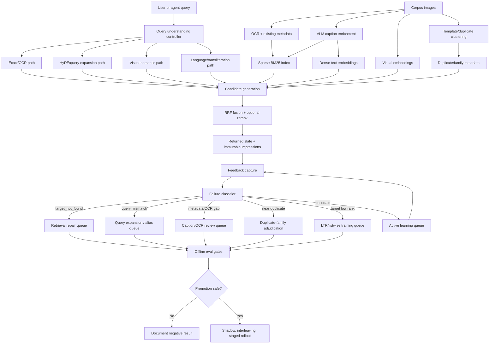

# Meme Search Self-Learning System Plan

**Date:** 2026-04-29
**Status:** research-backed architecture proposal for review
**Scope:** full self-learning loop for local multimodal meme retrieval
**Related docs:** `docs/RLAIF/R2_RETRIEVAL_FIRST_RLAIF_PLAN.md`, `docs/RLAIF/RLAIF_MEMERANK_RESEARCH_PLAN.md`, `docs/experiments/R1_FAILED_RLHF_EXPERIMENT.md`

> Status note, 2026-04-29: this is the broad system architecture. Use `docs/RLAIF/SELF_LEARNING_CANONICAL_PLAN.md` as the single source of truth for implementation.

> Implementation runbook: see `docs/RLAIF/SELF_LEARNING_EXECUTION_PLAN.md` for the self-contained phase plan, file-level deliverables, commands, gates, and first builder prompt.

## Executive Summary

The system should not be framed as "do RLHF until retrieval improves." RLHF/RLAIF is only one possible supervision source. The more correct architecture is a **closed-loop retrieval learning system** with separate loops for observation, diagnosis, repair, training, validation, and guarded rollout.

The core invariant from R1 remains: **a ranker cannot learn to rank an image that candidate generation never shows.** Therefore self-learning must first classify failures before deciding what kind of learning is allowed.

The recommended design has six learning loops:

1. **Observability loop:** log every query, candidate slate, visible metadata, selected result, skipped results, latency, and model version.
2. **Failure-classification loop:** classify each bad search as retrieval miss, query-understanding miss, metadata/caption miss, OCR/language miss, duplicate ambiguity, ranking miss, or UX/presentation miss.
3. **Retrieval-repair loop:** improve candidate generation using VLM captions, HyDE query expansion, BM25/RRF fusion, transliteration, aliases, and metadata repair.
4. **Preference-learning loop:** train rankers only from target-present low-rank examples, never from target-not-found rows.
5. **Active-learning loop:** ask humans or AI judges only for examples with high expected value: uncertain slates, near-duplicates, failures, long-tail languages, and rank disagreements.
6. **Rollout/evaluation loop:** promote changes only through held-out target packs, full-corpus qrels, no-regression gates, blind review, shadow mode, and eventually online interleaving/exploration.

This is compatible with RLHF and RLAIF, but it is broader and safer: **feedback chooses the repair mechanism; it does not automatically create preference pairs.**

## Research Basis

| Area | Evidence | Design consequence |
| --- | --- | --- |
| Relevance feedback and query expansion | The Stanford IR book identifies relevance feedback and query expansion as core ways to handle synonymy and user-query mismatch. | User/AI feedback should update query rewriting, aliases, and retrieval representations, not only ranker weights. |
| Interactive image retrieval | Image retrieval literature treats interactive search as a dialog where feedback refines what the user means, especially when words are insufficient. | The UI should support "more like this", "not this", "same template", "wrong text", "wrong language", and "near duplicate" feedback. |
| Active learning for image retrieval | Human-in-the-loop retrieval can select informative samples for annotation instead of labeling everything. | The system should ask for feedback on uncertain/high-impact slates, not random searches. |
| Unbiased LTR | Position bias makes naive click/selection logs unsafe for direct ranker training. Counterfactual LTR requires propensities or controlled logging policy. | Keep deterministic replay metrics separate from online learning claims; use interleaving/exploration only after offline gates pass. |
| HyDE | Hypothetical-document embeddings improve zero-shot dense retrieval across tasks and languages. | Short, vague, Bangla, and romanized prompts should go through query-expansion experiments before ranker training. |
| SimRAG/self-training | Synthetic domain-relevant questions from unlabeled corpora can improve specialized-domain RAG by `1.2%--8.6%` in reported experiments. | Use AI to generate prompts and qrels-like target checks, but filter and evaluate them as synthetic supervision. |
| Self-RAG / iterative self-feedback | Retrieval systems can learn when to retrieve, critique retrieved content, and avoid fixed retrieval behavior. | Add a controller that decides whether to use exact-text, HyDE, visual, OCR, or expanded search paths. |
| Multimodal self-adaptive RAG | Multimodal RAG benefits from dynamic filtering and verification of retrieved documents, including image captions. | Meme search should verify candidate quality with multimodal judge/audit tools before using labels for training. |
| VeCLIP / VLM captions | VLM-enriched captions improve image-text retrieval in published CLIP training settings. | Generate structured meme captions and search aliases as additive indexed metadata. |
| Promptagator/InPars | Few-shot LLM-generated synthetic queries can train or evaluate retrievers efficiently. | Use target-image prompt generation for test packs and prompt balance, but avoid overfitting to one generator family. |
| RankGPT/listwise reranking | Listwise LLM reranking and distillation are stronger serving-reranker candidates than tiny tabular pairwise models. | If reranking remains needed, evaluate listwise LLM reranking offline before another pairwise logistic serving attempt. |

## System Architecture



## Data Model: What The System Must Remember

The learning system needs immutable evidence before it can improve safely.

Required event tables/artifacts:

| Record | Purpose |
| --- | --- |
| `search_session` | query text, normalized query, query language, controller decisions, user/session hash, timestamp |
| `search_impression` | every shown candidate, base rank, scores, metadata versions, ranker version, caption version |
| `feedback_judgment` | select/reject/none_correct/too_literal/wrong_language/wrong_template/near_duplicate |
| `target_outcome` | target ID present/absent, target rank, bucket, deterministic or judged provenance |
| `failure_case` | classified root cause and repair recommendation |
| `caption_enrichment` | versioned VLM captions, aliases, language, visible text, model fingerprint, review status |
| `query_expansion` | HyDE text, generated aliases, language/transliteration variants, model fingerprint |
| `training_snapshot` | immutable set of examples used for any model/adaptor/ranker |
| `eval_report` | base vs candidate metrics, gates, deltas, failures, artifact manifest |

Non-negotiable provenance:

- every AI-generated label has model, endpoint, prompt version, timestamp, and source inputs
- every learned artifact points to an immutable training snapshot
- raw artifacts remain uncommitted, but summarized markdown tables are committed
- no production mutation happens without an eval report and rollback path

## Feedback Types And What They Are Allowed To Do

| Feedback signal | Example | Allowed learning action | Forbidden action |
| --- | --- | --- | --- |
| `select_best` | user picks one returned meme | create pairwise/listwise ranking examples if target was shown | treat unseen images as losers |
| `none_correct` | user says no result is right | create retrieval/query failure case | create arbitrary ranker pairs |
| `wrong_language` | prompt was Bangla, result English | add language-routing/transliteration repair case | penalize all returned images blindly |
| `wrong_text` | meme text mismatch | improve OCR/BM25/caption path | tune visual embedding only |
| `wrong_template` | same topic, wrong meme format | update template/family labels | mark image globally bad |
| `near_duplicate` | visually similar but not exact target | route to duplicate cluster/human adjudication | let AI judge alone decide identity |
| `good_but_not_best` | acceptable alternative | graded relevance label | binary loser pair against exact target |
| `query_rewrite_accepted` | expanded query found target | train/evaluate query controller | directly overwrite user's original query semantics |
| `click/no-click` | passive interaction | logged for future OPE only | naive ranker training without propensity |

## Learning Loops

### Loop 1: Retrieval Repair

Trigger:

```text
target_not_found
target_in_top_100_not_20
none_correct
exact_text miss outside top10
```

Actions:

- inspect OCR/caption/tag fields
- generate VLM caption candidates
- add reviewed aliases/transliterations
- improve query normalization
- increase or route candidate depth
- add sparse/BM25/RRF path
- add qrel/eval case

Promotion gate:

```text
target pickup@10/@20/@100 improves or is preserved
top_1_hit_rate does not regress
exact_text misses outside top10 remain zero
language-specific failures decrease
```

### Loop 2: Query Learning

Trigger:

```text
short prompt
vague semantic prompt
Bangla or romanized Bangla
prompt where HyDE or rewrite finds target and base does not
```

Actions:

- generate HyDE hypothetical meme caption
- generate transliteration variants
- generate alternate phrasings
- choose retrieval path with a controller
- cache successful query expansions

Training candidates:

- supervised query-controller labels: `exact`, `hyde`, `visual`, `hybrid`, `language`
- preference over query rewrites when multiple expansions are tried
- rejected rewrites become negative controller examples

Serving gate:

```text
exact_text behavior preserved
HyDE improves short/sloppy and multilingual target packs
latency/cost acceptable with cache
controller can fall back to base search
```

### Loop 3: Index Learning

Trigger:

```text
metadata_gap
OCR_gap
caption_gap
template/family ambiguity
language mismatch
```

Actions:

- VLM caption enrichment
- visible text correction
- Bangla script and romanization aliases
- template/family labels
- emotion/use-case labels
- search aliases from user-like prompts

Rules:

- additive metadata first
- reviewed sample before full index use
- versioned captions
- no destructive overwrite of source OCR without explicit repair record

Serving gate:

```text
caption index improves held-out target pickup
does not increase false positives for exact-text queries
near-duplicate confusion measured separately
```

### Loop 4: Rank Learning

Trigger:

```text
target_found_low_rank
multiple relevant candidates need ordering
user repeatedly selects same target below rank 1
```

Eligible examples:

```text
target_in_top_10_not_1
target_in_top_20_not_10
graded relevance alternatives
```

Ineligible examples:

```text
target_not_found
uncertain
prompt_bad
AI-only near_duplicate
rank1-only success without downweighting
```

Model sequence:

1. current Phase 0 baseline
2. heuristic feature reweighting
3. LambdaMART/listwise baseline
4. listwise LLM reranker over top-20
5. distillation from listwise LLM rankings
6. only then adapter/LoRA experiments

Promotion gate:

```text
non-overlap top_1_hit_rate >= base
non-overlap MRR >= base
non-overlap nDCG@10 >= base
Recall@10 regression <= 1pp
exact_text misses outside top10 = 0
blind changed-ranking review passes
latency p95 budget passes
```

### Loop 5: Active Learning

Goal: reduce annotation cost and avoid labeling easy cases.

Ask for human/AI labels when:

- target is found at ranks 2-20
- top candidates are near-duplicates
- model paths disagree
- query controller is uncertain
- exact/fuzzy/multilingual buckets are underrepresented
- changes affect promotion gates

Do not ask for labels when:

- target is confidently rank 1 and no change is proposed
- target is absent and root cause is obvious metadata failure
- the same target/template has already hit its sample cap

Active-learning score:

```text
value = uncertainty + expected_metric_impact + bucket_undercoverage + novelty - duplicate_penalty - labeling_cost
```

### Loop 6: Online Learning / Exploration

Online learning is the last step, not the first.

Allowed only after offline gates pass:

- shadow scoring
- team-draft interleaving between base and candidate
- tiny randomized swaps in ranks 4-8
- propensities logged for every exposure
- exact-text and safety-critical queries excluded initially

Not allowed before controlled exploration:

- claims of unbiased IPS/SNIPS/DR-OPE
- training directly from uncorrected click logs
- changing top-1 result in production without gates

## Candidate Algorithms By Layer

| Layer | First choice | Research branch |
| --- | --- | --- |
| Query expansion | HyDE + transliteration + controlled rewrite templates | train query-controller model |
| Sparse retrieval | BM25 over OCR/caption/aliases | learned sparse retriever/SPLADE |
| Dense retrieval | BGE-M3 over captions/query/HyDE | low-rank adapter with strict gates |
| Visual retrieval | existing SigLIP/VLM embeddings | crop/object-region retrieval |
| Fusion | RRF `k=60` | learned fusion after RRF baseline |
| Rerank | current Jina/safe rerank slices | listwise LLM rerank + distillation |
| Feedback learning | rank-bucket filtered LTR | DPO/KTO/ORPO only for query/judge/generative components |
| Judge | deterministic ID + multimodal AI audit | multi-judge consensus + human adjudication |

## Milestones

### M0: Stabilize Observability

Deliver:

- complete search/impression/judgment/failure-case logging
- metadata version fields in every impression
- artifact manifest for every run
- fixed rank-bucket report: `target_found` counted correctly, categories normalized

Exit gate:

- every query can be replayed with the exact metadata/model versions used

### M1: Failure Taxonomy And Dashboards

Deliver:

- `failure_case` schema
- deterministic classifier for known outcomes
- markdown summary by failure class, language, prompt type, and target rank
- active-learning queue generator

Exit gate:

- bad searches produce repair instructions instead of generic "train ranker" labels

### M2: Retrieval-First Improvements

Deliver:

- HyDE offline ablation
- BM25/RRF offline ablation
- 100-image VLM caption pilot
- target-pack replay for each variant

Exit gate:

- at least one candidate-generation variant improves a target-pack slice without exact-text regression

### M3: Caption And Query Learning

Deliver:

- versioned caption enrichment table/artifacts
- reviewed caption sample
- query-controller logs
- successful query expansion cache

Exit gate:

- improved candidate pickup on short/sloppy, semantic, Bangla/mixed, and exact-text subsets

### M4: Active Learning Workflow

Deliver:

- active-learning sampler
- OWUI feedback controls beyond select/reject
- AI-agent labeling harness with provenance
- human review packet for uncertain/near-duplicate examples

Exit gate:

- labels are concentrated in high-value buckets, not rank-1 successes

### M5: Offline Rank/Policy Learning

Deliver:

- target-present-only LTR dataset
- LambdaMART/listwise LLM reranker baselines
- no target-not-found pairs
- full-corpus and non-overlap verification

Exit gate:

- candidate ranker improves held-out top-rank metrics or remains offline-only with documented negative result

### M6: Shadow And Interleaving

Deliver:

- shadow scoring reports
- team-draft interleaving implementation
- exploration policy with propensities
- rollback flags

Exit gate:

- real user/AI feedback shows candidate wins without harming exact-text or latency

### M7: Continuous Learning Governance

Deliver:

- weekly experiment report template
- promotion checklist
- model/data cards for each artifact
- stale-model rollback policy
- paper tables generated from markdown summaries

Exit gate:

- the system can improve, reject, or rollback changes with reproducible evidence

## Concrete Next Implementation Sequence

1. Fix existing R2 report correctness:
   - count `target_found` as found
   - normalize prompt categories
   - add stratified sample builder
2. Add `failure_case` records:
   - schema migration or artifact schema first
   - classify target-not-found, low-rank, near-duplicate, wrong-language, prompt-bad
3. Build HyDE offline A/B:
   - generate through LiteLLM gateway
   - compare base vs HyDE on existing 10% sample and stratified sample
4. Build BM25/RRF baseline:
   - local sparse index over OCR/captions/aliases
   - RRF fuse with current dense/visual results
5. Build VLM caption pilot:
   - 100 images from train/holdout mix
   - generate structured captions through LiteLLM multimodal gateway
   - evaluate additive-caption retrieval
6. Build active-learning queue:
   - rank 2-20 cases
   - path-disagreement cases
   - undercovered categories
   - near-duplicate cases
7. Only after those, revisit ranker training:
   - train only on target-present low-rank examples
   - compare LambdaMART and listwise LLM rerank
   - reject on any full-corpus regression

## Evaluation Plan

Every candidate change gets three reports:

1. **Candidate-generation report**
   - pickup@10/@20/@50/@100
   - target-not-found rate
   - median target rank
   - exact-text misses outside top10
   - language/prompt-category slices

2. **Ranking report**
   - top_1_hit_rate
   - MRR
   - nDCG@10
   - changed top result count
   - worse-query examples

3. **Learning-system report**
   - failure-class distribution
   - active-learning queue composition
   - label provenance
   - model/caption/query-expansion versions
   - promotion decision and rollback path

Promotion requires:

```text
base metrics preserved on full corpus
non-overlap metrics preserved
exact-text remains safe
latency budget passes
negative examples reviewed
raw artifacts summarized in markdown
rollback env/config documented
```

## Paper Framing

The publishable contribution should not be "we used RLHF for meme search." A stronger framing is:

```text
We study self-improvement in local multimodal meme retrieval. A first preference-reranking loop failed despite successful pairwise training, showing that retrieval failures and ranking failures must be separated. We then propose a retrieval-first self-learning architecture that uses AI and human feedback to choose among query expansion, index enrichment, sparse/dense fusion, active learning, and guarded rank learning.
```

Potential claims after implementation:

- R1 negative result: preference-only ranker degraded top-rank quality.
- R2 protocol: failure-classified feedback avoids invalid ranker training.
- Retrieval-first learning: caption/query/fusion repairs improve candidate generation more safely than naive ranker updates.
- Governance: no-regression gates and artifact summaries make self-learning reproducible.

## Open Questions For Review

1. Should the first implementation target be HyDE or VLM caption enrichment?
2. Should `failure_case` live in Postgres immediately, or start as versioned JSONL artifacts?
3. What minimum human audit is required before AI-generated captions become searchable metadata?
4. Should active learning be exposed in OWUI now, or first as an offline queue?
5. Is listwise LLM reranking worth testing before BM25/RRF and caption enrichment are complete?
6. How should near-duplicate meme families be represented: perceptual hash clusters, template IDs, or manual canonical groups?
7. What latency budget is acceptable for self-learning features in live search versus offline/shadow mode?

## Sources

- Relevance feedback and query expansion: https://nlp.stanford.edu/IR-book/html/htmledition/relevance-feedback-and-query-expansion-1.html
- Interactive image retrieval survey: https://link.springer.com/article/10.1007/s13735-012-0014-4
- Human-in-the-loop image search: https://arxiv.org/abs/1809.08714
- Unbiased LTR with biased feedback: https://arxiv.org/abs/1608.04468
- HyDE: https://arxiv.org/abs/2212.10496
- SimRAG: https://aclanthology.org/2025.naacl-long.575/
- Self-RAG: https://arxiv.org/abs/2310.11511
- RA-ISF: https://arxiv.org/abs/2403.06840
- SAM-RAG: https://arxiv.org/abs/2410.11321
- VeCLIP: https://arxiv.org/abs/2310.07699
- Promptagator: https://openreview.net/forum?id=gmL46YMpu2J
- RankGPT: https://arxiv.org/abs/2304.09542
- Reciprocal Rank Fusion: https://cormack.uwaterloo.ca/cormacksigir09-rrf.pdf
- Gwet/kappa prevalence comparison: https://link.springer.com/article/10.1186/1471-2288-13-61
