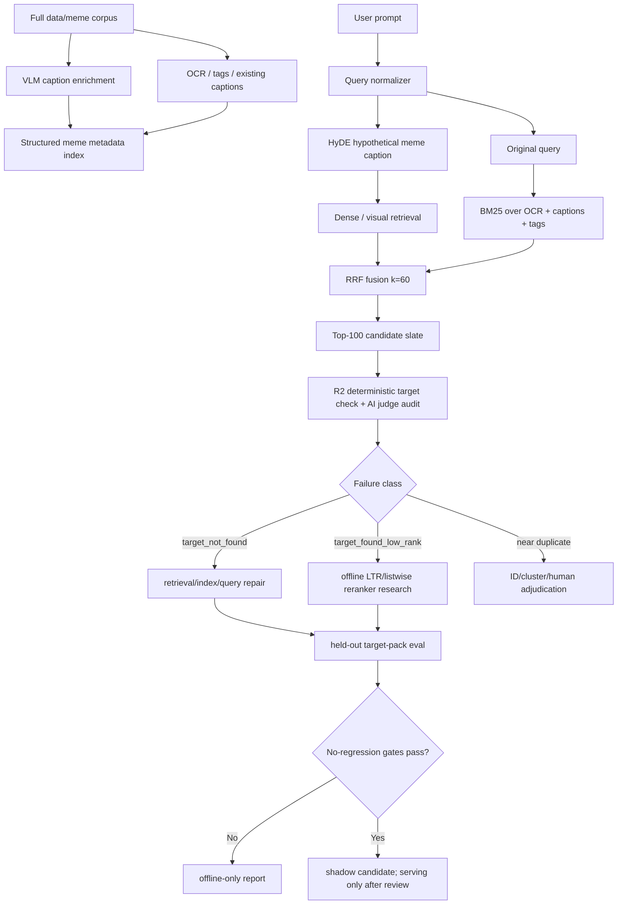

# R2 Retrieval-First RLAIF Plan

**Date:** 2026-04-29
**Owner:** Codex validation pass
**Status:** implementation plan for review
**Related docs:** `docs/RLAIF/RLAIF_MEMERANK_RESEARCH_PLAN.md`, `docs/RLAIF/RLAIF_LITERATURE_REVIEW_AND_PRIORITY_REVISION.md`, `docs/experiments/R1_FAILED_RLHF_EXPERIMENT.md`

> Status note, 2026-04-29: this is the architectural pivot rationale. Use `docs/RLAIF/SELF_LEARNING_EXECUTION_PLAN.md` as the canonical implementation runbook.

## Executive Decision

The literature review supports the user's main steer: R2 should stop treating "more preference pairs for a small ranker" as the primary serving path. R1 already showed that a pairwise ranker can train mechanically while hurting full-corpus top-rank quality. The stronger path is retrieval-first RLAIF:

1. Enrich indexed image metadata with VLM-generated meme captions and structured facets.
2. Add HyDE-style query expansion so short, Bangla, romanized, and vague prompts become richer retrieval inputs.
3. Add BM25-over-OCR/metadata and fuse it with dense retrieval using Reciprocal Rank Fusion.
4. Keep R2 prompt/judge/consensus infrastructure, but use it to evaluate retrieval repairs and caption quality before using it for ranker training.
5. Continue learned ranker work only as an offline research artifact unless full-corpus, overlap-safe no-regression gates pass.

This does not abandon RLAIF. It moves the AI feedback loop to the layer where it can help most: index labels, query interpretation, retrieval-failure diagnosis, and guarded candidate-set repair.

## Literature Validation Matrix

| Claim | Verdict | Evidence | Project implication |
| --- | --- | --- | --- |
| VLM-enriched captions are high leverage | validated, but cite VeCLIP correctly | VeCLIP is `arXiv:2310.07699`, not `2209.11755`; it reports up to `+25.2%` gain on COCO/Flickr30k retrieval under the 12M setting and better data efficiency with 14% of vanilla CLIP's data. | Make caption enrichment the first R2 serving-improvement track. Do not promise VeCLIP's exact gains on memes; measure on target packs. |
| Hybrid sparse+dense retrieval with RRF is robust | validated with measurement caveat | RRF is a simple unsupervised fusion method; the original paper fixed `k=60` and found it consistently improved over individual systems and other fusion methods in tested TREC/LETOR settings. BEIR shows BM25 remains a robust baseline and rerankers/late-interaction models are strong but expensive. | Add BM25 over OCR/captions/tags and fuse with existing dense/visual results via RRF `k=60`; evaluate by prompt class. |
| Permutation self-consistency for judges is right | validated | NAACL 2024 permutation self-consistency reports listwise ranking gains from shuffling and aggregating, including `7-18%` for GPT-3.5 and `8-16%` for LLaMA-2-70B. Position-bias work shows judge bias depends on quality gap, which is severe for near-duplicate memes. | Keep blind candidate IDs, hidden ranks/scores, repeated permutations, and consensus. Never use AI judge consensus alone for near-duplicate identity. |
| Reranker degradation on strong bases is common | validated, but do not overgeneralize | RankGPT and reranker surveys show rerankers can be strong, but generalization varies and novelty/training overlap matter. R1 is consistent with the known risk that rerankers can shuffle a strong first-stage result in harmful ways. | Learned rankers remain disabled by default. Require no-regression on top-1, MRR, nDCG, Recall@10, exact-text misses, and overlap-safe holdouts. |
| HyDE is a major missed opportunity | validated | HyDE generates a hypothetical document from a query, embeds that document, and retrieves real corpus neighbors. It significantly outperforms Contriever and is comparable to fine-tuned retrievers across tasks and languages including `sw`, `ko`, and `ja`. | Add HyDE as a parallel R2 track now. It directly addresses short prompts, Bangla/romanized prompts, and semantic prompts with weak lexical overlap. |
| If serving reranker is needed, switch architecture | validated | RankGPT shows properly instructed LLMs can rank competitively and a distilled 440M model can outperform a 3B supervised model on BEIR. Promptagator shows strong few-shot synthetic-query retriever gains from only 8 examples. | Do not bet serving quality on a 14-feature pairwise logistic model. If reranking is revisited, test listwise LLM reranking or distillation against the same no-regression gates. |
| CLIP/BGE LoRA on 290 pairs is possible but fragile | softened | CLIP-LoRA demonstrates few-shot VLM adaptation, but small, imbalanced supervision is exactly where R1 failed. The cited overfit warning should be treated as a risk, not a guaranteed outcome. | Treat LoRA/adapter tuning as offline-only, very-low-rank, epoch-gated research. Abort on any held-out target-pack regression. |
| Cohen's kappa should not be the only judge audit metric | validated | Gwet AC1/AC2 is less sensitive to prevalence/skew than kappa in skewed agreement settings. R2 labels are skewed because most sampled prompts find the target at rank 1. | Add Gwet AC2 plus rank correlation and position-consistency metrics to `consensus.py:summarize-audit`. |
| Drop 200/category prompt floors | mostly validated | Promptagator succeeded from 8 real examples per task, and R2's deterministic target IDs are stronger supervision than free-form preference clicks. Large same-family synthetic prompt counts risk overfitting to prompt style. | Change 200/category from hard gate to soft diagnostic target. Use 50-75/category minimum for run readiness, then stratified replay and held-out metrics decide. |
| AI judges should not decide near-duplicate identity | validated | Position-bias findings worsen when candidates are close in quality. Meme near-duplicates are exactly that condition. | Near-duplicate verdicts require deterministic image ID, perceptual-hash/cluster policy, or human review. AI judges can flag candidates, not finalize target identity. |

## Corrected Source Mapping

The pasted source list includes one important mismatch:

- `arXiv:2209.11755` is Promptagator, not VeCLIP.
- VeCLIP is `arXiv:2310.07699`.

This matters because the project should cite Promptagator for few-shot synthetic query generation, and cite VeCLIP for VLM-enriched image-caption/index-label gains.

## Revised R2 Architecture



## New Governing Rule

R2 should optimize the candidate-generation layer first.

```text
target_not_found -> repair index labels, query expansion, OCR, language normalization, candidate depth, or fusion
target_found_low_rank -> only then consider ranker/listwise reranker training
target_at_rank_1 -> stability evidence, not the main training signal
near_duplicate -> deterministic ID/cluster/human adjudication, not AI-only consensus
```

## Implementation Plan

### Track A: VLM Caption Enrichment

Goal: create durable, structured, multi-aspect captions for every indexed image without mutating the original OCR/corpus records blindly.

Add a new reviewed metadata layer:

```text
vidsearch/enrichment/vlm_captioner.py
vidsearch/enrichment/caption_schema.py
vidsearch/enrichment/caption_ingest.py
infra/postgres/004_caption_enrichment.sql
docs/experiments/results/R2_CAPTION_ENRICHMENT_SUMMARY.md
```

Caption schema:

```json
{
  "record_type": "vlm_caption_v1",
  "image_id": "...",
  "source_uri": "...",
  "caption_model": "qwen3-vl-32b-wrapper|qwen3.6-vlm-wrapper",
  "caption_model_family": "qwen-vl",
  "caption_version": 1,
  "visual_summary": "what is visible",
  "meme_template": "known template or unknown",
  "visible_text_transcript": "OCR as seen by VLM",
  "language": "en|bn|mixed|unknown",
  "transliteration": "romanized visible text when applicable",
  "humor_intent": "why this meme is funny or when a user would search for it",
  "entities": ["people", "objects", "characters"],
  "emotions": ["awkward", "angry", "confused"],
  "search_aliases": ["natural user phrases"],
  "safety_notes": [],
  "provenance": {
    "generated_at": "iso timestamp",
    "prompt_version": "caption_prompt_v1",
    "review_status": "raw|sample_reviewed|accepted|rejected"
  }
}
```

Rules:

- Store enriched captions in a separate table and/or versioned metadata artifact first.
- Do not overwrite OCR, raw captions, thumbnails, source paths, or Qdrant vectors in the first pass.
- Index captions as an additive retrieval field only after a sample audit.
- Record caption model family so downstream prompt/judge family-disjoint checks remain possible.

Acceptance:

- At least 100-image pilot with exact target-pack evaluation before full corpus.
- Full-corpus caption run only after the pilot improves or preserves target pickup/top-1.
- Report target pickup@10/@20/@100, top-1, MRR, exact-text misses, Bangla/romanized subset, and near-duplicate errors.

### Track B: HyDE Query Expansion

Goal: expand short/vague/multilingual user prompts into a hypothetical meme caption before dense retrieval.

Add:

```text
vidsearch/query/hyde.py
vidsearch/query/query_expansion.py
tests/test_hyde_query_expansion.py
docs/experiments/results/R2_HYDE_ABLATION_SUMMARY.md
```

HyDE output schema:

```json
{
  "record_type": "hyde_query_v1",
  "query": "find me meme on স্মরণশক্তি দুর্বল হয়ে গেছে",
  "hyde_model": "fast|qwen...",
  "hyde_version": 1,
  "hypothetical_caption": "A Bangla meme where visible text says memory has become weak...",
  "detected_language": "bn",
  "transliteration_variants": ["smoronshokti durbol hoye geche"],
  "expanded_terms": ["memory weak", "forgetfulness", "Bangla meme"],
  "provenance": {
    "gateway_url_env": "LITELLM_URL",
    "generated_at": "iso timestamp"
  }
}
```

Serving policy:

- First run as offline A/B on R2 target prompts.
- For live search, default to shadow logging until it preserves exact-text behavior.
- Disable HyDE for exact visible-text queries if it hurts exact-text retrieval.
- Cache by normalized query hash to control latency.

Evaluation matrix:

| Variant | Description |
| --- | --- |
| base | current Phase 0 retrieval |
| base+HyDE dense | embed hypothetical caption and fuse with original dense query |
| base+HyDE sparse | add HyDE text to sparse/BM25 query |
| base+HyDE hybrid | dense + sparse + visual fused |

Acceptance:

- No exact-text misses outside top 10.
- Improvement on short/sloppy, Bangla/mixed, and semantic prompts.
- Latency budget documented separately for cold-cache and warm-cache paths.

### Track C: BM25 + Dense + Visual RRF

Goal: recover OCR/exact-text and lexical cues that dense embeddings miss.

Add:

```text
vidsearch/query/bm25_index.py
vidsearch/query/rrf.py
tests/test_rrf_fusion.py
docs/experiments/results/R2_HYBRID_RRF_SUMMARY.md
```

Candidate lists:

- BM25 over OCR text, VLM visible text, transliteration, tags, aliases.
- BGE-M3 dense over query/HyDE/captions.
- SigLIP visual retrieval where the query can map to visual concepts.
- Existing reranker slice, if enabled, only after candidate generation.

Fusion:

```text
RRFscore(image) = sum(1 / (60 + rank_in_system))
```

Do not use learned fusion until RRF baselines are measured.

Acceptance:

- Report BM25-only, dense-only, visual-only, RRF, and current Phase 0.
- Report by prompt category and language.
- Do not claim hybrid is better unless meme target-pack metrics show it.

### Track D: R2 Judge/Audit Tightening

Goal: keep the strong R2 methodology, but align it with the new retrieval-first target.

Required changes:

- `consensus.py:summarize-audit`: add Gwet AC2, Spearman/Kendall rank correlation, position consistency, false-positive target-found rate, and near-duplicate disagreement rate.
- `rank_bucket_report.py`: count both `target_found` and `found_selected`; normalize legacy prompt categories into canonical exact/fuzzy/semantic/mixed groups.
- Prompt floors: change hard `200/category` language in docs/runbooks to `50-75/category soft readiness target`; final gates are held-out metrics and bucket health.
- Near duplicates: route `near_duplicate_found` to `duplicate-family-adjudication-required`, not promotion-quality labels.
- Add stratified replay builder so 10% diagnostics are category-balanced instead of prefix-biased.

Acceptance:

- Judge audit report can be used as paper evidence without relying on Cohen's kappa alone.
- No AI-only near-duplicate label can enter serving-ranker training.
- 10% and full replays produce accurate found/missing summaries.

### Track E: Offline Ranker Research Only

Goal: preserve R2 LTR work as paper material and only promote if it beats the strong base.

Keep:

- Pairwise logistic v2.
- LambdaMART/XGBoost baseline.
- Post-RLHF verifier with overlap and without-overlap blocks.
- Target-grouped splits.
- No target-not-found pairs.

Add if serving reranker remains a goal:

- Listwise LLM reranker experiment over top-20 candidates.
- Permutation self-consistency for listwise ranking.
- Optional distillation dataset from accepted listwise rankings.

Promotion remains blocked unless:

```text
non-overlap top_1_hit_rate >= base
non-overlap MRR >= base
non-overlap nDCG@10 >= base
Recall@10 regression <= 1pp
exact_text misses outside top10 = 0
latency p95 increase < 50ms
blind changed-ranking review passes
```

## Revised Priority Order

| Priority | Work | Why now | Default posture |
| --- | --- | --- | --- |
| 1 | VLM caption enrichment pilot | strongest literature-backed lever for image-text retrieval; directly repairs index labels | offline pilot, then additive index field |
| 2 | HyDE query expansion | zero-shot, multilingual, low implementation cost, attacks known Bangla/short-prompt failures | offline A/B, then shadow |
| 3 | BM25/RRF hybrid retrieval | robust sparse+dense baseline and exact-text safety net | offline A/B, then candidate generator |
| 4 | R2 audit fixes | needed for publishable judge evidence and correct 10% diagnostics | implement before next large replay |
| 5 | Full stratified R2 replay | measure after retrieval changes, not before | no ranker training until bucket health passes |
| 6 | LoRA/adapter experiment | possible but fragile with 290 targets | research-only, abort on regression |
| 7 | Listwise LLM reranker/distillation | better model family if reranking remains necessary | research/shadow only |

## Immediate Next Tasks

1. Patch R2 diagnostics:
   - fix found-count handling in `rank_bucket_report.py`
   - normalize prompt categories for gates
   - add a stratified prompt sampler
2. Implement HyDE in offline mode:
   - generate HyDE captions through LiteLLM gateway only
   - replay the 157-row 10% sample as `base` vs `base+HyDE`
   - write `docs/experiments/results/R2_HYDE_ABLATION_SUMMARY.md`
3. Implement RRF utility and BM25 pilot:
   - index OCR/caption text for a local sparse retriever
   - compare BM25-only, dense-only, current, and RRF
4. Build 100-image VLM caption pilot:
   - use the LiteLLM multimodal model through the gateway
   - write captions to artifact JSONL and summarized markdown
   - do not mutate production metadata or Qdrant until pilot passes
5. Update R2 docs:
   - revise `RLAIF_MEMERANK_RESEARCH_PLAN.md` and protocol docs to mark reranker work as offline/paper-first
   - lower prompt floors in docs to soft 50-75/category readiness targets
   - add Gwet AC2 and near-duplicate adjudication rules

## Research Claims Allowed After This Plan

Allowed:

- "R1 showed preference reranking can degrade full-corpus ordering despite successful pairwise training."
- "R2 shifts AI feedback from ranker-first to retrieval/index enrichment first."
- "VeCLIP, HyDE, RRF, Promptagator, and RankGPT motivate the new priority order."
- "All gains must be measured on the meme corpus; external paper deltas are priors, not project results."

Not allowed:

- "VeCLIP proves we will get +25% on memes."
- "Hybrid retrieval guarantees +15-30% recall here."
- "AI judges are equivalent to human labels."
- "R2 has unbiased OPE/IPS/SNIPS before randomized exploration."
- "Near-duplicate identity is solved by AI consensus."
- "A learned ranker is serving-ready without no-regression gates."

## Source Notes

- VeCLIP: https://arxiv.org/abs/2310.07699
- HyDE: https://arxiv.org/abs/2212.10496
- RankGPT: https://arxiv.org/abs/2304.09542
- Permutation self-consistency: https://aclanthology.org/2024.naacl-long.129/
- Position bias in LLM judges: https://arxiv.org/abs/2406.07791
- Reciprocal Rank Fusion: https://cormack.uwaterloo.ca/cormacksigir09-rrf.pdf
- Promptagator: https://openreview.net/forum?id=gmL46YMpu2J
- BEIR benchmark: https://arxiv.org/abs/2104.08663
- CLIP-LoRA: https://arxiv.org/abs/2405.18541
- Gwet AC1/kappa prevalence comparison: https://link.springer.com/article/10.1186/1471-2288-13-61
- Sentence-Transformers training overview: https://www.sbert.net/docs/sentence_transformer/training_overview.html
