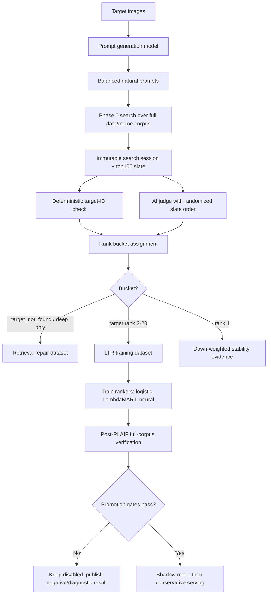

# RLAIF-MemeRank Research Plan

**Project:** `Abbiirr/meme-searcher`  
**Document purpose:** Research-grade plan for the next self-improvement experiment after R1 failed as a serving ranker.  
**Recommended status:** Draft for implementation and paper planning.  
**Core claim:** RLAIF can be useful for meme retrieval only when AI feedback is used to separate retrieval failures from ranking failures, validate judge reliability, and train conservative rerankers under full-corpus no-regression gates.

> Status note, 2026-04-29: this is background research for the earlier R2 plan. Use `docs/RLAIF/SELF_LEARNING_EXECUTION_PLAN.md` as the canonical implementation runbook and `docs/RLAIF/R2_RETRIEVAL_FIRST_RLAIF_PLAN.md` as the architectural pivot rationale.

> 2026-04-29 Codex validation update: after a fresh literature pass, R2 should be treated as **retrieval-first RLAIF**, not ranker-first RLAIF. The detailed revision is in `docs/RLAIF/R2_RETRIEVAL_FIRST_RLAIF_PLAN.md`. The ranker/LTR path remains valid as an offline research branch, but the serving-improvement priority is now VLM caption enrichment, HyDE query expansion, and BM25+dense+visual RRF.

---

## 0. One-sentence experiment thesis

**RLAIF-MemeRank** is an AI-supervised self-improvement loop for local multimodal meme retrieval that uses AI-generated prompts and AI judge feedback to diagnose retrieval failures, improve index/query representations, construct ranker training pairs only when the target image is present in the slate, and gate every learned reranker against held-out full-corpus retrieval metrics.

---

## 1. Why R2 is needed: lessons from R1

R1 attempted an RLHF-style feedback loop for meme retrieval, but the practical implementation was not PPO-first RLHF. It was preference learning / learning-to-rank over returned meme slates. R1 produced useful infrastructure and a valuable negative result:

- Feedback infrastructure worked: search sessions, search impressions, judgments, preference pairs, training snapshots, and ranker artifacts exist.
- The target replay produced `273 found_selected`, `17 target_not_found`, `2675 preference pairs`, and a diagnostic pairwise logistic artifact.
- The target-only ranker preserved `Recall@10 = 0.95` but worsened `top_1_hit_rate` from `0.925` to `0.875` and `MRR` from `0.9333333333` to `0.9125`.
- The learned ranker therefore must stay offline-only.
- The main design correction is: **a ranker cannot learn to rank an image that retrieval never shows.**

R2 should not repeat R1 by producing more prompts and training another pairwise model. R2 must change the supervision protocol, experimental controls, and optimization layer. The next serving-oriented work should target candidate generation and index/query labels before another ranker.

**R2 invariant:**

```text
target_not_found -> retrieval repair only
target_found_but_low_rank -> ranker training
target_at_rank_1 -> down-weighted stability evidence only
near_duplicate -> deterministic ID/cluster or human adjudication, not AI-only consensus
```

R2 retrieval-first additions:

```text
VLM-enriched captions -> additive indexed metadata
HyDE query expansion -> richer dense/sparse query inputs
BM25 + dense + visual RRF -> measured candidate-generation baseline
LTR/listwise rerankers -> offline research branch unless no-regression gates pass
```

---

## 2. Research grounding

### 2.1 RLAIF and AI-generated supervision

Constitutional AI introduced RL from AI Feedback (RLAIF): an AI model can critique, revise, and judge outputs, reducing dependence on human labels while still requiring careful principles and validation. For meme retrieval, the analogous idea is not to let an AI directly optimize a policy, but to use AI models as scalable prompt generators, target-presence judges, and disagreement adjudicators.

**Design consequence:** use AI feedback for scalable supervision, but validate it against deterministic target identity checks and a human audit set before using it for serving-ranker promotion.

### 2.2 LLM-as-judge strengths and weaknesses

LLM-as-judge work shows strong models can approximate human preferences, but also identifies biases such as position bias and verbosity or presentation effects. Later systematic studies show position bias is a real and judge-dependent failure mode.

**Design consequence:** judges must not see original rank, score, image IDs, or answer-leaking filenames. Candidate order must be randomized and repeated. A label is accepted only when it is stable across permutations or consensus judges.

### 2.3 Relevance feedback and learning-to-rank

Classic relevance feedback, including Rocchio-style methods, uses user-marked relevant/non-relevant results to refine retrieval. Clickthrough learning-to-rank converts search sessions into pairwise preferences. Unbiased LTR research shows that implicit feedback is biased by presentation position and needs propensities and counterfactual estimators for strong offline policy claims.

**Design consequence:** immutable search sessions and impressions are necessary. Selection feedback becomes pairwise ranking data only when the target was actually exposed. Propensity and exploration fields should be logged from the start, but IPS/SNIPS/doubly robust claims are invalid until controlled exploration exists.

### 2.4 DPO/KTO/ORPO are research branches, not the first serving path

DPO simplifies preference optimization by avoiding explicit reward-model plus PPO training. KTO can learn from binary desirable/undesirable labels. ORPO folds preference optimization into supervised fine-tuning. These methods are useful for research comparisons, query-rewriter training, AI judge tuning, or generative explanation models. They are not the first production solution for local image retrieval, where the immediate action is to rank existing retrieved images.

**Design consequence:** production uses retrieval repair plus classical/neural LTR. Research exports can support SFT/DPO/KTO/ORPO experiments as secondary branches.

---

## 3. Main research question and hypotheses

### Research question

Can a local multimodal meme retrieval system improve itself using AI-generated feedback while avoiding the R1 failure mode where a learned ranker hurts full-corpus top-result quality?

### Hypotheses

| ID | Hypothesis | Evidence required |
|---|---|---|
| H1 | AI judges can reliably determine whether a target image is present in a retrieved slate. | High agreement with deterministic ID match and a human audit set; low false-positive rate. |
| H2 | Separating retrieval failures from ranking failures improves self-improvement quality. | Retrieval repair improves target pickup; LTR improves only target-present low-rank cases. |
| H3 | AI-enriched index labels and HyDE-style query expansion improve candidate pickup and ordering for short, multilingual, and semantic meme prompts. | Target-pack pickup@10/@20/@100, `top_1_hit_rate`, `MRR`, and exact-text misses improve or preserve baseline. |
| H4 | Multi-judge RLAIF is safer than single-judge RLAIF. | Consensus labels have lower false-positive target selections and better post-RLAIF metrics. |
| H5 | LambdaMART/XGBoost LTR is a stronger baseline than the current pairwise logistic ranker. | LambdaMART beats or matches pairwise logistic on validation/holdout without full-corpus regression. |

---

## 4. Experimental design overview



---

## 5. Data splits

### 5.1 Candidate corpus

Use full `data/meme` as the candidate pool. This remains the real production search space.

### 5.2 Target sets

Create target packs, not just prompt splits:

```text
data/meme_rlhf_train     -> RLAIF training targets
data/meme_rlhf_val       -> validation targets
data/meme_rlhf_holdout   -> held-out target-image benchmark
data/meme_disjoint_holdout -> targets sampled from data/meme, excluding training targets
```

Recommended split for current scale:

```text
Train targets:      180
Validation targets: 45
Holdout targets:    45
Disjoint holdout:   100 from data/meme excluding data/meme_rlhf target IDs
```

### 5.3 Split constraints

Never split by prompt row alone. Split by:

```text
target_id
perceptual/near-duplicate cluster
template family
language class
```

All prompts for one target stay in one split. Near-duplicates or template-family variants stay in one split to reduce leakage.

---

## 6. AI roles

Use at least three roles. Do not let one model family own the whole feedback loop.

| Role | Input | Output | Model requirement |
|---|---|---|---|
| Prompt generator | target image or metadata | natural user prompts | Model family A |
| Primary judge | target image + randomized candidate slate | found/not found, selected candidate, confidence | Model family B |
| Secondary judge | same task with different candidate order | independent judgment | Model family C or B with strict permutation tests |
| Adjudicator | disagreement cases | final label or uncertain | Model family C or human |
| Human auditor | sampled audit set | gold validation labels | human reviewer |

R2 should be considered **RLAIF-assisted**, not fully autonomous, until judge validation passes.

---

## 7. Prompt generation protocol

For each target image, generate 8–12 natural prompts.

Required prompt categories:

| Category | Minimum per OCR-rich target | Notes |
|---|---:|---|
| `exact_text` | 1 | Exact visible text when a user would remember it. |
| `fuzzy_text` | 2 | Partial/incorrect/paraphrased text memory. |
| `semantic_description` | 2 | Situation, meaning, emotion. |
| `mixed_visual_description` | 2 | Visual scene + meaning/template. |
| `short_sloppy` | 1 | Incomplete realistic user wording. |
| `multilingual` | 1 when applicable | Bangla/script/transliteration variants. |

Required prompt schema:

```json
{
  "record_type": "target_prompt_label_v2",
  "target_id": "target-...",
  "prompt_id": "target-...:p03",
  "prompt": "find me that meme about not having friends just people I know",
  "category": "exact_text|fuzzy_text|semantic_description|mixed_visual_description|short_sloppy|multilingual",
  "language": "en|bn|mixed|unknown",
  "uses_visible_text": true,
  "expected_difficulty": "easy|medium|hard",
  "operator_model": "model-family-hidden-id",
  "operator_role": "prompt_generator",
  "source_modality": "image|metadata|image_plus_metadata",
  "rationale": "The visible meme text is likely what a user remembers."
}
```

Prompt generation rejection rules:

- Reject prompts containing filename, path, target ID, image ID, SHA, or database metadata.
- Reject prompts that are academic image captions rather than user searches.
- Reject prompts with no plausible path to the target.
- Reject prompt files that do not meet per-intent minimums.

R2 prompt-file readiness target:

```text
exact_text >= 50-75 prompts
fuzzy_text >= 50-75 prompts
semantic_description >= 50-75 prompts
mixed_visual_description >= 50-75 prompts
multilingual/Bangla coverage present when target OCR indicates Bangla
```

These are soft readiness targets, not serving-promotion gates. External evidence from Promptagator supports useful synthetic-query learning from very small real-example counts; over-generating same-family prompts can create synthetic style overfit. Final readiness is decided by stratified replay, rank buckets, held-out target-pack metrics, and full-corpus no-regression gates.

---

## 8. Search replay protocol

For every generated prompt:

1. Run Phase 0 search over the full `data/meme` index.
2. Request `top_k = 100`.
3. Log `feedback.search_sessions` and `feedback.search_impressions`.
4. Do not pass target image, target ID, target path, or target text to retrieval.
5. Store the returned slate as a replay artifact.

R2 must preserve the candidate-depth invariant:

```python
rerank_cap = max(requested_limit, configured_intent_cap)
```

Any violation invalidates target-not-found claims.

---

## 9. AI judge protocol

### 9.1 Judge input

The judge sees:

```text
- Target image
- Query prompt
- Candidate thumbnails
- Candidate OCR/caption excerpts
- Candidate rank-hidden labels such as C01, C02, ...
```

The judge must not see:

```text
- original retrieval rank
- retrieval score
- rerank score
- learned score
- image_id
- filename/path if it leaks the answer
```

### 9.2 Candidate randomization

Each judge sees the slate twice, with different candidate orders.

Accept an item-level label only if:

```text
same target candidate selected across both permutations
confidence >= 0.70
verdict is not uncertain
```

### 9.3 Judge output schema

```json
{
  "record_type": "ai_target_judgment_v1",
  "prompt_id": "target-...:p03",
  "target_id": "target-...",
  "judge_model": "judge-family-hidden-id",
  "judge_role": "primary|secondary|adjudicator",
  "candidate_order_seed": 381927,
  "verdict": "exact_target_found|near_duplicate_found|semantically_relevant_but_not_target|not_found|prompt_bad|uncertain",
  "selected_candidate_index": 7,
  "selected_candidate_blind_id": "C07",
  "confidence": 0.82,
  "evidence": {
    "visual_match": 0.91,
    "ocr_match": 0.75,
    "semantic_match": 0.88,
    "template_match": 0.69
  },
  "short_reason": "Candidate C07 has the same layout, OCR content, and visual subject as the target."
}
```

---

## 10. Label mapping and buckets

### 10.1 Deterministic target-ID rule

If exact `target_image_id` is available, deterministic ID match is the strongest target-found label.

```text
target_image_id in slate -> target present
target_image_id absent from top100 -> target not retrieved, unless AI judge identifies validated near-duplicate
```

AI judges are used mainly for:

```text
near-duplicate flagging for later deterministic/human adjudication
semantic false positives
prompt quality
ambiguous template-family cases
```

AI judge consensus alone must not finalize near-duplicate target identity. Near-duplicate labels need deterministic image ID, perceptual-hash/cluster policy, or human review.

### 10.2 Rank buckets

Every prompt-slate outcome must be bucketed:

| Bucket | Meaning | Use |
|---|---|---|
| `target_at_rank_1` | Baseline solved it | Down-weighted stability evidence only. |
| `target_in_top_10_not_1` | Strong ranking-improvement case | Strong LTR training signal. |
| `target_in_top_20_not_10` | Medium ranking-improvement case | Medium LTR signal. |
| `target_in_top_100_not_20` | Weak candidate generation / deep recall | Retrieval repair + weak diagnostic only. |
| `target_not_in_top_100` | Retrieval failure | Retrieval repair only. |
| `prompt_bad` | Bad/generated prompt | Exclude. |
| `near_duplicate_confusion` | Duplicate/template ambiguity | Duplicate-family policy or adjudication. |
| `uncertain` | Judge/model disagreement | Exclude from serving-ranker training. |

---

## 11. Training datasets

### 11.1 Retrieval repair dataset

All `target_not_in_top_100`, `target_in_top_100_not_20`, and diagnosed false-miss cases produce retrieval-repair records.

```json
{
  "record_type": "retrieval_failure_v1",
  "prompt_id": "...",
  "target_id": "...",
  "target_image_id": "...",
  "failure_bucket": "target_not_in_top_100",
  "target_ocr_redacted": "...",
  "target_caption_redacted": "...",
  "returned_top_images": ["blind_id_or_image_hashes"],
  "diagnosis": "ocr_gap|caption_gap|transliteration_gap|query_language_gap|duplicate_confusion|visual_embedding_gap|candidate_depth_gap",
  "recommended_repair": "add alias|repair OCR|add transliteration|increase candidate depth|caption update|add qrel"
}
```

These records do not create preference pairs.

### 11.2 LTR training dataset

Only use:

```text
target_in_top_10_not_1
target_in_top_20_not_10
```

Optionally include rank-1 examples at very low weight for stability.

Pair construction:

```text
winner = selected target impression
losers = shown non-target impressions
```

Pair weights:

| Case | Weight |
|---|---:|
| Target below wrong candidates ranked above it | 1.0 |
| Target above wrong candidates ranked below it | 0.3 |
| Target already rank 1 | 0.05–0.10 |
| Target rank 11–20 | 0.5 |
| Near-duplicate accepted | 0.5 |
| AI judge confidence < 0.7 | exclude or <= 0.2 |
| Judge disagreement | exclude |

Training caps:

```text
rank1_effective_pair_share <= 0.30
max_pairs_per_target_id <= 30
max_pairs_per_template_cluster <= 300
min_valid_rank_2_to_20_judgments >= 100
min_valid_rank_2_to_10_judgments >= 50
min_exact_text_judgments >= 50
min_fuzzy_text_judgments >= 50
min_semantic_description_judgments >= 50
min_mixed_visual_description_judgments >= 50
```

---

## 12. Judge validation experiment

Before using AI labels for serving-ranker training, validate the judge.

### 12.1 Human audit set

Sample:

```text
200 prompt-slate examples
50 exact_text
50 fuzzy_text
50 semantic_description
50 mixed_visual_description
```

Each receives:

```text
deterministic target ID label
AI judge label
human label
```

### 12.2 Judge validation metrics

Report:

```text
AI-human agreement
inter-AI agreement
Gwet AC2
Spearman/Kendall rank correlation for ordering tasks
false positive target-found rate
false negative target-found rate
near-duplicate adjudication accuracy
position consistency across randomized order
uncertain rate
```

Cohen's kappa or Krippendorff's alpha may be reported as secondary metrics, but they should not be the sole audit statistic because R2's found/not-found distribution is skewed.

### 12.3 Label-use thresholds

AI labels can enter serving-ranker training only if:

```text
AI-human agreement >= 0.85 on exact target found/not found
false positive target-found rate <= 0.03
position consistency >= 0.95
uncertain rate <= 0.15
```

If thresholds fail, AI labels are diagnostic only.

---

## 13. Models to train

### 13.1 Required baselines

| Model | Purpose |
|---|---|
| Phase 0 order | Required baseline. |
| Retrieval repair only | Measures whether recall repair alone improves results. |
| Existing pairwise logistic | Continuity with R1. |
| LambdaMART / XGBoost LTR | Strong tabular LTR baseline. |
| Neural pointwise scorer | Simple neural comparator. |
| Pairwise/listwise multimodal reranker | Main research model if enough data exists. |
| Oracle reranker | Upper bound if target is in slate. |

### 13.2 Recommended model sequence

```text
M0 Phase 0 baseline
M1 retrieval repair only
M2 pairwise logistic v2
M3 LambdaMART / XGBoost LTR
M4 neural pairwise/listwise reranker
M5 optional DPO/KTO/ORPO research branch for judge/query-rewriter/generative components
```

Do not make DPO/PPO the first serving path.

---

## 14. Evaluation protocol

### 14.1 Candidate-generation metrics

```text
Recall@10
Recall@20
Recall@50
Recall@100
target pickup rate
median target rank
target_not_found rate
```

Report all metrics per:

```text
intent
language
target split
template family
seen/unseen target family
```

### 14.2 Final-ranking metrics

```text
top_1_hit_rate
MRR
nDCG@10
selected-image MRR
pairwise holdout accuracy
position-only baseline lift
template diversity@10
```

### 14.3 Judge metrics

```text
AI-human agreement
inter-AI agreement
position consistency
false positive found rate
false negative found rate
uncertain rate
near-duplicate disagreement rate
```

### 14.4 Promotion gates

A learned ranker is serving-ready only if all pass:

```text
non-overlap heldout top_1_hit_rate >= base
non-overlap heldout MRR >= base
non-overlap heldout nDCG@10 >= base
Recall@10 no worse than base by > 1 percentage point
exact_text no misses outside top10
latency p95 increase < 50 ms
no top-image collapse
blind changed-ranking review accepted
promotion_approved = true
```

---

## 15. Counterfactual evaluation and exploration

Do not claim unbiased OPE before exploration. R2 can log propensities and randomized order for judges, but online ranking policy OPE requires a known exposure policy.

Exploration should start only after offline gates pass:

```text
VIDSEARCH_EXPLORATION_RATE=0.02
ranks 4-8 only
one swap max
never change ranks 1-3
disable exploration on exact_text
store propensity and exploration policy
```

Then evaluate:

```text
IPS
SNIPS
doubly robust OPE
team-draft interleaving win rate
```

Until that stage, report deterministic replay and shadow metrics only.

---

## 16. R2 run plan

### Step 0: freeze R1

Commit the R1 negative-result report and use it as the baseline motivation.

### Step 1: build target packs

```powershell
python -m vidsearch.feedback.target_benchmark build-target-pack `
  --folder data/meme_rlhf `
  --output artifacts/feedback_targets/r2_target_pack.jsonl
```

```powershell
python -m vidsearch.feedback.target_benchmark build-disjoint-holdout-pack `
  --training-pack artifacts/feedback_targets/r2_target_pack.jsonl `
  --output artifacts/feedback_targets/r2_disjoint_holdout_pack.jsonl `
  --limit 100
```

### Step 2: generate balanced prompts

```powershell
python -m vidsearch.feedback.target_benchmark generate-prompts-metadata-gateway `
  --pack artifacts/feedback_targets/r2_target_pack.jsonl `
  --output artifacts/feedback_targets/r2_prompts.jsonl `
  --model fast `
  --gateway-url $env:LITELLM_URL `
  --prompts-per-image 8 `
  --batch-size 8 `
  --resume
```

### Step 3: validate prompt balance

Stop if per-intent prompt floors are not met.

### Step 4: run search replay

```powershell
python -m vidsearch.feedback.target_benchmark run-target-searches `
  --pack artifacts/feedback_targets/r2_target_pack.jsonl `
  --prompts artifacts/feedback_targets/r2_prompts.jsonl `
  --output artifacts/feedback_targets/r2_results_top100.jsonl `
  --misses-output artifacts/feedback_targets/r2_target_not_found.jsonl `
  --client-session-prefix rlaif-r2-search `
  --operator search-runner `
  --api-base-url http://127.0.0.1:18000 `
  --top-k 100 `
  --replace-prefix
```

### Step 5: judge slates

```powershell
python -m vidsearch.feedback.ai_judge judge-target-slates `
  --pack artifacts/feedback_targets/r2_target_pack.jsonl `
  --results artifacts/feedback_targets/r2_results_top100.jsonl `
  --output artifacts/feedback_targets/r2_ai_judgments_model_a.jsonl `
  --judge-model <judge-model-a> `
  --shuffle-candidates `
  --repeat-permutations 2
```

Repeat with model B.

### Step 6: consensus

```powershell
python -m vidsearch.feedback.ai_judge consensus `
  --judgments artifacts/feedback_targets/r2_ai_judgments_model_a.jsonl `
  --judgments artifacts/feedback_targets/r2_ai_judgments_model_b.jsonl `
  --output artifacts/feedback_targets/r2_consensus_labels.jsonl
```

### Step 7: rank-bucket report

```powershell
python -m vidsearch.feedback.rank_bucket_report `
  --results artifacts/feedback_targets/r2_results_top100.jsonl `
  --judgments artifacts/feedback_targets/r2_consensus_labels.jsonl `
  --pack artifacts/feedback_targets/r2_target_pack.jsonl `
  --output artifacts/feedback_targets/r2_rank_buckets.json
```

Stop if ranking-improvement examples are insufficient.

### Step 8: apply eligible labels

```powershell
python -m vidsearch.feedback.target_benchmark apply-consensus-labels `
  --results artifacts/feedback_targets/r2_results_top100.jsonl `
  --labels artifacts/feedback_targets/r2_consensus_labels.jsonl `
  --client-session-prefix rlaif-r2-train `
  --eligible-buckets target_in_top_10_not_1,target_in_top_20_not_10 `
  --rank1-weight 0.05 `
  --replace-prefix
```

### Step 9: train rankers

```powershell
python -m vidsearch.feedback.train_ranker `
  --output artifacts/feedback_rankers/r2_pairwise_logistic.json `
  --client-session-prefix rlaif-r2-train `
  --rank1-weight 0.05 `
  --approve-promotion `
  --p0-g4-passing
```

```powershell
python -m vidsearch.feedback.train_lambdamart `
  --client-session-prefix rlaif-r2-train `
  --output artifacts/feedback_rankers/r2_lambdamart.json
```

### Step 10: verify

```powershell
python -m vidsearch.feedback.post_rlhf_verify `
  --artifact artifacts/feedback_rankers/r2_pairwise_logistic.json `
  --queries vidsearch/eval/queries_memes.yaml `
  --output artifacts/feedback_eval/r2_pairwise_logistic_post_rlhf.json `
  --limit 100
```

Repeat for LambdaMART and any neural ranker.

---

## 17. Paper structure

Working title:

```text
RLAIF-MemeRank: AI-Supervised Self-Improvement for Local Multimodal Meme Retrieval
```

Contributions:

1. A self-improving retrieval architecture that separates retrieval repair from ranking repair.
2. A target-conditioned AI-feedback protocol for multimodal retrieval.
3. A bias-controlled LLM-as-judge method using randomized candidate ordering and consensus.
4. A conservative promotion gate explaining why naive preference reranking can hurt full-corpus retrieval.
5. A local-first reproducible system with immutable impression logs and preference-pair export.

Core paper arc:

```text
R1 negative result -> failure analysis -> R2 RLAIF protocol -> validated AI judge -> balanced LTR training -> full-corpus no-regression gate
```

---

## 18. References

- Anthropic, “Constitutional AI: Harmlessness from AI Feedback,” 2022. https://www.anthropic.com/research/constitutional-ai-harmlessness-from-ai-feedback
- Zheng et al., “Judging LLM-as-a-Judge with MT-Bench and Chatbot Arena,” 2023. https://huggingface.co/papers/2306.05685
- Shi et al., “Judging the Judges: A Systematic Study of Position Bias in LLM-as-a-Judge,” 2024. https://www.sciencestack.ai/paper/2406.07791
- Stanford IR Book, “Relevance feedback and pseudo relevance feedback.” https://nlp.stanford.edu/IR-book/html/htmledition/relevance-feedback-and-pseudo-relevance-feedback-1.html
- Stanford IR Book, “The Rocchio algorithm for relevance feedback.” https://nlp.stanford.edu/IR-book/html/htmledition/the-rocchio-algorithm-for-relevance-feedback-1.html
- Joachims, “Optimizing Search Engines Using Clickthrough Data,” KDD 2002. https://www.semanticscholar.org/paper/Optimizing-search-engines-using-clickthrough-data-Joachims/cfd4259d305a00f13d5f08841230389f61322422
- Joachims, Swaminathan, Schnabel, “Unbiased Learning-to-Rank with Biased Feedback,” IJCAI 2018. https://www.ijcai.org/proceedings/2018/738
- Rafailov et al., “Direct Preference Optimization: Your Language Model is Secretly a Reward Model,” 2023. https://huggingface.co/papers/2305.18290
- Ethayarajh et al., “KTO: Model Alignment as Prospect Theoretic Optimization,” 2024. https://huggingface.co/papers/2402.01306
- Hugging Face TRL documentation. https://huggingface.co/docs/trl
- XGBoost Learning to Rank documentation. https://xgboost.readthedocs.io/en/release_2.0.0/tutorials/learning_to_rank.html
