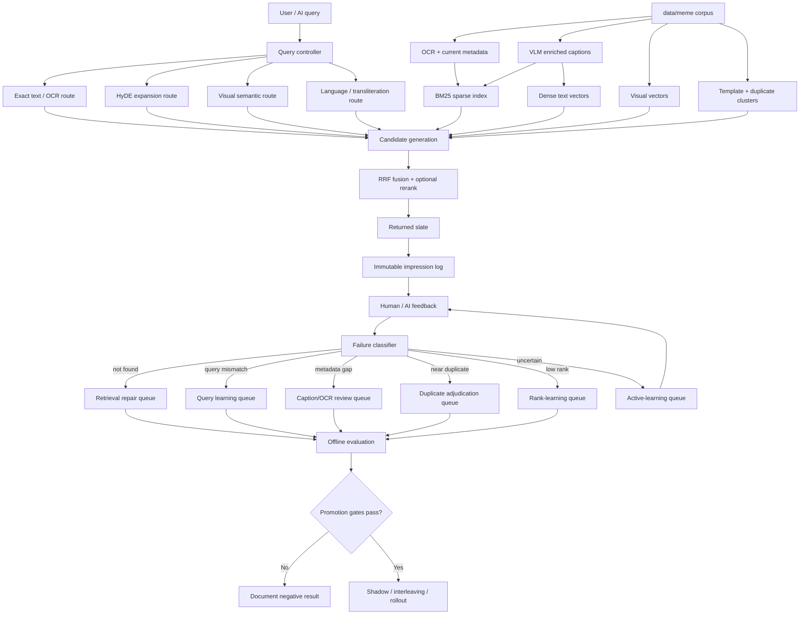

# Self-Learning Meme Search Execution Plan

**Date:** 2026-04-29
**Status:** implementation-ready plan
**Goal:** make the meme search system improve from human, AI, and replay feedback without repeating the failed R1 ranker mistake
**Primary repo:** `K:\projects\video_searcher`

> Canonical note, 2026-04-29: use `docs/RLAIF/SELF_LEARNING_CANONICAL_PLAN.md` as the single source of truth for implementation. This file is retained as the prior execution-plan draft.

## 1. Objective

Build a self-learning meme retrieval system where feedback improves search quality over time. This can include RLHF, RLAIF, active learning, query expansion, retrieval repair, caption enrichment, learning-to-rank, and online interleaving, but the system must choose the correct repair path for each failure.

The system should eventually support this workflow:

```text
User searches: "find me meme on I don't have friends just people I know"
System returns images from data/meme
User selects the best match or says none are correct
System logs the full slate and feedback
System classifies the outcome
System improves the right layer: query, metadata, retrieval, duplicate mapping, or ranking
System validates the improvement offline
System only promotes changes that pass no-regression gates
```

The first rule is:

```text
Feedback is evidence first. It becomes training data only after failure classification.
```

## 2. Why The First RLHF Failed

R1 was not classical PPO-based RLHF. It was preference learning / learning-to-rank over retrieved meme slates.

R1 worked mechanically:

- search sessions were logged
- impressions were logged
- target selections were converted into preference pairs
- a ranker trained successfully
- a post-RLHF verifier ran

R1 failed as a serving improvement:

| Metric | Base | Learned | Delta |
| --- | ---: | ---: | ---: |
| `Recall@10` | `0.95` | `0.95` | `0.00` |
| `top_1_hit_rate` | `0.925` | `0.875` | `-0.05` |
| `MRR` | `0.9333333333` | `0.9125` | `-0.0208333333` |

Failure reason:

```text
The ranker was asked to fix all feedback, including cases where the correct image was not retrievable or where the data was imbalanced. A ranker cannot rank an image it never sees.
```

Corrected rule:

```text
target_not_found -> retrieval/query/index repair
target_found_low_rank -> ranking repair
target_at_rank_1 -> stability evidence only
near_duplicate -> duplicate-family adjudication
```

## 3. Target Architecture



## 4. Learning Loops

### 4.1 Observability Loop

Purpose: every future improvement must be reproducible.

Log:

- original query
- normalized query
- detected language
- query route decisions
- HyDE text if generated
- candidate IDs and ranks
- dense/sparse/visual/RRF scores
- metadata version IDs
- caption version IDs
- feedback action
- user/session hash
- latency
- model/ranker/version flags

Existing code to extend:

- `vidsearch/feedback/service.py`
- `vidsearch/feedback/schema.py`
- `infra/postgres/003_feedback_loop.sql`
- `vidsearch/feedback/target_benchmark.py`

New deliverables:

```text
infra/postgres/004_self_learning.sql
vidsearch/feedback/failure_cases.py
vidsearch/feedback/learning_events.py
docs/experiments/results/SELF_LEARNING_OBSERVABILITY_SUMMARY.md
```

Acceptance:

- every replayed query can be reproduced from stored records
- every feedback label has provenance
- every model-generated artifact has model family, model ID, prompt version, and timestamp

### 4.2 Failure Classification Loop

Purpose: decide what the system should learn from each feedback event.

Failure classes:

| Class | Meaning | Repair path |
| --- | --- | --- |
| `target_not_found` | correct image absent from candidate slate | retrieval/index/query repair |
| `target_low_rank` | correct image present but below wrong items | rank learning |
| `wrong_text` | retrieved image has wrong visible text | OCR/BM25/caption repair |
| `wrong_language` | language/script mismatch | language routing/transliteration |
| `wrong_template` | semantic topic matches but meme format wrong | template/family metadata |
| `near_duplicate_confusion` | visually similar image but not exact target | duplicate-family adjudication |
| `query_underexpanded` | user prompt too short/vague | HyDE/query rewrite |
| `prompt_bad` | AI-generated prompt is invalid | exclude from training/eval |
| `uncertain` | insufficient evidence | active learning/human review |

Primary-class tiebreak:

```text
prompt_bad > target_not_found > wrong_language > query_underexpanded > wrong_text > wrong_template > near_duplicate_confusion > target_low_rank > uncertain
```

Classifier rule:

- A row may record secondary labels, but it must have exactly one `primary_failure_class`.
- The primary class is the first matching class in the tiebreak list.
- `prompt_bad` overrides downstream retrieval/ranking labels because invalid prompts make search-outcome labels untrustworthy.
- `target_not_found` overrides rank learning because an absent target cannot train a ranker.
- `near_duplicate_confusion` only becomes primary after higher-priority prompt, retrieval, language, and text failures are ruled out.

Failure case schema:

```json
{
  "record_type": "failure_case_v1",
  "search_id": "uuid",
  "query": "find me meme on ...",
  "target_image_id": "optional",
  "selected_image_id": "optional",
  "failure_class": "target_not_found|target_low_rank|wrong_text|...",
  "root_cause": "ocr_gap|caption_gap|query_language_gap|duplicate_confusion|...",
  "evidence": {
    "target_rank": 17,
    "top_result_image_id": "...",
    "query_language": "bn",
    "candidate_count": 100
  },
  "recommended_repair": "hyde|caption_enrichment|bm25_alias|duplicate_cluster|ranker_training|human_review",
  "provenance": {
    "classifier": "deterministic|ai|human",
    "model": "optional",
    "created_at": "iso"
  }
}
```

Implementation:

```text
vidsearch/feedback/failure_cases.py classify
vidsearch/feedback/failure_cases.py summarize
vidsearch/feedback/failure_cases.py export-active-learning-queue
```

Acceptance:

- `target_not_found` never creates ranker pairs
- every failed replay row gets exactly one primary failure class
- uncertain and near-duplicate rows are excluded from promotion-quality training

### 4.3 Retrieval Repair Loop

Purpose: improve candidate generation before reranking.

Allowed repairs:

- VLM caption enrichment
- reviewed OCR/visible-text correction
- Bangla transliteration aliases
- template/family labels
- query aliases
- BM25 sparse retrieval
- RRF fusion
- candidate-depth routing

Not allowed:

- silently overwrite source OCR without repair record
- mutate Qdrant vectors without versioned eval
- train ranker from retrieval misses

Deliverables:

```text
vidsearch/enrichment/vlm_captioner.py
vidsearch/enrichment/caption_schema.py
vidsearch/enrichment/caption_ingest.py
vidsearch/query/bm25_index.py
vidsearch/query/rrf.py
docs/experiments/results/CAPTION_ENRICHMENT_PILOT_SUMMARY.md
docs/experiments/results/HYBRID_RRF_ABLATION_SUMMARY.md
```

Evaluation:

| Metric | Gate |
| --- | --- |
| target pickup@10 | improve or preserve |
| target pickup@20 | improve or preserve |
| target pickup@100 | improve or preserve |
| top_1_hit_rate | no regression |
| MRR | no regression |
| exact-text misses outside top10 | must stay `0` |
| Bangla/mixed prompt pickup | should improve |
| latency p95 | report before serving |

### 4.4 Query Learning Loop

Purpose: learn how to rewrite, expand, or route queries.

First implementation: HyDE.

HyDE schema:

```json
{
  "record_type": "hyde_query_v1",
  "query_hash": "sha256",
  "original_query": "find me meme on স্মরণশক্তি দুর্বল হয়ে গেছে",
  "detected_language": "bn",
  "hypothetical_caption": "A Bangla meme where the visible text says memory has become weak...",
  "transliteration_variants": ["smoronshokti durbol hoye geche"],
  "expanded_terms": ["memory weak", "forgetfulness", "Bangla meme"],
  "model": "fast|qwen...",
  "model_family": "gateway-default|qwen-vl|...",
  "prompt_version": "hyde_prompt_v1",
  "created_at": "iso"
}
```

Deliverables:

```text
vidsearch/query/hyde.py
vidsearch/query/query_expansion.py
tests/test_hyde_query_expansion.py
docs/experiments/results/HYDE_ABLATION_SUMMARY.md
```

Commands:

```powershell
python -m vidsearch.query.hyde generate `
  --prompts artifacts/feedback_targets/r2_prompts_train_10pct.jsonl `
  --output artifacts/query_expansion/hyde_10pct.jsonl `
  --gateway-url http://127.0.0.1:4100 `
  --model fast `
  --resume
```

```powershell
python -m vidsearch.query.hyde evaluate `
  --prompts artifacts/feedback_targets/r2_prompts_train_10pct.jsonl `
  --hyde artifacts/query_expansion/hyde_10pct.jsonl `
  --output artifacts/query_expansion/hyde_10pct_eval.json `
  --summary docs/experiments/results/HYDE_ABLATION_SUMMARY.md `
  --api-base-url http://127.0.0.1:8000 `
  --top-k 100
```

Serving rules:

- HyDE is shadow-only until exact-text safety passes.
- Cache by normalized query hash.
- Disable HyDE route for exact visible-text prompts if it hurts exact-text retrieval.
- Log base and HyDE route results separately.

### 4.5 Index Learning Loop

Purpose: learn better image descriptions and aliases.

Caption enrichment pilot:

- sample 100 images from train/holdout/disjoint target packs
- generate structured captions through LiteLLM multimodal gateway
- store as artifacts first
- audit at least 20 examples manually
- run retrieval eval with captions as additive text

Caption schema:

```json
{
  "record_type": "vlm_caption_v1",
  "image_id": "...",
  "source_uri": "...",
  "caption_version": 1,
  "caption_model": "qwen3-vl-32b-wrapper",
  "caption_model_family": "qwen-vl",
  "visual_summary": "...",
  "visible_text_transcript": "...",
  "language": "bn|en|mixed|unknown",
  "transliteration": "...",
  "meme_template": "...",
  "humor_intent": "...",
  "entities": [],
  "emotions": [],
  "search_aliases": [],
  "quality_flags": [],
  "review_status": "raw|sample_reviewed|accepted|rejected",
  "enabled_for_retrieval": false
}
```

Deliverables:

```text
vidsearch/enrichment/vlm_captioner.py
vidsearch/enrichment/caption_eval.py
artifacts/caption_enrichment/pilot_100_captions.jsonl
docs/experiments/results/CAPTION_ENRICHMENT_PILOT_SUMMARY.md
```

Commands:

```powershell
python -m vidsearch.enrichment.vlm_captioner generate `
  --pack artifacts/feedback_targets/r2_splits/holdout_pack.jsonl `
  --output artifacts/caption_enrichment/pilot_100_captions.jsonl `
  --limit 100 `
  --gateway-url http://127.0.0.1:4100 `
  --model qwen3-vl-32b-wrapper `
  --resume
```

```powershell
python -m vidsearch.enrichment.caption_eval evaluate `
  --captions artifacts/caption_enrichment/pilot_100_captions.jsonl `
  --prompts artifacts/feedback_targets/r2_prompts_train_10pct.jsonl `
  --output artifacts/caption_enrichment/pilot_100_eval.json `
  --summary docs/experiments/results/CAPTION_ENRICHMENT_PILOT_SUMMARY.md
```

Promotion rules:

- Caption metadata starts as additive only.
- Production retrieval can use accepted captions only after pilot passes.
- Captions must be versioned and reversible.
- Rollback uses feature flags, not SQL surgery:
  - `VIDSEARCH_USE_AI_CAPTIONS=false` disables all AI-caption retrieval.
  - `VIDSEARCH_BM25_INCLUDES_AI_CAPTIONS=false` removes captions from sparse retrieval only.
  - `VIDSEARCH_DENSE_INCLUDES_AI_CAPTIONS=false` removes captions from dense retrieval only.
- Caption rows retain `caption_version`, `review_status`, and `enabled_for_retrieval`; old versions remain queryable for audit.

### 4.6 Preference / Rank Learning Loop

Purpose: improve ordering only when retrieval already found the right image.

Eligible:

```text
target_in_top_10_not_1
target_in_top_20_not_10
human selected correct image from shown slate
graded relevance alternatives
```

Ineligible:

```text
target_not_found
prompt_bad
uncertain
AI-only near_duplicate
rank1-only success without downweighting
```

Model sequence:

1. heuristic feature weights
2. LambdaMART/XGBoost baseline
3. listwise LLM reranker over top 20
4. distillation from listwise rankings
5. low-rank adapter only as offline research

Existing modules:

- `vidsearch/feedback/train_ranker.py`
- `vidsearch/feedback/train_lambdamart.py`
- `vidsearch/feedback/post_rlhf_verify.py`
- `vidsearch/feedback/ranker.py`

Promotion:

```text
promotion_ready=true only if:
  non-overlap top_1_hit_rate >= base
  non-overlap MRR >= base
  non-overlap nDCG@10 >= base
  Recall@10 regression <= 1pp
  exact_text misses outside top10 = 0
  latency p95 increase < budget
  blind changed-ranking review passes
```

## 5. User Feedback UX

The UI should collect more than "thumbs up/down".

Open WebUI result controls:

| Control | Meaning | Backend action |
| --- | --- | --- |
| `Use this one` | selected best result | `select_best` judgment |
| `Not this` | result is wrong | `reject` judgment |
| `None are right` | target absent | `none_correct` failure case |
| `Wrong text` | OCR/text mismatch | metadata/OCR failure |
| `Wrong language` | language mismatch | language/query failure |
| `Wrong template` | topic OK, template wrong | template/family failure |
| `Near duplicate` | similar but not exact | duplicate adjudication |
| `More like this` | positive visual/template signal | deferred from v1 unless explicitly scoped |

Implementation rules:

- GET links show confirmation only.
- POST writes feedback.
- duplicate clicks are idempotent.
- rate limits remain active.
- every write records search ID and impression ID where applicable.
- `More like this` is not part of the first UI implementation unless it is defined as a concrete `positive_signal_v1` record. In v1, use `Use this one` for hard positive feedback and keep `More like this` out of training/promotion-quality data.

## 6. Active Learning

The system should not ask humans to label easy examples.

Queue priority:

```text
initial_score =
  1.0 * path_disagreement
  + 1.0 * target_rank_2_to_20
  + 1.0 * undercovered_category
  + 1.0 * near_duplicate_uncertainty
  + 1.0 * language_gap
  - 1.0 * already_rank1
  - 1.0 * duplicate_target_over_cap
```

The first cycle must treat these as equal-weight defaults, not tuned weights. After one full labeling cycle, recalibrate weights from which queued examples produced useful labels, repaired failures, or promotion-relevant eval changes.

Deliverables:

```text
vidsearch/feedback/active_learning.py
docs/experiments/results/ACTIVE_LEARNING_QUEUE_SUMMARY.md
```

Commands:

```powershell
python -m vidsearch.feedback.active_learning build-queue `
  --failure-cases artifacts/self_learning/failure_cases.jsonl `
  --results artifacts/feedback_targets/r2_train_results_top100_10pct.jsonl `
  --output artifacts/self_learning/active_learning_queue.jsonl `
  --summary docs/experiments/results/ACTIVE_LEARNING_QUEUE_SUMMARY.md
```

Exit gate:

- queue contains rank 2-20, near-duplicate, language, and path-disagreement examples
- rank-1 successes are capped

## 7. Online Learning And Exploration

Do not start here.

Prerequisites:

- offline candidate passes gates
- shadow mode runs without regressions
- latency budget passes
- rollback is tested
- exact-text queries are excluded at first

Allowed online methods:

- team-draft interleaving between base and candidate
- one randomized swap in ranks 4-8
- exploration rate <= 2%
- propensities logged
- online feedback used only after OPE assumptions are valid

Forbidden before exploration:

- IPS/SNIPS/DR claims
- direct click training
- changing rank 1 for exact-text queries

## 8. Evaluation Packs

Required packs:

| Pack | Purpose |
| --- | --- |
| `vidsearch/eval/queries_memes.yaml` | Phase 0 qrels/full-corpus regression |
| `data/meme_rlhf` target pack | training/diagnostic targets |
| R2 train split | training target pack |
| R2 val split | tuning target pack |
| R2 holdout split | held-out target pack |
| disjoint holdout from `data/meme` | non-overlap promotion check |
| user-feedback pack | real feedback queries |
| failure-case pack | known bad cases that must improve |

Every report must include:

- base metrics
- candidate metrics
- deltas
- gates
- failed examples
- artifact paths
- raw artifact note: not committed

## 9. Implementation Phases

Canonical sequence after review:

```text
SL-0      Fix R2 diagnostics and audit metrics
SL-0.5    Profile/fix /search latency
SL-1a     Minimal JSONL failure-case classifier
SL-2      HyDE offline A/B
SL-1b     Postgres failure-case store/backfill, after schema has real data
SL-3      BM25/RRF candidate generation
SL-4      VLM caption enrichment pilot
SL-5      Feedback UX + active-learning queue
SL-6      Offline rank/listwise experiments
SL-7      Shadow/interleaving/exploration
```

### Phase SL-0: Repair Existing R2 Diagnostics

Files:

```text
vidsearch/feedback/rank_bucket_report.py
vidsearch/feedback/prompt_balance.py
tests/test_rank_bucket_eligibility.py
```

Tasks:

- count `target_found` and `found_selected` as found
- normalize legacy prompt categories
- add stratified sample builder
- regenerate `R2_RANK_BUCKET_SUMMARY_10PCT.md`
- add Gwet AC2 plus Spearman/Kendall rank correlation to `consensus.py:summarize-audit`

Acceptance:

- found/missing header matches manual counts
- exact/fuzzy eligibility uses normalized categories
- stratified 10% sample can be produced deterministically
- judge audit summaries do not rely on Cohen's kappa alone

### Phase SL-0.5: Search Latency Profile And Replay Feasibility

Files:

```text
vidsearch/query/retrieve_images.py
vidsearch/api/main.py
vidsearch/feedback/target_benchmark.py
docs/experiments/results/SEARCH_LATENCY_PROFILE.md
```

Problem:

Prior R2 replay attempts observed `/search` calls timing out at 120 seconds and at least one `limit=100` search completing around 297 seconds. At that speed, full replay and HyDE/BM25/caption ablations are operationally blocked.

Tasks:

- profile `/search` for `limit=10`, `20`, `50`, and `100`
- identify dominant cost: Qdrant fetch, metadata hydration, reranker call, model cold load, DB roundtrips, image URL generation, or Open WebUI path overhead
- add replay-mode instrumentation that records per-stage timings
- fix the dominant cost before large replays
- document baseline and post-fix latency

Acceptance:

- a stratified 10% replay of about 157 prompts completes in under 10 minutes wall-clock
- `SEARCH_LATENCY_PROFILE.md` records p50/p95/p99 or per-query timing distribution
- any workaround used for offline replay is explicitly marked offline-only
- no serving feature flag is enabled as part of this phase

### Phase SL-1a: Minimal Failure Case Artifact System

Files:

```text
vidsearch/feedback/failure_cases.py
tests/test_failure_cases.py
docs/experiments/results/FAILURE_CASE_MINIMAL_SUMMARY.md
```

Tasks:

- define `FailureClass` enum and tiebreak order
- implement `classify_replay_row()` deterministic classifier
- write JSONL `failure_case_v1` artifacts
- classify new SL-2/SL-3/SL-4 outputs as they are generated
- do not add Postgres migration yet

Acceptance:

- every known target-not-found row is retrieval repair only
- no failure class can accidentally enter ranker pairs without eligibility
- schema can still evolve based on real SL-2/SL-3 data

### Phase SL-1b: Durable Failure Case Store And Backfill

Files:

```text
infra/postgres/004_self_learning.sql
vidsearch/feedback/failure_cases.py
docs/experiments/results/FAILURE_CASE_SUMMARY.md
```

Tasks:

- promote stabilized failure-case schema to Postgres
- backfill/classify existing R1/R2 artifacts
- export active-learning candidates
- summarize failures by class/language/category/rank

Acceptance:

- schema has been exercised by at least SL-2 and one additional retrieval-side experiment
- migration is additive and does not rewrite historical feedback rows
- JSONL and Postgres summaries agree on counts for the same input artifacts

### Phase SL-2: HyDE Offline A/B

Files:

```text
vidsearch/query/hyde.py
vidsearch/query/query_expansion.py
tests/test_hyde_query_expansion.py
docs/experiments/results/HYDE_ABLATION_SUMMARY.md
```

Tasks:

- generate HyDE captions through LiteLLM gateway
- evaluate base vs HyDE on 10% and stratified sample
- report short/sloppy, Bangla, semantic, exact-text slices

Acceptance:

- exact-text does not regress
- at least one non-exact slice improves before moving to shadow

### Phase SL-3: BM25/RRF Candidate Generation

Files:

```text
vidsearch/query/bm25_index.py
vidsearch/query/rrf.py
tests/test_rrf_fusion.py
docs/experiments/results/HYBRID_RRF_ABLATION_SUMMARY.md
```

Tasks:

- build local sparse index over OCR/captions/aliases
- fuse sparse, dense, visual using RRF k=60
- evaluate by prompt category

Acceptance:

- exact-text improves or preserves
- semantic/visual does not regress materially
- latency reported

### Phase SL-4: VLM Caption Pilot

Files:

```text
vidsearch/enrichment/vlm_captioner.py
vidsearch/enrichment/caption_schema.py
vidsearch/enrichment/caption_eval.py
tests/test_caption_schema.py
docs/experiments/results/CAPTION_ENRICHMENT_PILOT_SUMMARY.md
```

Tasks:

- caption 100 images through LiteLLM multimodal gateway
- manually audit 20 captions
- evaluate additive caption search
- document good/bad examples

Acceptance:

- captions are versioned
- no source metadata overwritten
- pilot improves or preserves held-out metrics

### Phase SL-5: Feedback UX And Active Learning

Files:

```text
vidsearch/feedback/active_learning.py
vidsearch/feedback/service.py
openwebui pipe/function files if present
docs/experiments/results/ACTIVE_LEARNING_QUEUE_SUMMARY.md
```

Tasks:

- add feedback action types
- build active-learning queue
- render controls in OWUI
- prove one round trip per feedback type

Acceptance:

- feedback writes are idempotent
- GET does not write
- POST writes with CSRF/rate limits
- action routes to correct learning queue

### Phase SL-6: Offline Rank/Listwise Experiments

Files:

```text
vidsearch/feedback/train_lambdamart.py
vidsearch/feedback/listwise_rerank.py
vidsearch/feedback/post_rlhf_verify.py
docs/experiments/results/RANKING_REPAIR_SUMMARY.md
```

Tasks:

- train only from target-present low-rank examples
- compare LambdaMART vs listwise LLM rerank
- verify full-corpus and non-overlap metrics

Acceptance:

- no target-not-found training
- no full-corpus top-rank regression
- otherwise offline-only negative result

### Phase SL-7: Shadow, Interleaving, Continuous Learning

Files:

```text
vidsearch/feedback/interleaving.py
vidsearch/feedback/exploration.py
docs/experiments/results/ONLINE_SHADOW_INTERLEAVING_SUMMARY.md
```

Tasks:

- shadow candidate scores
- implement team-draft interleaving
- log propensities
- run tiny exploration only after gates

Acceptance:

- rollback tested
- exact-text protected
- no OPE claims before valid exploration logs

## 10. Definition Of Done

The self-learning system is complete when:

```text
[ ] Every feedback event is logged with full provenance.
[ ] Every failed search gets a failure class.
[ ] target_not_found cannot create ranker pairs.
[ ] HyDE/query expansion has offline A/B reports.
[ ] BM25/RRF has offline A/B reports.
[ ] VLM caption enrichment has pilot and audit reports.
[ ] Feedback UI supports select, reject, none_correct, wrong_text, wrong_language, wrong_template, near_duplicate, and optionally more_like_this only if implemented as positive_signal_v1.
[ ] Active-learning queue prioritizes high-value examples.
[ ] Ranker/listwise training uses only eligible target-present examples.
[ ] All candidate changes pass full-corpus and non-overlap no-regression gates before serving.
[ ] Raw artifacts remain uncommitted and summarized in markdown.
[ ] Negative results are documented as paper evidence.
```

## 11. First Builder Prompt

Use this prompt to start implementation:

```text
Implement Phase SL-0, SL-0.5, and SL-1a of docs/RLAIF/SELF_LEARNING_EXECUTION_PLAN.md.

Goal:
Prepare the meme search system for safe self-learning by fixing R2 diagnostics, profiling search latency, and adding minimal JSONL failure-case classification. Do not implement model training or serving changes yet.

Read first:
- docs/RLAIF/SELF_LEARNING_EXECUTION_PLAN.md
- docs/RLAIF/MEME_SEARCH_SELF_LEARNING_SYSTEM_PLAN.md
- docs/RLAIF/R2_RETRIEVAL_FIRST_RLAIF_PLAN.md
- docs/experiments/R1_FAILED_RLHF_EXPERIMENT.md
- vidsearch/feedback/rank_bucket_report.py
- vidsearch/feedback/prompt_balance.py
- vidsearch/feedback/target_benchmark.py
- vidsearch/feedback/service.py
- infra/postgres/003_feedback_loop.sql

Implement:
- Fix rank_bucket_report found/missing counts so target_found and found_selected are both counted as found.
- Normalize prompt categories in rank_bucket_report using the same logic as prompt_balance.
- Add deterministic stratified prompt/sample builder for R2 replay.
- Add Gwet AC2 and rank correlation to consensus audit summaries.
- Profile /search latency for replay-critical limits and write docs/experiments/results/SEARCH_LATENCY_PROFILE.md.
- Add minimal failure case artifact schema and classifier in vidsearch/feedback/failure_cases.py.
- Implement the documented primary failure-class tiebreak order.
- Add tests proving target_not_found is retrieval repair only and cannot become ranker training data.
- Generate/update markdown summaries under docs/experiments/results/.

Do not:
- Do not train a ranker.
- Do not enable learned serving behavior.
- Do not mutate Qdrant vectors or source OCR/captions.
- Do not commit raw artifacts.

Acceptance:
- Focused tests pass.
- Existing 10% R2 summary can be regenerated with correct found/missing counts.
- Stratified 10% replay is feasible after latency profiling/fix or has a documented blocker.
- Failure-case summary classifies known target_not_found, target_low_rank, near_duplicate, wrong_language, and prompt_bad cases using JSONL artifacts.
```

## 12. Sources

- Relevance feedback and query expansion: https://nlp.stanford.edu/IR-book/html/htmledition/relevance-feedback-and-query-expansion-1.html
- Interactive image retrieval survey: https://link.springer.com/article/10.1007/s13735-012-0014-4
- Human-in-the-loop image search: https://arxiv.org/abs/1809.08714
- Unbiased learning-to-rank: https://arxiv.org/abs/1608.04468
- HyDE: https://arxiv.org/abs/2212.10496
- SimRAG: https://aclanthology.org/2025.naacl-long.575/
- Self-RAG: https://arxiv.org/abs/2310.11511
- RA-ISF: https://arxiv.org/abs/2403.06840
- SAM-RAG: https://arxiv.org/abs/2410.11321
- VeCLIP: https://arxiv.org/abs/2310.07699
- Promptagator: https://openreview.net/forum?id=gmL46YMpu2J
- RankGPT: https://arxiv.org/abs/2304.09542
- Reciprocal Rank Fusion: https://cormack.uwaterloo.ca/cormacksigir09-rrf.pdf
