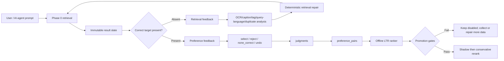

# RLHF_FEEDBACK_LOOP_PLAN.md - Human feedback loop for meme retrieval

**Version:** 2026-04-25  
**Status:** Implemented through gated log/feedback/pair/ranker infrastructure; expanded through 2026-04-27 with target-pickup repair, transliteration metadata repair, and offline-only diagnostic ranker training.
**Owner:** primary builder / OpenCode  
**Reviewers:** Codex, Claude  
**Scope:** Add a human-in-the-loop learning system where a user or AI-agent searches for a meme, selects the best result when found, records recall failures when not found, and the system improves both retrieval and ranking.

---

## 0. Executive decision

Call this feature **human preference learning for retrieval**, not generic RLHF.

The user's desired loop has two feedback layers:

1. **Retrieval feedback:** an agent inspects target images from `data/meme_rlhf`, writes natural prompts, runs search against the full corpus, and records whether the intended image was found at all.
2. **Learning-to-rank feedback:** if the intended image appears in the returned slate, the agent selects it and the system learns that it should rank above the shown wrong candidates.

That is a retrieval-feedback plus learning-to-rank problem. Classical RLHF is useful as background because it learns from human preferences, but the action here is a ranked list of existing images, not generated text. The safest architecture is therefore:

- Keep Phase 0 retrieval unchanged as the deterministic baseline.
- Log every shown result list as an immutable "impression".
- Convert explicit user selections into pairwise preferences: selected image beats shown-but-unselected images for that query.
- Convert target-not-found cases into retrieval-failure records: prompt, target image, returned wrong images, failure type, and retrieval configuration.
- Train an additive reranking model offline from those preferences.
- Improve candidate generation from retrieval-failure records through OCR/text normalization, lexical recall, multilingual query handling, query expansion, and eval qrels.
- Promote a new ranker only if it beats the baseline in held-out replay and does not regress the fixed Phase 0 eval set.
- Promote retrieval changes only if target-not-found recall improves and the fixed Phase 0 eval set does not regress.
- Add controlled exploration only after logging and offline evaluation exist.

No first version should fine-tune BGE-M3, SigLIP, the VLM captioner, or OCR. Those are expensive to retrain and easy to corrupt. The first learned serving component should be a small, versioned ranker that rescales Phase 0 candidates. Retrieval-feedback fixes should be deterministic retrieval improvements first, not model fine-tuning.

### 0.0.0 Architecture at a glance



```mermaid
sequenceDiagram
    participant Agent as Human or AI-agent
    participant OWUI as Open WebUI / target replay
    participant API as Vidsearch API
    participant Store as Postgres + Qdrant
    participant Trainer as Offline trainer

    Agent->>OWUI: "find me meme on ..."
    OWUI->>API: POST /search
    API->>Store: Retrieve candidates from full data/meme index
    API->>Store: Log search_session and search_impressions
    API-->>OWUI: Images + feedback controls
    Agent->>API: Select target if present
    API->>Store: Write judgment and derived pairs
    Agent->>API: Record target_not_found if absent
    API->>Store: Keep as recall failure, not ranker pair
    Trainer->>Store: Read eligible pairs by provenance prefix
    Trainer-->>Trainer: Train/evaluate offline
    Trainer-->>API: Artifact only if gates pass; otherwise disabled
```

Design boundary:

- **Retrieval repair** changes what enters the candidate slate.
- **Learning-to-rank** changes only the order of candidates already found.
- **Research exports** convert immutable snapshots to DPO/ORPO/KTO/reward-model data, but they are not serving dependencies.

### 0.0.1 Target-image benchmark loop

The benchmark source for AI-agent feedback is `data/meme_rlhf`, currently a curated 293-file image set.

For each image in that folder:

1. The AI agent inspects the image as a human would.
2. The AI agent writes 5-10 natural prompts using `docs/AGENT_PROMPT_LABELING_INSTRUCTIONS.md`.
3. The system runs each prompt against the full active corpus, not just `data/meme_rlhf`.
4. The system does not receive the target image during retrieval.
5. After search returns, the evaluator checks whether the target image is present in top K.
6. If present, the target is selected through the normal feedback path and creates preference pairs.
7. If absent, the system records a `target_not_found` retrieval-failure case. It must not pretend a wrong returned image was correct.
8. Training consumes ranking feedback; retrieval development consumes recall failures.

This preserves the "no handholding" rule: the search system has to find the correct image from the full corpus. The target is used only for offline evaluation and feedback bookkeeping.

### 0.1 Deep research report decisions

`deep-research-report (14).md` reinforces and hardens the direction of this plan:

- The production architecture is **logged-feedback retrieve-then-rerank**, not PPO-first RLHF.
- The first implementation must be **counterfactually evaluable**: every served result needs a stable `search_id`, immutable impression rows, ranker lineage, and propensity fields even before exploration is enabled.
- Store user actions as raw `judgments`, then derive deterministic `preference_pairs`; do not collapse exposure, judgment, and training labels into one table.
- Separate the production track from the research track. Production uses classical/neural learning-to-rank first; research exports the same logged data to SFT, DPO, ORPO, KTO, and reward-model formats.
- Add privacy/governance primitives from day one: redacted query text, optional encrypted raw text, consent scope, opt-out/tombstone state, and redaction audit events.
- Promotion requires query-grouped replay, held-out preference metrics, Phase 0 regression checks, latency checks, and, once exploration exists, IPS/SNIPS/doubly robust offline policy evaluation.

### 0.2 Approved kickoff gates

Milestone 1 must not start until all of these are true:

- ADR-001 in `docs/decision_log.md` records the canonical recursive `data/meme` corpus count, including the 2026-04-25 reconciliation that excludes the zero-byte `Screenshot 2022-11-04 203012.png` from the indexable corpus.
- P0-G3 is closed with the 5-query Open WebUI evidence log in `docs/owui_integration.md`.
- P0-G4 is closed against the canonical corpus and recorded in `eval.metrics` plus `docs/decision_log.md`.
- P0-G4 absolute thresholds still pass: `Recall@10 >= 0.90`, `top_1_hit_rate >= 0.70`, `reranker_uplift_ndcg10 >= 0.02`, and no `exact_text` query misses outside top 10.

The 293-file non-recursive count is superseded. The 2026-04-25 canonical corpus baseline is **3,103 unique decodable/indexable images**: `scan_corpus` saw 3,125 supported-extension paths and 3,104 unique byte hashes, but one supported-extension file is zero bytes and cannot be decoded or indexed. At reconciliation time, `core.images`, `core.image_items`, and Qdrant `memes.points_count` were all 3,103.

### 0.3 Implementation status

Implemented files:
- `infra/postgres/003_feedback_loop.sql` adds `ranker_versions`, `search_sessions`, `search_impressions`, `judgments`, `preference_pairs`, `training_snapshots`, `redaction_events`, and invalid-token audit rows with the required indexes.
- `vidsearch.feedback.tokens` signs/verifies 24-hour feedback tokens and computes HMAC-SHA256 user hashes with `VIDSEARCH_USER_HASH_SECRET`.
- `vidsearch.feedback.service` logs search sessions/impressions, stores versioned feature snapshots, validates shown impressions, rate-limits writes, records idempotent judgments, dual-writes legacy `feedback.events`, and derives deterministic selection preference pairs.
- `vidsearch.feedback.ranker` loads a promotion-approved ranker artifact, computes shadow scores, and can conservatively rerank top candidates with upward movement capped by `VIDSEARCH_FEEDBACK_MAX_UPWARD_MOVEMENT`.
- `vidsearch.feedback.train_ranker` trains the NumPy pairwise logistic ranker only after the required volume gates, reports the rank-only baseline and selected-image MRR gates, and refuses promotion unless P0-G4 is asserted passing.
- `vidsearch.feedback.evaluate_ranker` writes offline artifact evaluation reports and blind changed-ranking review packets.
- `vidsearch.feedback.backfill_pairs` deterministically backfills selected-vs-skipped pairs from existing active judgments.
- `vidsearch.feedback.snapshots` and `vidsearch.feedback.exporters` build immutable JSONL snapshots and derive LTR/DPO/ORPO/KTO/reward-model research datasets from those snapshots.
- `vidsearch.feedback.target_benchmark` builds `data/meme_rlhf` target packs, writes AI-agent prompt-labeling instructions, generates prompt labels through the LiteLLM gateway at `LITELLM_URL`/`LITELLM_MASTER_KEY`, runs those prompts against the full corpus, and splits found-target selections from `target_not_found` retrieval failures.
- `vidsearch.api.main` exposes `GET /feedback/confirm/{token}` and `POST /feedback/judgment`; GET does not write, and POST requires the CSRF cookie/form token.
- `infra/open_webui/functions/meme_search_pipe.py` renders `Select`, `Reject`, `Undo`, and `None of these are correct` controls in Open WebUI.

Current runtime policy:
- Feedback logging and explicit judgment capture are enabled.
- Learned ranker shadow/online serving is off by default.
- Exploration is implemented as a default-off one-swap policy for ranks 4-8 and is controlled by `VIDSEARCH_EXPLORATION_RATE=0.0`.
- `python -m vidsearch.feedback.train_ranker --client-session-prefix rlhf-target` now has enough total judgments and pairs for diagnostics, but promotion still blocks because exact-text and fuzzy-text intent floors are below `50`.
- Feedback logging code does not mutate Qdrant vectors, OCR, captions, thumbnails, or corpus records. Separate reviewed retrieval-repair scripts may update metadata/text vectors only as explicit target-pickup repair work.
- The current diagnostic target ranker is not promotion-approved and must remain disabled for serving.

---

## 1. Research synthesis

### 1.1 Relevance feedback is the right primitive

Rocchio relevance feedback is the classic retrieval pattern: use user-marked relevant and non-relevant documents to adjust the query representation in vector space. This maps directly to "selected meme is relevant; displayed non-selected memes are weaker negatives." It is useful for immediate session-level improvement, but not enough by itself for durable model learning.

Design consequence: implement optional session-level query expansion later, but make durable learning happen through logged preferences and a ranker.

### 1.2 Clicks and selections are relative preferences

Joachims' clickthrough work treats search logs as `(query, shown ranking, clicked result)` and derives pairwise preferences: if a user clicked a lower-ranked item after seeing higher-ranked items, the clicked item should rank above the skipped items for that query. This matches our explicit "I pick this image" UI even better than normal clicks because the user is intentionally marking the best match.

Design consequence: store the full shown ranking for each search, not just the selected image. A selection without the presented alternatives is not a training example.

### 1.3 Bias must be logged, not ignored

Learning-to-rank literature repeatedly warns that user feedback is biased by presentation position. Top-ranked images are more likely to be seen and clicked even when they are not best. Unbiased LTR methods use propensity weighting or counterfactual estimators, but these require knowing the logging policy and exposure probabilities.

Design consequence: every impression row must store rank, score, ranker version, exploration policy, and propensity. In the first version, explicit selection is strong enough to train a conservative offline ranker, but promotion gates must still protect against position bias.

### 1.4 Contextual bandits are the later online-learning form

Contextual bandits model the system as repeatedly choosing items under context and updating from observed rewards. This is appropriate once we intentionally explore alternative rankings. It is premature before we can log propensities and evaluate candidate rankers offline.

Design consequence: use a staged rollout. Start log-only, then offline ranker, then small controlled exploration. Do not randomize top results on day one.

### 1.5 True RLHF/DPO is not the first implementation

RLHF and DPO are designed around learning from human preferences over generated outputs or policy trajectories. They are relevant if we later fine-tune a query-rewriter, captioner, or answer generator. For Phase 0/Phase 1 retrieval, a pairwise ranker is simpler, safer, easier to evaluate, and enough to learn from "this image is the best match".

Design consequence: reserve "RLHF" for future generative components. The first delivered feature is preference-based reranking.

### 1.6 Current path check

The plan is still on the right path, with one important constraint: it must remain split into retrieval repair and learning-to-rank. The 2026-04-27 run proved that many apparent "RLHF failures" were actually target-pickup failures: the correct image was absent from the slate, so a learned ranker had no opportunity to choose it. After candidate-depth repair, metadata repair, and transliteration alias repair, all `290/290` `data/meme_rlhf` target IDs have at least one successful pickup across accumulated artifacts.

The remaining risk is not architecture; it is data balance and evaluation strength:

- The current target-feedback data is strong for semantic and mixed visual prompts, but weak for exact-text and fuzzy-text intent classes.
- Internal pairwise metrics can look excellent even when the model mostly learns position or score artifacts, so the full `data/meme` post-RLHF eval remains mandatory.
- Agent-generated feedback is useful for bootstrapping and finding defects, but promotion-quality evidence still needs either real user feedback or independently reviewed agent labels with clear provenance.
- Until controlled exploration exists, propensity fields are lineage/audit data only. They must not be used to claim unbiased counterfactual evaluation.
- Verification must explicitly separate qrels that overlap `data/meme_rlhf` training targets from qrels that do not; if overlap exists, only the `without_overlap` block can be a serving-promotion gate.

---

## 2. Product loop

### 2.1 User flow in Open WebUI

Search response should render each image with feedback links:

```markdown


[Open full image](http://127.0.0.1:8000/image/img_x)
[Select](http://127.0.0.1:8000/feedback/confirm/<signed_token>)
[Reject](http://127.0.0.1:8000/feedback/confirm/<signed_token>)
[Undo](http://127.0.0.1:8000/feedback/confirm/<signed_token>)
[None of these are correct](http://127.0.0.1:8000/feedback/confirm/<signed_token>)
```

Open WebUI markdown links are the most robust first UI. They avoid needing custom frontend code. The `GET` link **must not write feedback**. It opens a FastAPI confirmation page that auto-submits a `POST /feedback/judgment` form with a CSRF token and `SameSite=Strict` cookie; link unfurlers and scanners do not execute that form, so they do not create judgments.

The resulting confirmation page says:

```text
Feedback recorded.
Query: orange food items on a tray
Selected: img_...
You can close this tab and continue in Open WebUI.
```

Later, replace markdown links with native OWUI actions if Open WebUI exposes a stable button/action API for pipe outputs.

### 2.1.1 AI-agent benchmark flow

The AI-agent benchmark flow is different from normal OWUI use:

```text
target image in data/meme_rlhf
-> agent writes natural prompts
-> system searches full corpus without target hint
-> evaluator checks whether target is in the returned slate
-> if target is present: select target and create ranking preferences
-> if target is absent: record target_not_found retrieval failure
```

This flow is the default way to test whether the system can find a known meme from a large corpus. It avoids handholding during retrieval while still producing auditable labels after the fact.

### 2.2 Signals and strength

Use explicit signals first:

| Signal | Strength | Use for training? | Notes |
|---|---:|---|---|
| `selected_best` | 1.0 | yes | Strong positive; creates pairwise preferences against shown unselected hits. |
| `rejected` | -0.5 | yes, cautiously | Negative for that image on that query; weaker than a positive selection. |
| `opened_full_image` | 0.2 | no by default | Useful analytics; not enough to infer relevance. |
| `thumbs_up` | 0.8 | yes | Positive if available without full ranked-list context. |
| `thumbs_down` | -0.5 | yes, cautiously | Negative if available. |
| `none_correct` | -1.0 | yes, aggregate only | Marks all shown hits as poor for the query. |
| `target_not_found` | -1.0 | retrieval only | Target image was absent from top K; do not generate ranking pairs. |
| `undo` | N/A | removes/invalidates | Required to fix accidental clicks. |

Do not train on passive dwell time in the first version. It is noisy and adds privacy questions.

### 2.3 Feedback granularity

Training should be per redacted/normalized query and `image_id`, but logs must also store:

- `user_hash`, if available and consented, for personalization later.
- `conversation_id` or `surface`, if available, to distinguish OWUI from API tests.
- `intent` from the Phase 0 router.
- retriever/reranker/feedback-ranker version IDs and `retrieval_config_hash`.
- Full list of displayed alternatives.

This allows both global learning and later per-user preference layers without changing the log format.

### 2.4 Two feedback loops

There are two loops and they must not be collapsed:

| Loop | Trigger | Teaches | Stored as | Promotion gate |
|---|---|---|---|---|
| Retrieval feedback | Target image absent from returned slate | Candidate generation, lexical OCR recall, multilingual normalization, query expansion | `target_not_found` correction case | Target recall improves without P0-G4 regression |
| Learning-to-rank feedback | Target image present but not necessarily top-ranked | How to reorder candidates already found by Phase 0 | `judgments` + `preference_pairs` | Ranker gates pass and P0-G4 holds |

A learning-to-rank model cannot learn to rank an image it never sees. If the right image is absent, record a recall failure and fix retrieval first.

---

## 3. Data model

The existing `feedback.events` table is useful for simple feedback, but it is not enough for ranker training because it does not preserve the displayed ranking. Add an additive migration, for example `infra/postgres/003_feedback_loop.sql`.

### 3.1 Migration prerequisites

```sql
CREATE SCHEMA IF NOT EXISTS feedback;
CREATE EXTENSION IF NOT EXISTS pgcrypto;
CREATE EXTENSION IF NOT EXISTS pg_trgm;
```

### 3.2 Training snapshots

Training snapshots make exports reproducible. A model should always point to the exact feedback window and export artifact used to train it.

```sql
CREATE TABLE feedback.training_snapshots (
    snapshot_id UUID PRIMARY KEY DEFAULT gen_random_uuid(),
    name TEXT NOT NULL,
    source_started_at TIMESTAMPTZ,
    source_ended_at TIMESTAMPTZ NOT NULL DEFAULT now(),
    export_uri TEXT,
    export_sha256 TEXT,
    query_count INT NOT NULL DEFAULT 0,
    impression_count INT NOT NULL DEFAULT 0,
    judgment_count INT NOT NULL DEFAULT 0,
    pair_count INT NOT NULL DEFAULT 0,
    config JSONB NOT NULL DEFAULT '{}'::jsonb,
    created_at TIMESTAMPTZ NOT NULL DEFAULT now()
);
```

### 3.3 Ranker registry

Every online or offline scorer gets a version row. This includes the fixed Phase 0 retriever, the Jina reranker, future feedback rankers, and any research reward/policy model.

```sql
CREATE TABLE feedback.ranker_versions (
    ranker_version_id UUID PRIMARY KEY DEFAULT gen_random_uuid(),
    name TEXT NOT NULL,
    stage TEXT NOT NULL CHECK (
        stage IN ('retriever', 'reranker', 'feedback_ranker', 'reward_model', 'policy', 'fusion')
    ),
    model_family TEXT NOT NULL DEFAULT 'baseline',
    artifact_uri TEXT,
    base_checkpoint TEXT,
    adapter_uri TEXT,
    git_commit TEXT,
    training_snapshot_id UUID REFERENCES feedback.training_snapshots(snapshot_id),
    config JSONB NOT NULL DEFAULT '{}'::jsonb,
    metrics JSONB NOT NULL DEFAULT '{}'::jsonb,
    rollout_status TEXT NOT NULL DEFAULT 'candidate' CHECK (
        rollout_status IN ('candidate', 'shadow', 'active', 'rejected', 'archived')
    ),
    created_at TIMESTAMPTZ NOT NULL DEFAULT now(),
    approved_at TIMESTAMPTZ,
    approved_by TEXT,
    UNIQUE (name, git_commit, training_snapshot_id)
);
```

Seed rows:

```sql
INSERT INTO feedback.ranker_versions (name, stage, model_family, rollout_status)
VALUES
    ('phase0-hybrid-retriever', 'retriever', 'phase0', 'active'),
    ('phase0-jina-reranker', 'reranker', 'jina', 'active')
ON CONFLICT DO NOTHING;
```

### 3.4 Search sessions

Store redacted query text by default. Optional encrypted raw text is allowed only for short-retention debugging or research review.

```sql
CREATE TABLE feedback.search_sessions (
    search_id UUID PRIMARY KEY DEFAULT gen_random_uuid(),
    user_hash TEXT,
    client_session_id TEXT,
    query_text_redacted TEXT NOT NULL,
    query_text_encrypted BYTEA,
    normalized_query TEXT NOT NULL,
    query_lang TEXT,
    intent TEXT NOT NULL,
    context JSONB NOT NULL DEFAULT '{}'::jsonb,
    retriever_version_id UUID REFERENCES feedback.ranker_versions(ranker_version_id),
    reranker_version_id UUID REFERENCES feedback.ranker_versions(ranker_version_id),
    feedback_ranker_version_id UUID REFERENCES feedback.ranker_versions(ranker_version_id),
    experiment_bucket TEXT,
    consent_scope TEXT NOT NULL DEFAULT 'feedback_only',
    opt_out BOOLEAN NOT NULL DEFAULT false,
    surface TEXT NOT NULL DEFAULT 'api',
    limit_requested INT NOT NULL,
    retrieval_config_hash TEXT,
    exploration_policy TEXT NOT NULL DEFAULT 'none',
    served_at TIMESTAMPTZ NOT NULL DEFAULT now(),
    deleted_at TIMESTAMPTZ
);

CREATE INDEX search_sessions_query_trgm
    ON feedback.search_sessions USING gin (normalized_query gin_trgm_ops)
    WHERE deleted_at IS NULL;
CREATE INDEX search_sessions_served_idx
    ON feedback.search_sessions (served_at);
CREATE INDEX search_sessions_user_idx
    ON feedback.search_sessions (user_hash);
CREATE INDEX search_sessions_client_served_idx
    ON feedback.search_sessions (client_session_id, served_at DESC);
CREATE INDEX search_sessions_versions_idx
    ON feedback.search_sessions (retriever_version_id, reranker_version_id, feedback_ranker_version_id);
```

`user_hash` is `HMAC_SHA256(VIDSEARCH_USER_HASH_SECRET, raw_owui_user_id_or_client_session_id)`. Never store raw OWUI user IDs, and never reuse `VIDSEARCH_FEEDBACK_SECRET` for user hashing.

### 3.5 Search impressions

One row per displayed candidate.

```sql
CREATE TABLE feedback.search_impressions (
    impression_id UUID PRIMARY KEY DEFAULT gen_random_uuid(),
    search_id UUID NOT NULL REFERENCES feedback.search_sessions(search_id) ON DELETE CASCADE,
    rank INT NOT NULL,
    image_id TEXT NOT NULL REFERENCES core.images(image_id) ON DELETE CASCADE,
    meme_content_hash TEXT,
    dense_score DOUBLE PRECISION,
    sparse_score DOUBLE PRECISION,
    fusion_score DOUBLE PRECISION,
    retrieval_score DOUBLE PRECISION NOT NULL DEFAULT 0,
    rerank_score DOUBLE PRECISION,
    feedback_ranker_score DOUBLE PRECISION,
    final_score DOUBLE PRECISION NOT NULL DEFAULT 0,
    propensity DOUBLE PRECISION NOT NULL DEFAULT 1.0,
    is_exploration BOOLEAN NOT NULL DEFAULT false,
    features_jsonb JSONB NOT NULL DEFAULT '{}'::jsonb,
    shown BOOLEAN NOT NULL DEFAULT TRUE,
    displayed_at TIMESTAMPTZ NOT NULL DEFAULT now(),
    UNIQUE (search_id, rank),
    UNIQUE (search_id, image_id)
);

CREATE INDEX search_impressions_image_idx
    ON feedback.search_impressions (image_id);
CREATE INDEX search_impressions_search_rank_idx
    ON feedback.search_impressions (search_id, rank);
CREATE INDEX search_impressions_search_idx
    ON feedback.search_impressions (search_id);
```

### 3.6 Explicit judgments

Raw user actions stay separate from derived training pairs. `impression_id` is nullable for search-level actions such as `none_correct`.

```sql
CREATE TABLE feedback.judgments (
    judgment_id UUID PRIMARY KEY DEFAULT gen_random_uuid(),
    search_id UUID NOT NULL REFERENCES feedback.search_sessions(search_id) ON DELETE CASCADE,
    impression_id UUID REFERENCES feedback.search_impressions(impression_id) ON DELETE CASCADE,
    image_id TEXT REFERENCES core.images(image_id) ON DELETE CASCADE,
    judgment_type TEXT NOT NULL CHECK (
        judgment_type IN (
            'selected_best',
            'rejected',
            'opened_full_image',
            'thumbs_up',
            'thumbs_down',
            'none_correct',
            'best',
            'worst',
            'skip',
            'comment',
            'undo'
        )
    ),
    label SMALLINT,
    strength DOUBLE PRECISION NOT NULL DEFAULT 1.0,
    comment_redacted TEXT,
    comment_encrypted BYTEA,
    source TEXT NOT NULL DEFAULT 'inline' CHECK (source IN ('inline', 'signed_url', 'admin', 'batch')),
    validator_version TEXT,
    is_valid BOOLEAN NOT NULL DEFAULT true,
    invalid_reason TEXT,
    user_hash TEXT,
    created_at TIMESTAMPTZ NOT NULL DEFAULT now(),
    invalidated_at TIMESTAMPTZ
);

CREATE INDEX judgments_search_idx ON feedback.judgments (search_id);
CREATE INDEX judgments_image_idx ON feedback.judgments (image_id);
CREATE INDEX judgments_impression_idx ON feedback.judgments (impression_id);
CREATE INDEX judgments_signal_idx ON feedback.judgments (judgment_type);
CREATE UNIQUE INDEX judgments_one_none_correct_per_user_search_idx
    ON feedback.judgments (search_id, COALESCE(user_hash, 'anonymous'))
    WHERE judgment_type = 'none_correct' AND invalidated_at IS NULL;
CREATE UNIQUE INDEX judgments_one_active_item_action_idx
    ON feedback.judgments (search_id, impression_id, judgment_type)
    WHERE impression_id IS NOT NULL
      AND judgment_type <> 'undo'
      AND invalidated_at IS NULL;
```

Duplicate item-level POSTs return the existing active judgment instead of inserting a second row. Pair generation must dedupe before inserting into `feedback.preference_pairs`.

### 3.7 Derived preference pairs

Materialize pairwise examples so training is deterministic and auditable.

```sql
CREATE TABLE feedback.preference_pairs (
    pair_id UUID PRIMARY KEY DEFAULT gen_random_uuid(),
    search_id UUID NOT NULL REFERENCES feedback.search_sessions(search_id) ON DELETE CASCADE,
    chosen_impression_id UUID NOT NULL REFERENCES feedback.search_impressions(impression_id) ON DELETE CASCADE,
    rejected_impression_id UUID NOT NULL REFERENCES feedback.search_impressions(impression_id) ON DELETE CASCADE,
    source_judgment_id UUID REFERENCES feedback.judgments(judgment_id) ON DELETE SET NULL,
    derivation_method TEXT NOT NULL CHECK (
        derivation_method IN (
            'explicit_pair',
            'best_vs_worst',
            'positive_vs_negative',
            'selected_vs_skipped',
            'hard_negative'
        )
    ),
    pair_weight DOUBLE PRECISION NOT NULL DEFAULT 1.0,
    split TEXT CHECK (split IN ('train', 'val', 'test')),
    created_at TIMESTAMPTZ NOT NULL DEFAULT now(),
    UNIQUE (search_id, chosen_impression_id, rejected_impression_id, derivation_method)
);

CREATE INDEX preference_pairs_chosen_idx ON feedback.preference_pairs (chosen_impression_id);
CREATE INDEX preference_pairs_rejected_idx ON feedback.preference_pairs (rejected_impression_id);
CREATE INDEX preference_pairs_split_idx ON feedback.preference_pairs (split);
```

### 3.8 Redaction and governance audit

```sql
CREATE TABLE feedback.redaction_events (
    redaction_id UUID PRIMARY KEY DEFAULT gen_random_uuid(),
    table_name TEXT NOT NULL,
    row_id TEXT NOT NULL,
    field_name TEXT NOT NULL,
    detector TEXT NOT NULL CHECK (detector IN ('pii', 'secret', 'manual', 'copyright', 'retention')),
    action TEXT NOT NULL CHECK (action IN ('mask', 'drop', 'encrypt', 'delete', 'hash')),
    original_sha256 TEXT,
    reason TEXT NOT NULL,
    reviewer_hash TEXT,
    created_at TIMESTAMPTZ NOT NULL DEFAULT now()
);

CREATE INDEX redaction_events_row_idx
    ON feedback.redaction_events (table_name, row_id);
```

### 3.9 Rate-limit audit

```sql
CREATE TABLE feedback.rate_limit_events (
    rate_limit_event_id UUID PRIMARY KEY DEFAULT gen_random_uuid(),
    client_session_id TEXT,
    user_hash TEXT,
    action TEXT NOT NULL,
    bucket TEXT NOT NULL,
    allowed BOOLEAN NOT NULL,
    reason TEXT,
    created_at TIMESTAMPTZ NOT NULL DEFAULT now()
);

CREATE INDEX rate_limit_events_session_idx
    ON feedback.rate_limit_events (client_session_id, created_at DESC);
CREATE INDEX rate_limit_events_user_idx
    ON feedback.rate_limit_events (user_hash, created_at DESC);
```

Start with `60` feedback writes per hour per `client_session_id` and `300` writes per day per `user_hash`. Count invalid-token attempts in a separate `invalid_token` bucket so abuse can be separated from legitimate high-volume reviewing.

---

## 4. API changes

### 4.1 Search response must carry `search_id`

Add fields:

```python
class SearchHit(BaseModel):
    rank: int
    impression_id: str
    image_id: str
    source_uri: str
    thumbnail_uri: str
    feedback_select_url: str | None = None
    feedback_reject_url: str | None = None
    ocr_excerpt: str = ""
    retrieval_score: float
    rerank_score: float | None = None
    feedback_ranker_score: float | None = None
    final_score: float | None = None

class SearchResponse(BaseModel):
    search_id: str
    query: str
    intent: str
    retriever_version_id: str
    reranker_version_id: str
    feedback_ranker_version_id: str | None = None
    feedback_none_correct_url: str | None = None
    total_returned: int
    hits: list[SearchHit]
```

`POST /search` should:

1. Run Phase 0 retrieval.
2. Apply active feedback ranker if enabled.
3. Create `feedback.search_sessions`.
4. Create `feedback.search_impressions` for every displayed hit.
5. Return signed feedback URLs per hit.

### 4.2 Feedback endpoints

Add both machine and browser-friendly endpoints:

```http
POST /feedback/judgment
GET  /feedback/confirm/{signed_token}
```

The `GET` endpoint returns a confirmation page only. It must not create judgments directly. The confirmation page auto-submits a CSRF-protected `POST /feedback/judgment` form with `SameSite=Strict` cookies, then renders recorded/undo state. `select`, `reject`, `none_correct`, and `undo` are actions inside the signed token.

`signed_token` should encode:

- `search_id`
- `impression_id` for item-level feedback, or `null` for search-level feedback
- `action`
- `exp`
- `nonce`
- `ranker_version_ids`
- `feature_version`
- HMAC signature using `VIDSEARCH_FEEDBACK_SECRET`

Write-capable tokens expire after `VIDSEARCH_FEEDBACK_TOKEN_TTL_SECONDS=86400`. This prevents users from manually changing URLs to vote for arbitrary images outside the shown result list and limits the blast radius of copied Open WebUI history.

### 4.3 Pair generation on write

For `selected_best`:

- Winner = selected `impression_id`.
- Losers = every shown impression in the same `search_id` except the winner.
- Weight = `1.0` for losers ranked above the winner, `0.7` for losers ranked below the winner.
- If selected image was rank 1, still create weaker pairs against ranks 2-N with weight `0.5`.

For `rejected`:

- If there is a selected winner in the same session, create winner > rejected with weight `0.7`.
- Without a winner, store the judgment but do not generate pairs immediately.

For `none_correct`:

- Store a session-level negative judgment.
- Do not generate arbitrary winner-loser pairs.
- Use it for analytics, KTO-style binary desirability exports, and future query-rewrite training.

Undoing an active `none_correct` tombstones that search-level judgment and allows later `selected_best` or `rejected` judgments on the same search. If a future batch job ever derives rows from `none_correct`, undo must also tombstone those derived rows.

Validation rules:

- Reject expired or tampered tokens.
- Reject item feedback where `impression_id` does not belong to `search_id`.
- Reject pairwise feedback where chosen and rejected impressions are identical.
- Reject `none_correct` if the same user already submitted a valid positive judgment for that search, unless the later action explicitly invalidates the earlier one.
- Record invalid attempts in logs, but do not turn them into training rows.
- Apply idempotency before pair generation: duplicate active item-level judgments return the existing row and do not produce duplicate preference pairs.

---

## 5. Features for the learned ranker

The first ranker should use small, explainable, cheap features. Do not store or train directly on full embeddings in v1.

### 5.1 Candidate-level features

Store `features_jsonb` per impression with an explicit version wrapper:

```json
{"feature_version": 1, "features": {"rank_phase0": 1, "retrieval_score": 0.82}}
```

The trainer rejects mixed feature versions unless a deliberate backfill/imputation job upgrades older rows.

Per-impression features:

| Feature | Source |
|---|---|
| `rank_phase0` | baseline rank |
| `dense_score` | Qdrant dense image/text vector score |
| `sparse_score` | sparse OCR/keyword score |
| `fusion_score` | hybrid/RRF fusion score |
| `retrieval_score` | Qdrant hybrid score |
| `rerank_score` | Jina score |
| `intent_onehot` | query router |
| `has_ocr` | `core.image_items` |
| `has_caption` | `core.image_items` |
| `template_name_known` | `template_name != unknown` |
| `query_len_tokens` | query parser |
| `ocr_trigram_similarity` | Postgres `pg_trgm` or Python trigram |
| `retrieval_text_trigram_similarity` | Postgres `pg_trgm` or Python trigram |
| `tag_overlap_count` | query tokens vs tags |
| `template_exact_match` | template alias dictionary |
| `caption_literal_contains_query_token` | simple lexical |
| `caption_figurative_contains_query_token` | simple lexical |
| `source_path_tokens_overlap` | useful for local filenames |
| `width`, `height`, `aspect_ratio` | image metadata |
| `is_exploration` | impression log |
| `propensity` | impression log |
| `recency_seen_count` | optional anti-repeat feature |

List-level features are computed from all impressions in the same `search_id` and must only be used with train/validation/test splits by `search_id`, never by `impression_id`:

| Feature | Source |
|---|---|
| `duplicate_cluster_size` | perceptual/content duplicate grouping |
| `near_duplicate_in_top_k` | slate diversity guardrail |
| `template_diversity_top_k` | top-k impression set |
| `same_template_neighbors` | top-k impression set |
| `slate_position_context` | current ranked list |

The model should learn how to combine existing retrieval/rerank scores and metadata. It should not replace candidate generation.

### 5.2 Pairwise training rows

For each pair:

```text
x_pair = features(query, winner) - features(query, loser)
y = 1
weight = pair_weight
```

Train a binary pairwise logistic model:

```text
P(winner beats loser) = sigmoid(w dot x_pair)
```

At serving time:

```text
final_score = baseline_score + alpha * feedback_ranker_score
```

Where:

- `baseline_score` starts as normalized Jina reranker score, falling back to retrieval score.
- `feedback_ranker_score` is `w dot features(query, candidate)`.
- `alpha` starts at `0.15`, then is tuned by offline replay.

### 5.3 Why linear first

Use a NumPy-only linear ranker first:

- No new heavy dependency.
- Fast to train.
- Easy to inspect and roll back.
- Works with small feedback data.
- Lower risk of memorizing one user's accidental clicks.

After at least a few thousand judgments, consider XGBoost/LightGBM LambdaMART. After the logging and evaluation system is stable, add a transformer-based multimodal pairwise/listwise reranker over the top 50-100 candidates. That model is a research and quality target, not the first production dependency.

### 5.4 Production and research tracks

Keep one feedback lake and two model tracks:

| Track | First model | Later model | Purpose |
|---|---|---|---|
| Production ranking | NumPy pairwise logistic ranker | LambdaMART / neural pointwise / multimodal pairwise reranker | Improve live ordering safely with rollback and latency gates. |
| Research alignment | Dataset exporters only | SFT, DPO, ORPO, KTO, reward model, optional PPO | Compare preference-learning objectives for a paper without making production depend on them. |

The production ranker consumes `impressions`, `judgments`, and `preference_pairs`. The research track consumes the same versioned `training_snapshots`; no research exporter should create a private fork of the feedback data.

---

## 6. Learning stages

### Stage A - log-only

Prerequisite:

- P0-G3 and P0-G4 are closed and recorded; do not start this stage on an unclosed Phase 0 baseline.

Deliverables:

- Full impression logging.
- Feedback links in OWUI.
- Judgments stored.
- Preference pairs generated.
- No ranking changes.

Exit criteria:

- 50 real search sessions logged.
- At least 100 explicit judgments.
- No broken feedback tokens.
- No search latency regression above 5%.

### Stage B - offline ranker

Deliverables:

- `python -m vidsearch.feedback.train_ranker`
- `python -m vidsearch.feedback.evaluate_ranker`
- Ranker artifact written to `models/feedback_ranker/<version>/weights.json`.
- Candidate version inserted into `feedback.ranker_versions`.

Promotion gate:

- At least 200 valid unique-query judgments.
- At least 50 valid judgments per canonical intent class.
- At least 300 derived preference pairs.
- Pairwise holdout accuracy >= 0.60.
- Pairwise holdout accuracy is at least +0.05 above a position-only logistic baseline trained with rank as the sole feature on the same holdout. Example: if the position-only baseline is 0.58, the candidate ranker must score at least 0.63.
- Selected-image holdout MRR >= 0.50 and at least +0.10 above the base retrieval order's MRR on the same set.
- nDCG@10 improves on feedback holdout by >= 3 percentage points.
- All P0-G4 absolute thresholds remain passing: Recall@10 >= 0.90, top_1_hit_rate >= 0.70, reranker_uplift_ndcg10 >= 0.02, and no exact_text query misses outside top 10.
- If the prior P0-G4 run had margin, no Phase 0 fixed eval regression above 2 percentage points.

### Stage C - shadow mode

Deliverables:

- Active API computes candidate feedback ranker scores but does not apply them.
- Logs show how the learned ranker would reorder results.
- Compare baseline rank vs shadow rank for selected images.

Promotion gate:

- Shadow rank improves selected image median rank.
- No pathological collapse where the same image appears in top 3 for unrelated queries.
- Manual blind review of 20 changed rankings passes: no ranker ID, old/new label, score, or rank-delta metadata is shown until after the reviewer records accept/reject.

### Stage D - conservative online rerank

Deliverables:

- `VIDSEARCH_FEEDBACK_RANKER_ENABLED=true`.
- Apply learned ranker only to top 20 Phase 0 candidates.
- Do not introduce new candidates.
- Cap movement: an item cannot move up more than 5 slots at first.
- Baseline fallback env var: `VIDSEARCH_FEEDBACK_RANKER_ENABLED=false`.
- Bypass the learned ranker when the query intent class has fewer than 20 valid training judgments or when the active feature version differs from the candidate row feature version.

Promotion gate:

- Live selected-best top-1 rate improves over the previous active version.
- Negative feedback rate does not increase.
- API p95 latency increase < 50 ms.

### Stage E - controlled exploration

Only after Stage D is stable:

- Randomly swap one candidate into positions 4-8 for a small fraction of sessions.
- Store propensity for every explored item.
- Before this stage, log `propensity=1.0` and `propensity_method='deterministic_no_ope'`; do not make counterfactual claims.
- If a pre-exploration sensitivity report uses position-decay weights, label it `propensity_method='pbm_literature_prior'`.
- Fit PBM propensities from project randomized exposure data only after this stage accrues enough samples.
- Never randomize rank 1 until offline and shadow metrics are strong.
- Use interleaving or counterfactual evaluation before promoting more aggressive exploration.

Initial policy:

```text
VIDSEARCH_EXPLORATION_RATE=0.05
Explore only ranks 4-8.
One swap per session max.
Never explore on exact_text queries unless the baseline confidence is low.
```

---

## 7. Code architecture

Add package:

```text
vidsearch/feedback/
  __init__.py
  tokens.py              # HMAC feedback token encode/decode
  logging.py             # create sessions, impressions, judgments
  features.py            # feature extraction for query-candidate pairs
  pairs.py               # derive preference_pairs from judgments
  ranker.py              # load/scoring for active model
  train_ranker.py        # offline training CLI
  evaluate_ranker.py     # replay/eval CLI
  artifacts.py           # save/load versioned weights
  snapshots.py           # build immutable training snapshots
  redaction.py           # redact/hash/encrypt query/comment fields
  exporters.py           # LTR/SFT/DPO/ORPO/KTO/reward-model exports
```

Modify:

```text
vidsearch/api/contracts.py
vidsearch/api/main.py
vidsearch/query/retrieve_images.py
infra/open_webui/functions/meme_search_pipe.py
infra/postgres/003_feedback_loop.sql
docs/runbook.md
docs/owui_integration.md
```

Optional later:

```text
vidsearch/feedback/rocchio.py       # session-level query refinement
vidsearch/feedback/bandit.py        # exploration policy
vidsearch/feedback/personalize.py   # per-user preference layer
vidsearch/feedback/slate.py         # diversity and slate-aware reranking
```

---

## 8. Serving path

Current Phase 0 path:

```text
query -> intent -> BGE/SigLIP query vectors -> Qdrant hybrid -> Jina rerank -> top hits
```

New path:

```text
query
  -> Phase 0 candidate generation and Jina rerank
  -> feature extraction for top N
  -> optional feedback ranker score
  -> conservative merge with baseline scores
  -> impression logging
  -> OWUI markdown with feedback links
```

Important rules:

- The feedback ranker only reranks Phase 0 candidates.
- It must not decide whether an image is in the corpus.
- It must not write to Qdrant.
- It must not mutate captions, OCR, or embeddings.
- It must be bypassable by one env var.

This keeps the Phase 0 baseline usable even if feedback learning is wrong.

---

## 9. Evaluation plan

### 9.1 Offline split policy

Use query/session-safe splits:

- Primary split: time-based, with older data for train and newer data for validation/test.
- Leakage guard: never random split by pair only, because pairs from the same search session leak.
- User guard: keep one user's same query sessions in one split when `user_hash` is present.
- Query-cluster guard: keep semantically similar queries in one split where possible, so "drake meme" and "hotline bling meme" do not leak across train/test.

### 9.2 Offline metrics

Metrics:

| Metric | Purpose |
|---|---|
| Recall@100/200 candidate generation | Confirms Phase 0 retriever still finds the selected image before reranking. |
| Pairwise accuracy | Does the model prefer selected images over skipped images? |
| Preference win rate | Held-out pairwise win rate for candidate rankers. |
| MRR on selected image | How high does the selected image rank? |
| nDCG@10 | Compatible with existing eval protocol. |
| Top-1 selected rate | Product metric: did the chosen image become first? |
| Mean selected rank | More stable on small data. |
| Duplicate/diversity@10 | Detects top-k collapse into near-duplicates or one over-promoted template. |
| Phase 0 regression nDCG@10 | Guardrail against harming fixed baseline. |
| p95 latency and cost/query | Prevents a better ranker from breaking local UX. |

Promotion must include a paired per-query comparison against the active baseline. Use bootstrap or paired randomization tests once the query set is large enough; until then, require manual review of changed rankings.

### 9.3 Online metrics

Log daily:

- Searches with explicit feedback.
- Selection rate per search.
- Median selected rank.
- Top-1 selected rate.
- Rejection rate by rank.
- Undo rate.
- "None correct" rate.
- Search latency p50/p95.
- Ranker version distribution.
- Diversity/duplicate rate in top 10.
- Opt-out and invalid-feedback counts.

### 9.4 Counterfactual caveat

If rankings are deterministic, logs mostly show what the current ranker already thought was good. This makes offline evaluation biased. To support stronger counterfactual evaluation later:

- Store propensities from day one.
- Add small exploration only after logging works.
- Keep a baseline holdout where the feedback ranker is disabled.
- Use interleaving, IPS, SNIPS, or doubly robust estimators only once there is enough randomized traffic.

For this local project, explicit best-match choices reduce the risk, but they do not eliminate position bias.

### 9.5 Research exporters

Build all research datasets from `feedback.training_snapshots`:

| Export | Source rows | Output shape | Use |
|---|---|---|---|
| Classical LTR | `impressions` + `judgments` + derived labels | query group, features, label, propensity | Production baseline and LambdaMART experiments. |
| SFT | human-validated single candidate judgments | prompt plus structured relevance verdict | Judge/rationale model experiments. |
| DPO / ORPO | `preference_pairs` | prompt, chosen, rejected | Direct preference optimization comparisons. |
| KTO | `judgments`, including `none_correct` and thumbs | prompt, candidate, desirable/undesirable label | Sparse binary feedback experiments. |
| Reward model | `preference_pairs` | query/candidate pair comparison | Optional auxiliary reward-scoring branch. |

DPO/ORPO/KTO should be paper/research branches until they beat the production ranker under the same held-out queries and latency budget.

---

## 10. Personalization plan

Do not personalize in v1.

Later add a small per-user layer:

```text
final_score = baseline_score + global_feedback_score + beta * user_feedback_score
```

Where `user_feedback_score` is trained only from that user's judgments or from a small preference memory:

- User likes certain meme templates.
- User prefers exact text over semantic matches.
- User repeatedly selects a specific visual style.

Guardrails:

- Global ranker never trains directly on private per-user preferences unless opted in.
- User layer can be reset.
- Anonymous mode stores no `user_hash`.

---

## 11. Safety and anti-corruption rules

### 11.1 Do not poison the baseline

- Never overwrite OCR/captions/embeddings from feedback.
- Never delete or alter `core.images` from feedback.
- Never update Qdrant vectors from feedback.
- Store every ranker version and artifact hash.
- Keep a `baseline` ranker mode forever.

### 11.2 Prevent accidental bad data

- Every feedback confirmation page should include `Undo`.
- Duplicate same-user same-search same-image judgments collapse or invalidate older rows.
- Ignore feedback tokens after expiration.
- Reject feedback if the `impression_id` was not in `feedback.search_impressions` for that `search_id`.
- Rate-limit feedback endpoints at 60 writes/hour/client_session_id and 300 writes/day/user_hash to start; invalid-token attempts use a separate counter.
- Keep `GET /feedback/...` endpoints read-only confirmation pages; only `POST /feedback/judgment` writes.

### 11.3 Avoid reward hacking

The learned ranker should not optimize only click/open rate. It should optimize explicit `selected_best` and guard against:

- Always ranking visually bright thumbnails higher.
- Over-promoting common templates.
- Memorizing one frequent query.
- Collapsing different queries to the same popular image.

Add diagnostics:

- Top images by learned-score lift.
- Top query tokens by learned-score lift.
- Per-template score shifts.
- Changed-ranking review report.

### 11.4 Privacy, consent, and deletion

- Store `query_text_redacted` in normal logs; store encrypted raw query/comment text only when explicitly needed and covered by retention rules.
- Hash user identifiers before storage; never store raw usernames, emails, API keys, or browser cookies in feedback tables.
- Hash user identifiers with HMAC-SHA256 using `VIDSEARCH_USER_HASH_SECRET`; do not use raw SHA-256 and do not reuse `VIDSEARCH_FEEDBACK_SECRET`.
- Write a `feedback.redaction_events` row whenever query/comment fields are masked, encrypted, deleted, or excluded from a snapshot.
- Respect `consent_scope` and `opt_out` during all snapshot/export jobs.
- Tombstoned sessions remain useful for aggregate counts but must be excluded from future training exports.
- Keep retrieval relevance separate from content admissibility; a relevant meme can still be filtered by safety/moderation policy.

---

## 12. Implementation checklist

### Milestone 1 - feedback logging

- [x] Confirm ADR-001 corpus reconciliation, P0-G3, and P0-G4 are closed before starting this milestone. *(Closed 2026-04-25: ADR-001 reconciles corpus at 3,103 images; P0-G3 transcripts are in `docs/owui_integration.md`; P0-G4 run `21b3ade7-e9b4-4803-9a52-cb17370c8a28` passes and is recorded in ADR-007.)*
- [x] Add `infra/postgres/003_feedback_loop.sql`.
- [x] Add `vidsearch/feedback/tokens.py` with HMAC token tests.
- [x] Add HMAC user hashing in `vidsearch.feedback.tokens` / `vidsearch.feedback.service`.
- [x] Add `VIDSEARCH_USER_HASH_SECRET` and keep it separate from `VIDSEARCH_FEEDBACK_SECRET`.
- [x] Add `vidsearch/feedback/service.py` for logging, judgment validation, idempotency, rate limits, and pair generation.
- [x] Extend `/search` to create `feedback.search_sessions`.
- [x] Extend `/search` to create `feedback.search_impressions`.
- [x] Add `search_id`, `impression_id`, version IDs, and feedback URLs to API contracts.
- [x] Add read-only confirmation page for `GET /feedback/confirm/{token}`.
- [x] Add `POST /feedback/judgment` for actual writes.
- [x] Add CSRF-protected auto-POST from the confirmation page.
- [x] Add idempotency rules and rate-limit checks.
- [x] Add dual-write bridge to legacy `feedback.events`; mark it read-only after Milestone 2.
- [x] Add unit tests for invalid token, expired token, GET-does-not-write, duplicate judgment, and CSRF. *(Unshown-image/rate-limit are enforced in service; add live DB tests once a dedicated test DB fixture exists.)*

### Milestone 2 - OWUI feedback links

- [x] Update `infra/open_webui/functions/meme_search_pipe.py` to render `Select`, `Reject`, `Undo`, and `None of these are correct` links.
- [x] Verify links from Open WebUI hit FastAPI and return a confirmation page.
- [x] Capture transcripts in `docs/owui_integration.md`.
- [x] Document how to test feedback in `docs/runbook.md`.

### Milestone 3 - pair generation and feature snapshots

- [x] Implement feature snapshotting in `vidsearch.feedback.service` and vectorization in `vidsearch.feedback.ranker`.
- [x] Store `features_jsonb` as `{"feature_version": 1, "features": {...}}` for every impression.
- [x] Keep per-impression and list-level feature extraction separate.
- [x] Implement deterministic pair generation in `vidsearch.feedback.service`.
- [x] Generate pairs on `select`.
- [ ] Add deterministic live-DB tests for pair weights.
- [x] Add CLI: `python -m vidsearch.feedback.backfill_pairs`.

### Milestone 4 - offline ranker

- [x] Implement NumPy pairwise logistic training in `vidsearch.feedback.train_ranker`.
- [x] Enforce the 200 unique-query judgment / 50 per intent / 300 pair training floor.
- [x] Train and report the rank-only logistic baseline on the same holdout.
- [x] Enforce selected-image MRR >= 0.50 and >= +0.10 over base order.
- [x] Require `--p0-g4-passing` before promotion approval.
- [x] Save weights to `artifacts/feedback_rankers/<version>.json`.
- [x] Register candidate in `feedback.ranker_versions`.
- [x] Add offline replay evaluator in the training command.
- [x] Add report output under `artifacts/feedback_eval/<version>.json`. *(`python -m vidsearch.feedback.evaluate_ranker --artifact ... --output ...`)*
- [x] Add tests for model load, scoring, and deterministic replay. *(Feature vector/scoring and default-off exploration are covered; live promotion remains blocked until real feedback volume exists.)*

### Milestone 4b - snapshots and exporters

- [x] Implement `vidsearch/feedback/snapshots.py`.
- [x] Build immutable training snapshots with export SHA256 and source time window.
- [x] Implement `vidsearch/feedback/exporters.py`.
- [x] Export classical LTR data from impressions/judgments/pairs.
- [x] Export DPO/ORPO preference pairs.
- [x] Export KTO binary desirability rows, including `none_correct`.
- [ ] Add snapshot/export tests that prove opted-out and tombstoned rows are excluded.

### Milestone 5 - shadow and promote

- [x] Add `VIDSEARCH_FEEDBACK_RANKER_SHADOW=true`.
- [x] Compute shadow score during `/search` without applying it.
- [x] Add changed-ranking report. *(`python -m vidsearch.feedback.evaluate_ranker --changed-report-prefix ...` writes a blind packet and separate answer key.)*
- [x] Add `VIDSEARCH_FEEDBACK_RANKER_ENABLED=true`.
- [x] Apply ranker with capped movement.
- [x] Add `VIDSEARCH_FEEDBACK_RANKER_VERSION=...`.
- [x] Add rollback command to runbook. *(Set `VIDSEARCH_FEEDBACK_RANKER_ENABLED=false` and restart/recreate the API service.)*

### Milestone 6 - exploration

- [x] Add `VIDSEARCH_EXPLORATION_RATE`.
- [x] Implement one-swap exploration for ranks 4-8.
- [x] Store `exploration_policy` and `propensity`.
- [x] Add exploration audit report. *(Exploration impressions are queryable through `feedback.search_sessions.exploration_policy` and `feedback.search_impressions.is_exploration`; changed-ranking reports are generated by `evaluate_ranker`.)*
- [x] Keep disabled by default.

---

## 13. Test matrix

### Unit tests

- Token signing, expiration, tamper rejection.
- Redaction masks secrets/PII-like strings and records audit events.
- User hashing uses HMAC-SHA256 with `VIDSEARCH_USER_HASH_SECRET`.
- Search session logging with no hits.
- Impression logging preserves rank order.
- Selected-best creates correct preference pairs.
- None-correct creates a valid judgment without arbitrary preference pairs.
- Undo tombstones `none_correct` and allows later select/reject on the same search.
- Reject without selected-best does not generate bad pairs.
- Feature extraction handles missing OCR/caption.
- Feature extraction emits `feature_version`; training rejects mixed versions.
- Linear ranker scoring is deterministic.
- Rank-only logistic baseline is reported on the same holdout.
- Ranker artifact load failure falls back to baseline.
- Snapshot/export builders exclude opted-out and tombstoned sessions.

### Integration tests

- Search returns `search_id`.
- Search returns stable `impression_id` values for all displayed hits.
- GET feedback URL displays a confirmation page and does not write.
- Confirmation page POST records a judgment once.
- Duplicate POST is idempotent.
- Rate limits reject abusive feedback volume.
- Feedback for an unshown image is rejected.
- None-correct feedback records a search-level judgment.
- OWUI formatter includes feedback links.
- Shadow ranker computes scores without changing order.
- Enabled ranker changes order only within movement cap.

### Live smoke tests

1. Query `orange food items on a tray`.
2. Select the correct result.
3. Confirm `feedback.judgments` has `selected_best`.
4. Confirm `feedback.preference_pairs` has pairs.
5. Train ranker on fixture feedback.
6. Run same query in shadow mode and verify selected image improves or holds rank.

---

## 14. Configuration

Add to `.env.example`:

```env
VIDSEARCH_FEEDBACK_ENABLED=true
VIDSEARCH_FEEDBACK_SECRET=change-me-local-secret
VIDSEARCH_USER_HASH_SECRET=change-me-local-user-hash-secret
VIDSEARCH_FEEDBACK_TOKEN_TTL_SECONDS=86400
VIDSEARCH_FEEDBACK_RANKER_SHADOW=false
VIDSEARCH_FEEDBACK_RANKER_ENABLED=false
VIDSEARCH_FEEDBACK_RANKER_VERSION=baseline
VIDSEARCH_FEEDBACK_RANKER_ALPHA=0.15
VIDSEARCH_FEEDBACK_MAX_UPWARD_MOVEMENT=5
VIDSEARCH_FEEDBACK_SESSION_RATE_LIMIT_PER_HOUR=60
VIDSEARCH_FEEDBACK_USER_RATE_LIMIT_PER_DAY=300
VIDSEARCH_EXPLORATION_RATE=0.0
```

Default production/local behavior:

- Feedback logging enabled.
- Learned reranking disabled.
- Shadow disabled.
- Exploration disabled.

---

## 15. Implementation status - 2026-04-25

The Phase 0 prerequisite gate is closed for the current local stack: P0-G3 OWUI evidence is recorded and P0-G4 passed on eval run `21b3ade7-e9b4-4803-9a52-cb17370c8a28`.

The Layer 4 feedback loop is implemented through M6 for the current local stack:

- M1/M2: schema, signed feedback links, GET confirmation pages, CSRF POST writes, session/impression logging, idempotency, rate limiting, legacy dual-write, and Open WebUI feedback controls are implemented.
- M3/M4: feature snapshots, deterministic preference pairs, training snapshots, pairwise NumPy logistic training, rank-only baseline reporting, MRR/top-1 diagnostics, and changed-ranking blind review artifacts are implemented.
- M5/M6: shadow/online learned scoring and conservative top-20 rerank with movement cap are implemented. `docker-compose.yml` mounts `./artifacts` into the API container so promotion-approved artifacts can be served.
- Agent-operator automation: `python -m vidsearch.feedback.agent_operator` and `scripts/rlhf_agent_loop.ps1` now provide a reusable loop for review-pack generation, LLM-agent decision files, signed-token feedback application, gated training, and evaluation.
- Target-image automation: `python -m vidsearch.feedback.target_benchmark` and `scripts/rlhf_target_benchmark.ps1` now provide the `data/meme_rlhf` benchmark loop for AI-agent prompt generation, full-corpus search replay, found-target selections, and `target_not_found` retrieval-failure records.

Controlled bootstrap feedback was generated with Codex acting as the temporary operator:

- `280` reusable agent-loop select judgments under client-session prefix `rlhf-bootstrap`.
- At least `70` judgments per canonical intent class.
- `2,618` active derived preference pairs.
- Training artifact: `artifacts/feedback_rankers/latest.json`.
- Ranker version: `feedback_pairwise_v1_d1325bb7c307`.
- Evaluation report: `artifacts/feedback_eval/latest.json`.
- Blind changed-ranking report: `artifacts/feedback_eval/latest_changed_blind.json`.
- Answer key: `artifacts/feedback_eval/latest_changed_answer_key.json`.

Promotion-gate results:

- Pairwise holdout accuracy: `0.9315476190476191`.
- Position-only holdout accuracy: `0.8005952380952381`.
- Lift over position-only baseline: `0.13095238095238093`.
- Selected-image MRR: `0.8472222222222222`.
- Base selected-image MRR: `0.7412818662818664`.
- Selected-image MRR lift: `0.10594035594035578`.
- Top-1 selected rate: `0.7777777777777778`.
- `promotion_approved=true`.

Historical caveat: this bootstrap artifact proved the mechanics, but it is superseded for serving decisions by the target-image true-split work. Do not use this old artifact as current production approval evidence.

The required local serving posture is now:

```env
VIDSEARCH_FEEDBACK_RANKER_ENABLED=false
VIDSEARCH_FEEDBACK_RANKER_SHADOW=false
VIDSEARCH_FEEDBACK_RANKER_VERSION=baseline
VIDSEARCH_FEEDBACK_RANKER_ARTIFACT=
```

Operational caveat: the bootstrap run proves the full RLHF/relevance-feedback loop end to end, but the labels are controlled synthetic/operator labels, not organic production user feedback. Continue collecting real Open WebUI selections before using later ranker artifacts as product-quality personalization evidence.

## 15.1 Implementation status - 2026-04-27 target-image true split

The target-image loop is now the stronger truth test for "can the system find the intended meme from a sea of images?"

Current true-split state:

- Training source: `data/meme_rlhf`, deduped to `290` unique target IDs from `293` physical files.
- Candidate/search corpus: full indexed `data/meme`, not only `data/meme_rlhf`.
- Prompt generation: AI-agent generated natural prompts through the LiteLLM gateway and metadata prompt path.
- Replay rule: the search system never receives the target image; the target is only used after retrieval for evaluation and feedback bookkeeping.
- Target pickup: across accumulated full replay, deeper replay, and repair artifacts, all `290/290` target IDs now have at least one successful target-search selection.

Latest target-repaired diagnostic ranker:

- Artifact: `artifacts/feedback_rankers/latest_target_repaired.json`
- Ranker ID: `feedback_pairwise_v1_4e3d35e9cdbb`
- Status: diagnostic candidate only.
- Promotion: `promotion_approved=false`.
- Volume: `318` unique-query judgments, `3922` preference pairs.
- Blocking gate: per-intent floor still fails, with `exact_text=29 < 50` and `fuzzy_text=1 < 50`.
- Internal metrics: pairwise holdout accuracy `0.9691`, position-only baseline `0.8591`, lift `+0.1100`, selected-image MRR `0.9120` vs base `0.8371`.

Current post-RLHF verification:

- Completed artifact: `artifacts/feedback_eval/post_rlhf_target_repaired.json`
- Result: `promotion_ready=false`.
- Base metrics: `Recall@10=0.95`, `top_1_hit_rate=0.925`, `MRR=0.9333333333333333`, `nDCG@10=0.9375`.
- Learned metrics: `Recall@10=0.95`, `top_1_hit_rate=0.875`, `MRR=0.9083333333333334`, `nDCG@10=0.9190464876785729`.
- Failed gates: top-1 regression and positive-MRR-lift.
- Serving decision: learned ranker remains disabled. This artifact is rejected even before the later overlap-aware verifier rerun because aggregate top-1 and MRR regress.

Current technical conclusion:

- The architecture is correct: retrieve first, record exact slate, derive preferences only when the desired image is present, and treat absent-target cases as retrieval repair.
- The current data is not yet promotion-quality because exact/fuzzy intent coverage is too thin.
- The next data-generation cycle should deliberately create exact-text and fuzzy-text prompts, especially OCR/meme-text variants and natural misspellings, while preserving target-ID grouped splits.
- Claude Entry 91 follow-up is partially addressed: the selected-MRR gate now uses the relative preserve formula, the trainer emits per-intent capability status, post-RLHF verification reports training-target overlap, `artifacts/feedback_targets/holdout_target_pack.jsonl` now contains `100` target IDs disjoint from the current `data/meme_rlhf` training target pack, and generated prompt rows now carry prompt-generator `model_fingerprint`/`model_family` fields. Remaining blockers are holdout prompt generation/replay and captioner-family fingerprint enforcement.

Repeatable eval-slate agent-in-the-loop flow:

```bash
python -m vidsearch.feedback.agent_operator build-pack --eval-run-id <run_id> --output artifacts/feedback_agent/review_pack.jsonl --top-k 20 --repeats 5
python -m vidsearch.feedback.agent_operator write-prompt --pack artifacts/feedback_agent/review_pack.jsonl --output artifacts/feedback_agent/agent_prompt.md
# Codex/Claude/OpenCode fills artifacts/feedback_agent/decisions.jsonl from the prompt and review pack.
python -m vidsearch.feedback.agent_operator apply-decisions --pack artifacts/feedback_agent/review_pack.jsonl --decisions artifacts/feedback_agent/decisions.jsonl --client-session-prefix rlhf-agent --operator codex-agent --replace-prefix
python -m vidsearch.feedback.train_ranker --output artifacts/feedback_rankers/latest.json --approve-promotion --p0-g4-passing
python -m vidsearch.feedback.evaluate_ranker --artifact artifacts/feedback_rankers/latest.json --output artifacts/feedback_eval/latest.json --changed-report-prefix artifacts/feedback_eval/latest_changed
```

Repeatable target-image agent-in-the-loop flow:

```powershell
python -m vidsearch.feedback.target_benchmark build-target-pack --folder data/meme_rlhf --output artifacts/feedback_targets/target_pack.jsonl
python -m vidsearch.feedback.target_benchmark write-target-prompt --pack artifacts/feedback_targets/target_pack.jsonl --output artifacts/feedback_targets/agent_prompt.md --labels-output artifacts/feedback_targets/target_prompts.jsonl
python -m vidsearch.feedback.target_benchmark generate-prompts-gateway --pack artifacts/feedback_targets/target_pack.jsonl --output artifacts/feedback_targets/target_prompts.jsonl --model qwen3.6-vlm-wrapper --gateway-url $env:LITELLM_URL --resume
.\scripts\rlhf_target_benchmark.ps1 -Pack artifacts/feedback_targets/target_pack.jsonl -Prompts artifacts/feedback_targets/target_prompts.jsonl -ClientSessionPrefix rlhf-target -Operator codex-agent -ReplacePrefix -Train
```

If the image-VLM gateway path is unavailable, keep the provenance on LiteLLM and use the metadata prompt generator:

```powershell
python -m vidsearch.feedback.target_benchmark generate-prompts-metadata-gateway --pack artifacts/feedback_targets/target_pack.jsonl --output artifacts/feedback_targets/target_prompts.jsonl --model fast --gateway-url $env:LITELLM_URL --prompts-per-image 1 --batch-size 8 --resume
```

The target-image flow is now the preferred way to test "does the system find the intended meme from the sea of images?" The eval-slate flow remains useful for controlled LTR proving, but it cannot expose recall failures because the candidates are already fixed.

---

## 16. Recommended first implementation prompt

Use this when handing off implementation:

```text
Build Milestone 1 and Milestone 2 from docs/RLHF_FEEDBACK_LOOP_PLAN.md.

Goal: after a meme search in Open WebUI, each returned image has a "Select as best match" link. Clicking it records a durable, auditable feedback judgment tied to the exact search result list that was shown.

Read first:
- AGENTS.md
- AGENT_COMMUNICATION_RULES.md
- AGENTS_CONVERSATION.MD
- docs/RLHF_FEEDBACK_LOOP_PLAN.md
- deep-research-report (14).md
- vidsearch/api/main.py
- vidsearch/api/contracts.py
- infra/open_webui/functions/meme_search_pipe.py
- infra/postgres/001_schema.sql

Implement only:
- Add additive feedback-loop schema migration with `search_sessions`, `search_impressions`, `judgments`, `preference_pairs`, `ranker_versions`, `training_snapshots`, and `redaction_events`.
- Add HMAC signed feedback tokens.
- Add redaction/user-hashing helpers for feedback logging.
- Extend SearchResponse/SearchHit with `search_id`, `impression_id`, ranker version IDs, and feedback URLs.
- Log `search_sessions` and immutable `search_impressions` from POST /search.
- Add browser-friendly GET feedback endpoints, including `none_correct`, and JSON POST endpoint.
- Update OWUI pipe markdown to show feedback links.
- Add unit/integration tests for redaction, logging, tokens, none-correct, unshown-image rejection, and OWUI link rendering.

Do not implement learned ranking, exploration, or model training yet.
Do not implement DPO/ORPO/KTO exporters in Milestone 1/2; just keep the schema compatible with them.
Do not mutate Qdrant, OCR, captions, or embeddings from feedback.
Keep Phase 0 search results identical except for extra metadata/links.
```

---

## 17. Sources used

- Local report: `deep-research-report (14).md`, "Designing a Self-Improving Meme Retrieval System for Production and Publication"
- Stanford IR Book, "The Rocchio algorithm for relevance feedback": https://nlp.stanford.edu/IR-book/html/htmledition/the-rocchio-algorithm-for-relevance-feedback-1.html
- Joachims, "Optimizing Search Engines using Clickthrough Data" (KDD 2002): https://www.cs.cornell.edu/people/tj/publications/joachims_02c.pdf
- Joachims, Swaminathan, Schnabel, "Unbiased Learning-to-Rank with Biased Feedback": https://arxiv.org/abs/1608.04468
- Swaminathan and Joachims, "Batch Learning from Logged Bandit Feedback through Counterfactual Risk Minimization" (JMLR 2015): https://jmlr.org/papers/v16/swaminathan15a.html
- Li, Chu, Langford, Schapire, "A Contextual-Bandit Approach to Personalized News Article Recommendation": https://arxiv.org/abs/1003.0146
- Zhuang and Zuccon, "Counterfactual Online Learning to Rank": https://arvinzhuang.github.io/files/arvin2020counterfactual.pdf
- Christiano et al., "Deep Reinforcement Learning from Human Preferences" (NeurIPS 2017): https://papers.nips.cc/paper/7017-deep-reinforcement-learning-from-human-preferences
- Ouyang et al., "Training language models to follow instructions with human feedback": https://arxiv.org/abs/2203.02155
- Rafailov et al., "Direct Preference Optimization: Your Language Model is Secretly a Reward Model": https://arxiv.org/abs/2305.18290
- Jiang and Li, "Doubly Robust Off-policy Value Evaluation for Reinforcement Learning": https://proceedings.mlr.press/v48/jiang16.html
- XGBoost Learning to Rank documentation, for future tree-ranker option: https://xgboost.readthedocs.io/en/release_3.2.0/tutorials/learning_to_rank.html
