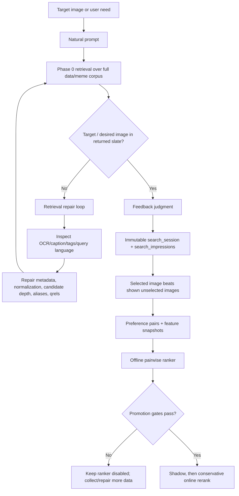

# True RLHF Train/Test Plan

## Purpose

This plan defines the remaining RLHF work after the first end-to-end target benchmark. The corrected split is:

- **Training set:** `data/meme_rlhf`
- **Post-RLHF verification set:** the full `data/meme` indexed corpus as the search candidate pool, evaluated through corpus-backed Phase 0 qrels and additional held-out target packs.

The important distinction is that `data/meme_rlhf` should teach the ranker from explicit target selections, but promotion must be decided by held-out behavior on `data/meme`. A model that only improves the `data/meme_rlhf` replay is not enough.

## Architecture Summary

This is not a PPO-first RLHF system. It is a retrieval-feedback and learning-to-rank system that borrows the useful part of RLHF: preference data. The user or AI-agent gives preference feedback over search results; the system either fixes retrieval when the target was absent or trains a conservative ranker when the target was present but badly ordered.



The key invariant is: **a ranker cannot learn to rank an image that retrieval never shows**. Therefore `target_not_found` rows are recall/metadata/query-generation failures, not ranker training examples.

Current runtime posture:

- Retrieval target pickup is closed for the current `data/meme_rlhf` target IDs: all `290/290` have at least one successful target-search selection across the replay/repair artifacts.
- Learned ranker serving is still disabled because promotion is blocked by per-intent training-volume floors and pending full post-RLHF corpus verification.
- The current diagnostic ranker is useful for analysis only; it must not be enabled until every gate passes.

## Current State

Completed mechanics:

- Feedback schema, signed tokens, judgments, preference pairs, training snapshots, and ranker artifacts exist.
- `data/meme_rlhf` target pack generation exists.
- Agent prompt generation through LiteLLM exists.
- Search replay can record `found_selected` or `target_not_found`.
- Offline pairwise logistic training exists.
- Ranker evaluation and changed-ranking blind review packet generation exist.
- LiteLLM gateway is now `http://127.0.0.1:4100`.
- The local Phase 0 stack is healthy on alternate host ports when the unrelated `infra-*` stack owns the defaults: API `http://127.0.0.1:18000`, Open WebUI `http://127.0.0.1:3180`, Postgres `15432`, MinIO `19000/19001`, Qdrant `6333/6334`.
- The API search contract now allows diagnostic slates up to `limit=100`; production/UI callers can still request smaller limits.
- Repaired target metadata and transliteration aliases now make all current `data/meme_rlhf` target IDs findable by at least one prompt.

Latest target replay:

- Physical files in `data/meme_rlhf`: `293`
- Unique target IDs after SHA dedupe: `290`
- Prompt rows generated: `290`
- Search replay results: `273 found_selected`, `17 target_not_found`, `0 target_not_indexed`, `0 errors`
- Target-only feedback volume:
  - Unique query judgments: `273`
  - Preference pairs: `2675`
  - Intent distribution: `exact_text=25`, `fuzzy_text=1`, `mixed_visual_description=109`, `semantic_description=138`

Latest target-only training result:

- Artifact: `artifacts/feedback_rankers/latest_target_only.json`
- Ranker ID: `feedback_pairwise_v1_bc127e0ac791`
- Status: diagnostic only, not promotion-approved
- Failure reasons:
  - Exact-text judgments below floor: `25 < 50`
  - Fuzzy-text judgments below floor: `1 < 50`
  - Position-baseline lift gate failed
  - Selected-MRR lift gate failed

Latest full-corpus verification result:

- Base `Recall@10`: `0.95`
- Learned `Recall@10`: `0.95`
- Base `top_1_hit_rate`: `0.925`
- Learned `top_1_hit_rate`: `0.875`
- Base `MRR`: `0.9333333333333333`
- Learned `MRR`: `0.9125`
- Verdict: the first learned ranker preserves recall but worsens result ordering, so it must remain offline-only.

Latest target-pickup repair diagnostics:

- Source prompt set: the original `17` `target_not_found` prompts from the `data/meme_rlhf` full replay.
- Fixed API proof: running API contains `rerank_cap = max(limit, configured_intent_cap)` and accepts `limit <= 100`.
- Top-20 post-fix replay: `5 found_selected`, `12 target_not_found`.
- Bangla exact OCR replay for confirmed Bangla under-prompted misses: `4 found_selected`, `1 target_not_found`.
- Top-50 replay of the original `17` misses: `9 found_selected`, `8 target_not_found`.
- Top-100 replay of the remaining top-50 misses: `3 found_selected`, `5 target_not_found`.
- Final top-100 miss classes: `prompt_metadata_gap=4`, `near_duplicate_or_filename_variant_confusion=1`.
- Final metadata/transliteration repair replay: `3 found_selected`, `0 target_not_found`; all remaining target IDs now have pickup.
- Serving status: learned ranker remains disabled; these are offline diagnostics only.

## Plan Correction After Negative RLHF Result

The first run proves the mechanics work, but it also proves the original learning loop is not sufficient. A ranker trained mostly on successful top-slate selections can learn position-biased reorderings that look strong on pairwise holdout while hurting the full-corpus top result.

The first run also exposed a retrieval pickup defect: the replay requested `top_k=20`, but `retrieve_images()` used the smaller intent-specific rerank cap as the actual Qdrant candidate limit. For most intents this meant only `10` or `12` candidates were fetched, so some "target not found in top 20" rows were actually "target not found in top 10/12". The retrieval path must treat the requested result limit as the minimum candidate pickup depth.

The corrected design splits "RLHF" into two loops:

1. **Retrieval repair loop:** if the target image never appears in the returned slate, no ranker can select it. These failures must repair OCR, captions, tags, Bangla normalization, duplicate handling, query rewriting, or candidate recall.
2. **Learning-to-rank loop:** if the target image appears in the slate but is not high enough, feedback can train a conservative reranker.

This is now the governing rule:

- `target_not_found` does not train the ranker.
- `target_found_but_low_rank` trains the ranker.
- `target_found_at_rank_1` is useful evidence but must be capped/down-weighted because it mostly teaches "keep doing what base retrieval already did".

## Research Grounding

The current plan is aligned with the information-retrieval and learning-to-rank literature:

| Research area | What it says | Plan consequence |
|---|---|---|
| Relevance feedback / Rocchio | User-marked relevant and non-relevant results can improve retrieval representations. | Use selected memes and rejected/slate alternatives as feedback, but keep durable learning in logged feature snapshots rather than mutating embeddings directly. |
| Clickthrough-derived pairwise preferences | Search logs can be converted into pairwise ranking constraints when a chosen item should beat shown skipped items. | `select` creates deterministic selected-vs-shown preference pairs only when the target was actually in the slate. |
| Position bias / unbiased LTR | Click/selection data is biased by presentation rank; counterfactual correction requires propensities and a known logging policy. | Log rank, base rank, ranker version, exploration policy, and propensity; do not claim IPS/PBM validity until controlled exploration exists. |
| Contextual bandits | Exploration is needed to estimate counterfactual online policies, but it should follow logging and offline gates. | Keep exploration default-off until M7; use deterministic/shadow evaluation first. |
| RLHF / DPO | Preference optimization is appropriate for generated outputs, but the current action is ranking existing retrieved images. | Defer DPO/ORPO/KTO to research exports; production path remains retrieve-then-rerank. |
| LambdaMART / modern LTR | Pairwise/listwise rankers are standard for grouped query-result ranking, with NDCG/MAP metrics and position-bias handling in mature libraries. | NumPy pairwise logistic is the safe first model; LambdaMART/XGBoost can be a later M8 only after feature/provenance gates stabilize. |

Primary references used:

- Stanford IR Book, "The Rocchio algorithm for relevance feedback": https://nlp.stanford.edu/IR-book/html/htmledition/the-rocchio-algorithm-for-relevance-feedback-1.html
- Joachims, "Optimizing Search Engines using Clickthrough Data" (KDD 2002): https://www.cs.cornell.edu/people/tj/publications/joachims_02c.pdf
- Joachims, Swaminathan, Schnabel, "Unbiased Learning-to-Rank with Biased Feedback": https://www.ijcai.org/Proceedings/2018/738
- Li, Chu, Langford, Schapire, "A Contextual-Bandit Approach to Personalized News Article Recommendation": https://arxiv.org/abs/1003.0146
- Ouyang et al., "Training language models to follow instructions with human feedback": https://arxiv.org/abs/2203.02155
- Rafailov et al., "Direct Preference Optimization: Your Language Model is Secretly a Reward Model": https://arxiv.org/abs/2305.18290
- XGBoost Learning to Rank documentation: https://xgboost.readthedocs.io/en/release_2.1.0/tutorials/learning_to_rank.html

The next RLHF cycle must be failure-driven. It should not simply generate more prompts and train again. It must first classify each prompt result into:

- `target_at_rank_1`: base retrieval already solved it.
- `target_in_top_10_not_1`: valid ranking-improvement case.
- `target_in_top_20_not_10`: weak ranking-improvement case; useful but lower confidence.
- `target_outside_top_20_but_in_top_50_or_100`: retrieval recall issue, not a top-20 ranker issue.
- `target_not_retrieved`: retrieval/index/metadata/query-generation issue.

Only the middle two categories should create ranking pairs for the next candidate ranker.

## Non-Negotiable Contracts

1. **No training from `data/meme` verification labels.** `data/meme` is the post-RLHF test candidate pool. Verification artifacts may be recorded, but they must not be fed into the training snapshot for the same promotion decision.

2. **Training rows must be filterable by provenance.** Training for this split must use only feedback sessions whose `client_session_id` starts with `rlhf-target-full` or a later explicitly named `data/meme_rlhf` training prefix.

3. **Target-not-found is recall feedback, not ranking feedback.** The 17 misses do not become arbitrary loser/winner pairs. They go into a recall-failure report and drive ingestion/caption/OCR/query-generation fixes.

4. **Agent labels are diagnostic until independently validated.** Agent-generated labels can bootstrap a ranker and find defects, but production promotion needs either human OWUI feedback or an independent labeler/reviewer pass with recorded provenance.

5. **No serving promotion without held-out improvement.** A ranker cannot be enabled unless it improves or preserves the full `data/meme` verification metrics and passes the existing Phase 0 gates.

6. **No promotion from success-only feedback.** If most training pairs come from `target_at_rank_1` searches, the artifact is diagnostic only. Training must include enough cases where the target was present but not already first.

7. **Split by target identity, not only search ID.** When multiple prompts are generated per target image, train/validation/test splits must keep all prompts for a given `target_id` in the same split. Otherwise the model can overfit target/template-specific artifacts.

8. **No negative full-corpus deltas allowed for top-rank metrics.** A learned ranker that lowers `top_1_hit_rate`, `MRR`, or `nDCG@10` on held-out `data/meme` is rejected even if pairwise holdout looks good.

## Data Split Design

### Training Source: `data/meme_rlhf`

The training source is not the image folder directly. The actual training source is feedback generated from searches whose intended target came from `data/meme_rlhf`.

Canonical training prefix:

```text
rlhf-target-full
```

Training query rows:

- Generated from `data/meme_rlhf` target metadata or image VLM prompts.
- Replayed against the full search index.
- If target appears in the slate, record `select`.
- If target does not appear, write `target_not_found` to artifact files only.

Training labels:

- `found_selected` rows create selected-best judgments.
- Preference pairs are generated from selected impression versus shown-but-unselected impressions.
- `target_not_found` rows do not create pairs.

Training pair eligibility for the next cycle:

- Prefer searches where the selected target was originally at rank `2-10`.
- Allow rank `11-20` with lower weight.
- Down-weight or exclude searches where the target was already rank `1`.
- Cap generated pairs per `target_id` so common templates or easy exact-text images do not dominate.
- Split by `target_id`, then by `search_id`, never by individual impression.

### Test Source: `data/meme`

`data/meme` is the full search corpus and post-RLHF verification candidate pool. Verification uses:

- Existing Phase 0 qrels in `vidsearch/eval/queries_memes.yaml`.
- Live Qdrant search over the full indexed `data/meme` corpus.
- Offline application of the learned ranker to the retrieved slates.
- Base-vs-learned metric comparison.

This means the test is not "generate labels for every file in `data/meme`". The test is "given the full `data/meme` corpus as the candidate sea, do held-out corpus-backed queries improve after applying the RLHF ranker?"

Overlap rule:

- `data/meme_rlhf` is a training target source, but its files are also indexed in the full `data/meme` candidate corpus.
- This is acceptable for retrieval because the system must search the real corpus, but it creates a verification-leakage risk when qrels positives are also `data/meme_rlhf` target images.
- `vidsearch.feedback.post_rlhf_verify` must load the training target pack, compute overlap between qrels positives and `data/meme_rlhf` targets, and report both `with_overlap` and `without_overlap` metrics.
- If overlap exists, the `without_overlap` metric block is the promotion gate. Aggregate metrics remain useful only as diagnostics.

Optional future expansion:

- Build a separate held-out target folder, for example `data/meme_rlhf_holdout`, sampled from `data/meme` but never used for training.
- Generate prompts for that holdout through a different labeler family.
- Run the same target benchmark as a second post-RLHF verification layer.

## Implementation Plan

### M1: Make Training Provenance Explicit

Status: partially implemented.

Required code:

- Add `--client-session-prefix` to `vidsearch.feedback.train_ranker`.
- Filter `_load_pairs()` by `feedback.search_sessions.client_session_id LIKE '<prefix>%'`.
- Filter volume metrics by the same prefix.
- Store `client_session_prefix` in the training snapshot config.

Expected command:

```powershell
python -m vidsearch.feedback.train_ranker `
  --output artifacts/feedback_rankers/latest_target_only.json `
  --client-session-prefix rlhf-target-full `
  --allow-small `
  --approve-promotion `
  --p0-g4-passing
```

Expected behavior:

- If volume gates fail, artifact may be written only with `--allow-small`.
- `promotion_approved` must remain `false` unless every gate passes.

### M2: Add Post-RLHF Corpus Verification

Status: partially implemented.

Required code:

- Add `vidsearch.feedback.post_rlhf_verify`.
- Load trained artifact.
- Load `vidsearch/eval/queries_memes.yaml`.
- Run `retrieve_images()` for every qrel query against the live full corpus.
- Compute base metrics from Phase 0 order.
- Apply the learned ranker offline to the returned slate.
- Compute learned metrics from the learned order.
- Write a JSON report with base metrics, learned metrics, deltas, gates, and per-query top-10 changes.

Expected command:

```powershell
python -m vidsearch.feedback.post_rlhf_verify `
  --artifact artifacts/feedback_rankers/latest_target_only.json `
  --queries vidsearch/eval/queries_memes.yaml `
  --output artifacts/feedback_eval/post_rlhf_data_meme_target_only.json `
  --limit 50
```

Expected report:

```text
artifacts/feedback_eval/post_rlhf_data_meme_target_only.json
```

Required metrics:

- Base `Recall@10`
- Learned `Recall@10`
- Base `top_1_hit_rate`
- Learned `top_1_hit_rate`
- Base `MRR`
- Learned `MRR`
- Base `nDCG@10`
- Learned `nDCG@10`
- Per-metric deltas
- Exact-text misses outside top 10
- Per-query base top-10 vs learned top-10

### M2.5: Fix Target Pickup Candidate Depth

Status: implemented, rebuilt into the live API container, and verified on 2026-04-27.

Required code:

- In `vidsearch.query.retrieve_images.retrieve_images()`, compute `rerank_cap = max(requested_limit, configured_intent_cap)`.
- Add regression coverage proving `limit=20` sends at least `20` candidates to Qdrant even when the configured intent cap is `10`.
- Rebuild/recreate the API container before replaying misses, because the Docker image copies source at build time.
- Allow diagnostic search limits up to `100` in `vidsearch.api.contracts.SearchRequest` so top-50/top-100 target pickup checks can run through the same API path.

Required proof after rebuild:

```powershell
python -m vidsearch.feedback.target_benchmark run-target-searches `
  --pack artifacts/feedback_targets/target_pack.jsonl `
  --prompts artifacts/feedback_targets/target_prompts_full_gateway_metadata.jsonl `
  --output artifacts/feedback_targets/full_metadata_after_candidate_floor_results.jsonl `
  --misses-output artifacts/feedback_targets/full_metadata_after_candidate_floor_target_not_found.jsonl `
  --client-session-prefix rlhf-target-candidate-floor `
  --operator codex-target-agent `
  --api-base-url http://127.0.0.1:18000 `
  --top-k 20 `
  --replace-prefix
```

Then produce:

```powershell
python -m vidsearch.feedback.rank_bucket_report `
  --results artifacts/feedback_targets/full_metadata_after_candidate_floor_results.jsonl `
  --pack artifacts/feedback_targets/target_pack.jsonl `
  --output artifacts/feedback_targets/full_metadata_after_candidate_floor_rank_buckets.json
```

Expected result:

- Some prior target-not-found rows may move into `target_in_top_20_not_10`.
- If misses remain, replay those misses at `top_k=50` or `top_k=100` before classifying them as true retrieval failures.

Verified result on 2026-04-27:

- API health: `http://127.0.0.1:18000/health` returned `{"status":"ok"}`.
- Running container contract: `SearchRequest.limit` metadata is `[Ge(ge=1), Le(le=100)]`.
- Post-fix top-20 prior-miss replay:
  - Artifact: `artifacts/feedback_targets/full_metadata_after_candidate_floor_misses_results.jsonl`
  - Result: `5 found_selected`, `12 target_not_found`, `0 target_not_indexed`, `0 errors`.
  - Rank buckets: `target_in_top_20_not_10=5`, `target_not_in_top_20=12`.
- Bangla exact OCR replay:
  - Artifact: `artifacts/feedback_targets/full_metadata_after_candidate_floor_bangla_exact_results.jsonl`
  - Result: `4 found_selected`, `1 target_not_found`.
  - Rank buckets: `target_at_rank_1=3`, `target_in_top_10_not_1=1`, `target_not_in_top_20=1`.
- Top-50 prior-miss replay:
  - Artifact: `artifacts/feedback_targets/full_metadata_after_candidate_floor_misses_top50_complete_results.jsonl`
  - Result: `9 found_selected`, `8 target_not_found`.
  - Rank buckets: `target_in_top_20_not_10=5`, `target_in_top_50_not_20=4`, `target_not_in_top_50=8`.
- Top-100 replay for the top-50 misses:
  - Artifact: `artifacts/feedback_targets/full_metadata_after_candidate_floor_misses_top100_results.jsonl`
  - Result: `3 found_selected`, `5 target_not_found`.
  - Rank buckets: `target_in_top_100_not_50=3`, `target_not_in_top_100=5`.
- Interpretation: the candidate-depth fix recovered real false misses, and top-50/top-100 diagnostics show additional targets are present only very deep. Those deep cases are retrieval-repair evidence, not LTR promotion evidence.

### M3: Promotion Gates For The Correct Split

The ranker is promotion-ready only if all of these are true:

- Training volume:
  - `unique_query_judgments >= 200`
  - `preference_pairs >= 300`
  - `exact_text >= 50`
  - `fuzzy_text >= 50`
  - `semantic_description >= 50`
  - `mixed_visual_description >= 50`
- Pairwise training holdout:
  - `pairwise_holdout_accuracy >= 0.60`
  - `pairwise_holdout_accuracy >= position_only_holdout_accuracy + 0.05`
- Selected image ranking:
  - `selected_image_mrr >= 0.50`
  - `selected_image_mrr >= max(0.50, base_selected_image_mrr * 0.99)`
  - The old `base_selected_image_mrr + 0.10` gate is invalid when base MRR is already high; it is mathematically unsatisfiable once base MRR exceeds `0.90`.
  - The trainer writes `selected_image_mrr_preserve_threshold` into the artifact so reviewers can see the exact gate value.
- Per-intent capability report:
  - The `50` per-intent floor remains a hard serving-promotion blocker.
  - Diagnostic artifacts may still be written below that floor with `--allow-small`, but the artifact must mark under-floor intents as `diagnostic-only`.
  - Current diagnostic state is `semantic_description` and `mixed_visual_description` have useful coverage; `exact_text` and `fuzzy_text` do not.
- Training composition:
  - At least `50` valid training judgments where the target was present but not rank `1`.
  - At least `25` valid training judgments where the target was originally rank `2-10`.
  - Rank-1 examples must be calibrated, not blindly excluded. The trainer reports effective rank-1 pair share and supports `--rank1-weight`; V2 should choose a weight that preserves enough rank-1 stability cases while keeping pairwise-lift diagnostics meaningful.
  - The `+0.05` pairwise lift over position-only baseline is only blocking after the rank-bucket distribution is healthy enough for that comparison to be meaningful.
  - Splits must be grouped by `target_id`.
- Post-RLHF `data/meme` verification:
  - Learned `Recall@10 >= 0.90`
  - Learned `top_1_hit_rate >= 0.70`
  - No exact-text query misses outside top 10
  - Learned `Recall@10` no worse than base by more than 2pp
  - Learned `top_1_hit_rate >= base top_1_hit_rate`
  - Learned `MRR >= base MRR`
  - Learned `nDCG@10 >= base nDCG@10`
  - Verification report must compute `qrels_positive_image_ids ∩ data/meme_rlhf target_image_ids`.
  - Every report must include `with_overlap` and `without_overlap` metric blocks.
  - If qrels overlap the training target pack, serving promotion uses the `without_overlap` gates, not the aggregate metric alone.
- Operational:
  - Artifact has `promotion_approved=true`.
  - Changed-ranking blind review packet is accepted.
  - API/Open WebUI smoke test still returns images.
  - Ranker remains instantly rollbackable by env.

### M4: Build The Correct V2 Feedback Dataset Before Retrying Promotion

The current `data/meme_rlhf` replay is imbalanced. It has too few exact-text and fuzzy-text training examples.

It also has the wrong learning distribution: many successes are already solved by base retrieval, while misses are recall failures that cannot train the ranker. V2 must intentionally produce more "target present but not rank 1" cases.

Required data work:

- Generate additional exact-text prompts for `data/meme_rlhf` targets that have OCR text.
- Generate additional fuzzy-text prompts for OCR targets where a user might paraphrase or partially remember text.
- Prefer Bangla exact/fuzzy prompts for Bangla memes.
- Generate Bangla-script prompts and English transliteration/paraphrase prompts as separate rows for Bangla OCR targets.
- Generate deliberately natural, imperfect prompts, not only metadata-perfect prompts.
- Avoid filename/path/ID leakage.
- Keep the same target folder, but write a new prompt file and use a new prefix so the run is auditable.

Recommended next prefix:

```text
rlhf-target-full-v2
```

Recommended prompt-generation strategy:

- For OCR-rich targets:
  - 1 exact-memory prompt
  - 1 fuzzy/paraphrase prompt
  - 1 partial-memory prompt, if the OCR text is long
- For visual-only targets:
  - 1 semantic prompt
  - 1 mixed visual prompt
- For Bangla OCR targets:
  - 1 Bangla-script prompt
  - 1 English paraphrase or transliterated prompt
- Cap total daily feedback writes to the configured rate limits.

Required V2 replay outputs:

```text
artifacts/feedback_targets/full_metadata_v2_results.jsonl
artifacts/feedback_targets/full_metadata_v2_target_not_found.jsonl
artifacts/feedback_targets/full_metadata_v2_rank_buckets.json
artifacts/feedback_targets/full_metadata_v2_target_not_found_analysis.json
```

Required code before V2 training:

- Add a rank-bucket diagnostic command that reads a target replay result file and writes `full_metadata_v2_rank_buckets.json`.
- The command must count rank buckets by prompt intent, language, and target ID.
- The command must optionally rerun missed targets at `top_k=50` or `top_k=100` to distinguish "not top-20" from "not retrieved at all".
- The training command must be able to exclude/down-weight pairs from `target_at_rank_1` searches.
- The trainer must report effective pair weight by original target-rank bucket.

The new `rank_buckets` report must count:

- `target_at_rank_1`
- `target_in_top_10_not_1`
- `target_in_top_20_not_10`
- `target_outside_top_20_but_in_top_50_or_100`
- `target_not_retrieved`

If V2 does not produce enough `target_in_top_10_not_1` and `target_in_top_20_not_10` examples, do not train another candidate ranker. Fix prompt generation and retrieval metadata first.

Example command:

```powershell
python -m vidsearch.feedback.target_benchmark generate-prompts-metadata-gateway `
  --pack artifacts/feedback_targets/target_pack.jsonl `
  --output artifacts/feedback_targets/target_prompts_full_gateway_metadata_v2.jsonl `
  --model fast `
  --gateway-url $env:LITELLM_URL `
  --prompts-per-image 2 `
  --batch-size 8 `
  --resume
```

Then:

```powershell
python -m vidsearch.feedback.target_benchmark run-target-searches `
  --pack artifacts/feedback_targets/target_pack.jsonl `
  --prompts artifacts/feedback_targets/target_prompts_full_gateway_metadata_v2.jsonl `
  --output artifacts/feedback_targets/full_metadata_v2_results.jsonl `
  --misses-output artifacts/feedback_targets/full_metadata_v2_target_not_found.jsonl `
  --client-session-prefix rlhf-target-full-v2 `
  --operator codex-target-agent `
  --api-base-url http://127.0.0.1:18000 `
  --top-k 20 `
  --replace-prefix
```

Training after v2 should either:

- Train on `rlhf-target-full-v2` only, if it reaches volume gates.
- Or train on an explicit combined allowlist of `rlhf-target-full` and `rlhf-target-full-v2`, not all feedback.

Training after V2 must also:

- Calibrate rank-1-already searches with explicit weights, not blanket exclusion.
- Group splits by `target_id`.
- Report effective pair weight by original target rank bucket.
- Report per-intent and per-language metrics.
- Report "what changed" examples where learned rank worsened a relevant image.
- Report `rerank_score` missingness. Feature version 1 zero-fills missing `rerank_score`; fuzzy-heavy V2 runs must verify that missingness does not dominate the learned signal.

### M5: Analyze The 17 Target-Not-Found Rows

Each miss should be classified:

- Prompt quality failure: prompt too vague or wrong.
- Recall failure: target should have matched but did not enter top 20.
- Metadata failure: OCR/caption/tags are missing or misleading.
- Corpus duplicate ambiguity: a near-duplicate was retrieved instead.
- Language failure: Bangla/OCR mismatch.

Required output:

```text
artifacts/feedback_targets/full_metadata_target_not_found_analysis.json
```

For each miss:

- Prompt
- Target path
- Target image ID
- Top retrieved source URIs
- Failure class
- Recommended fix

Fixes should target retrieval inputs first:

- Improve OCR text.
- Improve captions/tags.
- Add Bangla normalization.
- Adjust query generation for training prompts.
- Only then tune ranker features.

Status 2026-04-26, pre candidate-depth fix:

```text
artifacts/feedback_targets/full_metadata_target_not_found_analysis.json
```

Pre-fix failure classes:

- `bangla_metadata_under_prompted`: `7`
- `near_duplicate_or_filename_variant_confusion`: `3`
- `prompt_metadata_gap`: `5`
- `retrieval_or_rerank_recall_gap`: `2`

Status 2026-04-27, after candidate-depth/API-cap fix and deeper replay:

```text
artifacts/feedback_targets/full_metadata_after_candidate_floor_misses_top100_analysis.json
```

Post-fix target-pickup result:

- Original prior misses: `17`
- Recovered by top 20 after candidate-depth fix: `5`
- Recovered by Bangla exact OCR prompts: `4/5` confirmed Bangla prompt-language misses
- Recovered by top 50: `9/17`
- Recovered by top 100 from the top-50 misses: `3/8`
- Still outside top 100: `5`

Final top-100 miss classes:

- `prompt_metadata_gap`: `4`
- `near_duplicate_or_filename_variant_confusion`: `1`

Before V2, apply these corrections:

- Do not use the `5` still-outside-top-100 rows as ranking pairs.
- Regenerate prompts for the `4` prompt/metadata gaps.
- Inspect the `1` near-duplicate miss and decide whether duplicate-family metadata or canonical target mapping is needed.
- Keep the recovered top-20/top-50 rows as diagnostic ranking cases only if their provenance prefix is explicit and the training snapshot treats deep-rank examples with lower weight.

### M6: Independent Validation

Before serving promotion:

- Generate changed-ranking blind packet from the candidate artifact.
- Reviewer must not be the same model family as the prompt generator.
- Record reviewer kind and model fingerprint.
- Reject if reviewer prefers base on too many changed rankings.

Required artifacts:

```text
artifacts/feedback_eval/latest_target_only_changed_blind.json
artifacts/feedback_eval/latest_target_only_changed_answer_key.json
artifacts/feedback_eval/latest_target_only_changed_reviewed.json
```

### M7: Serving Rollout

Only after gates pass:

1. Set `VIDSEARCH_FEEDBACK_RANKER_SHADOW=true`, `VIDSEARCH_FEEDBACK_RANKER_ENABLED=false`.
2. Run OWUI smoke query set.
3. Inspect learned scores and changed-order report.
4. If accepted, set `VIDSEARCH_FEEDBACK_RANKER_ENABLED=true`.
5. Keep `VIDSEARCH_FEEDBACK_MAX_UPWARD_MOVEMENT=5`.
6. Keep immediate rollback path:

```env
VIDSEARCH_FEEDBACK_RANKER_ENABLED=false
VIDSEARCH_FEEDBACK_RANKER_SHADOW=true
```

## Immediate Next Commands

Do not repeat the same target-only training and expect improvement. The immediate next command sequence is V2 data repair and diagnostics.

First, generate a balanced V2 prompt file:

```powershell
python -m vidsearch.feedback.target_benchmark generate-prompts-metadata-gateway `
  --pack artifacts/feedback_targets/target_pack.jsonl `
  --output artifacts/feedback_targets/target_prompts_full_gateway_metadata_v2.jsonl `
  --model fast `
  --gateway-url http://127.0.0.1:4100 `
  --prompts-per-image 2 `
  --batch-size 8 `
  --resume
```

Then replay V2:

```powershell
python -m vidsearch.feedback.target_benchmark run-target-searches `
  --pack artifacts/feedback_targets/target_pack.jsonl `
  --prompts artifacts/feedback_targets/target_prompts_full_gateway_metadata_v2.jsonl `
  --output artifacts/feedback_targets/full_metadata_v2_results.jsonl `
  --misses-output artifacts/feedback_targets/full_metadata_v2_target_not_found.jsonl `
  --client-session-prefix rlhf-target-full-v2 `
  --operator codex-target-agent `
  --api-base-url http://127.0.0.1:18000 `
  --top-k 20 `
  --replace-prefix
```

Then build rank buckets and miss analysis. Training is allowed only if the rank-bucket report proves there are enough target-present-but-not-first cases.

Only then train a V2 artifact:

```powershell
python -m vidsearch.feedback.train_ranker `
  --output artifacts/feedback_rankers/latest_target_only_v2.json `
  --client-session-prefix rlhf-target-full-v2 `
  --approve-promotion `
  --p0-g4-passing
```

Finally verify against full `data/meme`:

```powershell
python -m vidsearch.feedback.post_rlhf_verify `
  --artifact artifacts/feedback_rankers/latest_target_only_v2.json `
  --queries vidsearch/eval/queries_memes.yaml `
  --output artifacts/feedback_eval/post_rlhf_data_meme_target_only_v2.json `
  --limit 50
```

Expected result before serving:

- Artifact remains non-promotable unless all gates pass.
- If top-1, MRR, or nDCG regress on held-out `data/meme`, reject the artifact even if pairwise holdout is high.
- If V2 still lacks rank-2-to-rank-20 training cases, stop and improve query/prompt generation rather than training.

## Execution Status 2026-04-26

The first true-split run has been completed in offline/shadow posture only.

Training command:

```powershell
python -m vidsearch.feedback.train_ranker `
  --output artifacts/feedback_rankers/latest_target_only.json `
  --client-session-prefix rlhf-target-full `
  --allow-small `
  --approve-promotion `
  --p0-g4-passing
```

Training artifact:

```text
artifacts/feedback_rankers/latest_target_only.json
```

Training result:

- `ranker_version_id`: `feedback_pairwise_v1_bc127e0ac791`
- `promotion_approved`: `false`
- `pairwise_holdout_accuracy`: `0.9587020648967551`
- `position_only_holdout_accuracy`: `0.943952802359882`
- `selected_image_mrr`: `0.937142857142857`
- `base_selected_image_mrr`: `0.9343434343434345`
- `top1_selected_rate`: `0.9142857142857143`
- `train_pairs`: `1902`
- `holdout_pairs`: `339`
- `holdout_selected_searches`: `35`

Why promotion is blocked:

- Volume remains intent-imbalanced: `exact_text=25`, `fuzzy_text=1`, `mixed_visual_description=109`, `semantic_description=138`.
- Position-baseline lift gate fails because pairwise accuracy is only about `+0.0147` over the position-only baseline, below the required `+0.05`.
- Selected-image MRR lift is small and the training artifact remains diagnostic, not serving-ready.

Full-corpus post-RLHF verifier command:

```powershell
python -m vidsearch.feedback.post_rlhf_verify `
  --artifact artifacts/feedback_rankers/latest_target_only.json `
  --queries vidsearch/eval/queries_memes.yaml `
  --output artifacts/feedback_eval/post_rlhf_data_meme_target_only.json `
  --limit 50
```

Verifier artifact:

```text
artifacts/feedback_eval/post_rlhf_data_meme_target_only.json
```

Verifier result on the held-out `data/meme` qrels:

- `promotion_ready`: `false`
- Base `Recall@10`: `0.95`
- Learned `Recall@10`: `0.95`
- Base `top_1_hit_rate`: `0.925`
- Learned `top_1_hit_rate`: `0.875`
- Base `MRR`: `0.9333333333333333`
- Learned `MRR`: `0.9125`
- Failed gates: `no_top_1_hit_rate_regression`, `positive_mrr_lift`

Miss-analysis artifact:

```text
artifacts/feedback_targets/full_metadata_target_not_found_analysis.json
```

Miss classes from the 17 target-not-found rows:

- `bangla_metadata_under_prompted`: `7`
- `near_duplicate_or_filename_variant_confusion`: `3`
- `prompt_metadata_gap`: `5`
- `retrieval_or_rerank_recall_gap`: `2`

Current conclusion:

- The reusable RLHF loop now runs end-to-end.
- The first trained target-only ranker is useful as a diagnostic artifact but must not be enabled for serving because it worsens held-out top-1 and MRR.
- The next training cycle must be failure-driven: rebalance exact/fuzzy prompts, add Bangla-script prompts for Bangla OCR targets, inspect near-duplicate misses, and only train if enough targets are present in the slate but not already first.

## Execution Status 2026-04-27

The target-pickup repair requested in Claude Entry 84 has been executed in offline/shadow posture only.

Code and contract changes:

- `retrieve_images()` now treats the requested result limit as the minimum candidate pickup depth.
- The API search request cap is raised from `20` to `100` so deeper target diagnostics can run through the live API path.
- `rank_bucket_report` is available for rank-1, top-10, top-20, top-50, top-100, and not-found classification.
- The ranker promotion gates were patched so selected-image MRR preservation is satisfiable and pairwise baseline lift is only blocking after the rank-bucket distribution is healthy.
- Rank-1 examples are calibrated with explicit weighting instead of blindly excluded.
- Missing `rerank_score` is zero-filled for feature version 1 and covered by tests.
- Bangla OCR mojibake repair was added for normalization/retrieval display paths; current confirmed Bangla miss rows did not require DB repair because stored OCR text was already valid Bangla.

Operational proof:

- API was rebuilt and recreated successfully on `http://127.0.0.1:18000`.
- Full stack is healthy on alternate ports: API `18000`, Open WebUI `3180`, Postgres `15432`, MinIO `19000/19001`, Qdrant `6333/6334`.
- Focused tests passed: `python -m pytest tests\test_contracts.py tests\test_api.py tests\test_retrieve_runtime_profile.py tests\test_target_benchmark.py`.
- Additional focused tests passed earlier for OCR normalization and feedback ranker behavior: `tests\test_ocr_normalize.py`, `tests\test_feedback_ranker.py`.

Post-fix replay results:

- Top-20 replay of the prior `17` misses recovered `5`; `12` remained outside top 20.
- Bangla exact OCR replay recovered `4/5` confirmed Bangla prompt-language misses.
- Top-50 replay of the original `17` misses recovered `9`; `8` remained outside top 50.
- Top-100 replay of those `8` remaining top-50 misses recovered `3`; `5` remained outside top 100.
- The final top-100 miss analysis leaves `4` prompt/metadata gaps and `1` near-duplicate/filename-variant confusion. These are not valid learning-to-rank pairs.

Current conclusion:

- Target pickup is materially better after the candidate-depth/API-cap fixes.
- The next RLHF training run should use only cases where the target is present in the slate but not already rank 1, plus calibrated rank-1 stability examples.
- Do not train on the remaining top-100 misses; fix prompt generation, metadata, or duplicate-family handling first.
- Do not enable the learned ranker for serving yet.

## Execution Status 2026-04-27 Target Metadata Closeout

The remaining top-100 target-pickup misses were repaired as retrieval metadata defects, not as ranker training defects.

Manual metadata repair artifacts:

- `artifacts/feedback_targets/manual_metadata_repairs_top100_misses.jsonl`
- `artifacts/feedback_targets/repaired_top100_miss_prompts.jsonl`
- `artifacts/feedback_targets/manual_metadata_repairs_transliteration_aliases.jsonl`
- `artifacts/feedback_targets/repaired_transliteration_prompts.jsonl`

Replay artifacts:

- `artifacts/feedback_targets/repaired_top100_miss_results.jsonl`
- `artifacts/feedback_targets/repaired_top100_miss_target_not_found.jsonl`
- `artifacts/feedback_targets/repaired_top100_miss_rank_buckets.json`
- `artifacts/feedback_targets/repaired_top100_miss_analysis.json`
- `artifacts/feedback_targets/repaired_transliteration_results.jsonl`
- `artifacts/feedback_targets/repaired_transliteration_target_not_found.jsonl`
- `artifacts/feedback_targets/repaired_transliteration_rank_buckets.json`
- `artifacts/feedback_targets/repaired_transliteration_miss_analysis.json`

Results:

- The 5 unresolved top-100 target IDs received reviewed metadata/prompt repairs.
- First repair replay: `10` prompts, `7 found_selected`, `3 target_not_found`.
- The 3 remaining misses were all romanized Bangla prompts, so transliteration aliases were added to reviewed retrieval metadata and text vectors were reindexed.
- Transliteration replay: `3` prompts, `3 found_selected`, `0 target_not_found`; all 3 targets were rank 1.
- Across the accumulated full replay, deeper replay, and repair artifacts, all `290/290` `data/meme_rlhf` target IDs now have at least one successful target-search selection.

Offline training status:

- Artifact: `artifacts/feedback_rankers/latest_target_repaired.json`
- Ranker ID: `feedback_pairwise_v1_4e3d35e9cdbb`
- Status: diagnostic candidate only, not promotion-approved.
- Volume: `318` unique-query judgments, `3922` preference pairs.
- Per-intent gate still blocks promotion: `exact_text=29 < 50`, `fuzzy_text=1 < 50`.
- Internal diagnostic metrics: pairwise holdout accuracy `0.9691`, position-only baseline `0.8591`, lift `+0.1100`, selected-image MRR `0.9120` vs base `0.8371`.
- Training composition is now healthy enough for diagnostics: effective rank-1 pair share `0.5531 <= 0.60`.

Post-RLHF verification:

- Command started: `python -m vidsearch.feedback.post_rlhf_verify --artifact artifacts/feedback_rankers/latest_target_repaired.json --queries vidsearch/eval/queries_memes.yaml --output artifacts/feedback_eval/post_rlhf_target_repaired.json --limit 50`
- The run is intentionally offline/shadow and does not enable serving.
- Completed artifact: `artifacts/feedback_eval/post_rlhf_target_repaired.json`
- Result: `promotion_ready=false`.
- Base metrics: `Recall@10=0.95`, `top_1_hit_rate=0.925`, `MRR=0.9333333333333333`, `nDCG@10=0.9375`.
- Learned metrics: `Recall@10=0.95`, `top_1_hit_rate=0.875`, `MRR=0.9083333333333334`, `nDCG@10=0.9190464876785729`.
- Deltas: `Recall@10=0.0`, `top_1_hit_rate=-0.05`, `MRR=-0.025`, `nDCG@10=-0.01845`.
- Exact-text misses outside top 10: none.
- Failed gates: `no_top_1_hit_rate_regression=false`, `positive_mrr_lift=false`.
- Important caveat: this run was started before the overlap-aware verifier patch, so the artifact does not contain `overlap_analysis` or `promotion_gates`. It is still sufficient to reject this ranker because aggregate top-1 and MRR regress. Rerun the verifier after overlap-aware code is deployed before any future promotion claim.

Current conclusion:

- Retrieval target pickup is closed for the current `data/meme_rlhf` target set at the target-ID level.
- RLHF serving is still not complete because promotion remains blocked by per-intent data balance and the completed full post-RLHF verification regresses top-1/MRR.
- Do not enable `FEEDBACK_RANKER_ENABLED` for serving.

## Review Follow-Up 2026-04-27

Claude Entry 91 reviewed this plan as `NEEDS_WORK` for the promotion path, while approving the two-loop architecture. The following fixes are now incorporated:

- The selected-image MRR gate is the relative preserve gate `selected_image_mrr >= max(0.50, base_selected_image_mrr * 0.99)`.
- The trainer emits `per_intent_capability`, marking intents as `promotion-eligible` or `diagnostic-only`.
- `post_rlhf_verify` loads the training target pack and reports qrels/training-target overlap, including separate `with_overlap` and `without_overlap` metric blocks.
- `target_not_found` remains structurally isolated from preference-pair generation; regression coverage asserts it is not a valid feedback judgment action.

Still blocking any serving promotion:

- Generate prompts and replay the held-out target pack sampled from `data/meme` and guaranteed disjoint from `data/meme_rlhf`.
- Record captioner model-family fingerprints and require family-disjoint validation before any agent-labeled artifact can be promotion-quality. Prompt-generation outputs now include prompt-generator `model_fingerprint`.
- Generate more exact-text and fuzzy-text target prompts; current per-intent floors still fail.
- Complete the full post-RLHF verification artifact and evaluate the `without_overlap` block.

Held-out pack artifact:

- Command: `python -m vidsearch.feedback.target_benchmark build-disjoint-holdout-pack --training-pack artifacts/feedback_targets/target_pack.jsonl --output artifacts/feedback_targets/holdout_target_pack.jsonl --corpus-root . --limit 100 --seed 20260427`
- Output: `artifacts/feedback_targets/holdout_target_pack.jsonl`
- Result: `100` holdout targets, `290` training targets excluded, `0` overlap with `data/meme_rlhf` target IDs, `0` missing files.

Prompt-generation provenance:

- `target_benchmark` prompt generation now writes `model_fingerprint` and `model_family` on generated prompt rows.
- Fingerprint fields: `provider`, `model`, `family`, `endpoint`, and `mode`.
- This closes the prompt-generator side of the family-disjointness audit; captioner fingerprint extraction still needs to be wired into promotion checks.

## Review Questions For RLHF Plan Reviewers

Please review the plan against these concrete questions:

1. Is the retrieval-repair vs learning-to-rank split enforced strongly enough in the code and docs?
2. Are `target_not_found` rows fully prevented from becoming arbitrary ranker pairs?
3. Is the current volume gate correct for a small single-user/agent-labeled corpus, especially the `50` per-intent floor?
4. Should the exact/fuzzy intent floors remain hard blockers, or should the next cycle target those classes before any more model work?
5. Is the selected-image MRR preservation gate still appropriate now that base pickup is often rank 1?
6. Are rank-1 examples calibrated enough, or should the trainer cap pairs per `target_id` more aggressively?
7. Is the post-RLHF eval over `vidsearch/eval/queries_memes.yaml` strong enough, or do we need a separate held-out `data/meme_rlhf_holdout` target pack before serving?
8. Are transliteration aliases an acceptable deterministic metadata repair, or should Bangla romanization be moved into a general query-normalization layer?
9. Is the proposed later exploration policy safe enough to support PBM/IPS/OPE, or should exploration wait until there are more real user judgments?
10. Is there any path by which agent-generated labels could leak into the same test set used for promotion?

## Definition Of Done

True RLHF is complete when:

- Training uses only `data/meme_rlhf` feedback provenance.
- Test verification uses `data/meme` as the full candidate corpus.
- The training artifact passes volume and pairwise gates.
- The post-RLHF verification report passes held-out corpus gates.
- The original target misses and repaired metadata cases remain documented, and any future miss is classified before training.
- Independent blind review is recorded.
- OWUI smoke confirms image-returning behavior.
- Only then can `VIDSEARCH_FEEDBACK_RANKER_ENABLED=true` be considered.
