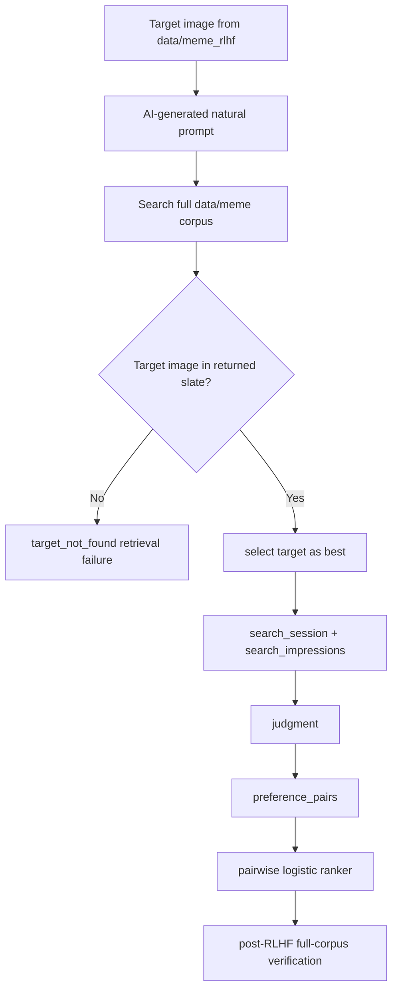

# R1 Failed RLHF Experiment: Preference Reranking Was Not Enough for Meme Retrieval Self-Improvement

**Date:** 2026-04-27  
**Repository:** `Abbiirr/meme-searcher`  
**Status:** Failed as a serving-ranker experiment; successful as a diagnostic experiment.  
**Serving decision:** the learned ranker remains offline-only and must not be enabled.

## 1. Executive Summary

This experiment attempted an RLHF-style feedback loop for local meme retrieval. The intended user-facing behavior was simple: a user or AI-agent searches for a meme, selects the best returned image when the target appears, and the system learns to serve similar images better in future searches.

The implemented loop was not PPO-first RLHF. It was **human/AI preference learning for retrieval**, implemented as learning-to-rank over retrieved meme slates. The action space was not free-form text generation; it was reordering existing image candidates returned by the Phase 0 retrieval pipeline.

The feedback infrastructure worked mechanically. The repository now contains schema and runtime support for search sessions, search impressions, judgments, preference pairs, training snapshots, and ranker artifacts. The Open WebUI/API path can expose feedback controls, record selections, and derive pairwise preferences from selected images versus shown-but-unselected images.

The ranker also trained successfully in the narrow mechanical sense. The target-image replay produced valid judgments and thousands of derived preference pairs, and the NumPy pairwise logistic trainer produced a ranker artifact with measurable offline diagnostics.

The experiment failed in the scientific and product sense. Full-corpus verification showed that the learned ranker preserved `Recall@10 = 0.95`, but degraded top ordering: `top_1_hit_rate` fell from `0.925` to `0.875`, and `MRR` fell from `0.9333333333` to `0.9125`. A ranker that preserves recall but worsens the first result is not serving-safe for meme search.

The failure exposed the key design correction: self-improvement must be split into a **retrieval repair loop** and a **learning-to-rank loop**. If the target image is absent from the candidate slate, the correct fix is retrieval, metadata, OCR, captioning, transliteration, aliasing, or candidate-depth repair. If the target image is present but ranked too low, then pairwise preference learning is appropriate.

This negative result is valuable because it defines the next RLAIF experiment. R2 should use AI feedback more carefully: balanced prompt generation, independent judging, rank-bucket gates, consensus labels, target-not-found isolation, and full-corpus held-out promotion checks.

## 2. Experiment Question

Can explicit target-image feedback from an AI/user improve the ranking quality of a local meme retrieval system without degrading the already-strong Phase 0 baseline?

Sub-questions:

- Q1. Can target-image searches produce useful preference pairs?
- Q2. Can a pairwise logistic ranker improve selected-image ranking?
- Q3. Does pairwise holdout success transfer to full-corpus search quality?
- Q4. Are failures mainly retrieval failures or ranking failures?

## 3. System Context

Phase 0 is a local-first meme search system over `data/meme`.

The canonical Phase 0 corpus contains **3,103 unique decodable/indexable images**. This supersedes the older non-recursive 293-file count. The corpus reconciliation recorded `core.images=3103`, `core.image_items=3103`, and Qdrant `memes.points_count=3103`.

Search stack:

- OCR, captions, tags, metadata, and source-path signals.
- BGE-M3 dense/sparse text retrieval.
- SigLIP visual retrieval.
- Qdrant hybrid retrieval.
- Jina reranker on selected slices.
- FastAPI service and Open WebUI integration.

Phase 0 baseline quality:

| Metric | Value |
| --- | ---: |
| `Recall@10` | `0.95` |
| `top_1_hit_rate` | `0.925` |
| `reranker_uplift_ndcg10` | `0.12302341547618086` |
| exact-text misses outside top 10 | `0` |

The Phase 0 baseline is strong enough that a learned ranker must beat a high bar. A model that only matches recall but worsens first-result quality should be rejected.

## 4. Feedback Loop Design



The intended design was correct in principle: retrieve candidates first, record immutable impressions, collect explicit selections, derive pairwise preferences, train offline, and promote only if full-corpus gates pass.

The first run exposed missing controls. The system needed a harder boundary between retrieval failures and ranking failures, stronger rank-bucket gating, better prompt balance across intent classes, and full-corpus top-rank verification as the primary promotion decision.

## 5. Dataset and Run Configuration

| Item | Value |
| --- | ---: |
| Training target folder | `data/meme_rlhf` |
| Physical files | `293` |
| Unique target IDs | `290` |
| Prompt rows generated | `290` |
| Candidate pool | full `data/meme` corpus |
| Search replay found-selected | `273` |
| Search replay target-not-found | `17` |
| target-not-indexed | `0` |
| errors | `0` |
| Unique query judgments | `273` |
| Preference pairs | `2675` |

Intent distribution:

| Intent | Judgments |
| --- | ---: |
| `exact_text` | `25` |
| `fuzzy_text` | `1` |
| `mixed_visual_description` | `109` |
| `semantic_description` | `138` |

This distribution is inadequate for serving promotion. Exact-text and fuzzy-text coverage are below the required floor of `50` judgments per intent, while semantic and mixed-visual prompts dominate the dataset.

## 6. Training Result

| Field | Value |
| --- | --- |
| Artifact | `artifacts/feedback_rankers/latest_target_only.json` |
| Ranker ID | `feedback_pairwise_v1_bc127e0ac791` |
| Model | NumPy pairwise logistic ranker |
| Status | diagnostic only |
| Promotion-approved | no |

Failure reasons:

```text
- exact_text judgments below floor: 25 < 50
- fuzzy_text judgments below floor: 1 < 50
- position-baseline lift gate failed
- selected-MRR lift gate failed
```

The ranker artifact is useful for analysis, but it is not a serving artifact.

## 7. Full-Corpus Verification Result

This is the decisive experiment result.

| Metric | Base | Learned | Delta | Verdict |
| --- | ---: | ---: | ---: | --- |
| `Recall@10` | `0.95` | `0.95` | `0.00` | preserved |
| `top_1_hit_rate` | `0.925` | `0.875` | `-0.05` | failed |
| `MRR` | `0.9333333333` | `0.9125` | `-0.0208333333` | failed |

Conclusion:

```text
The learned ranker did not reduce recall, but it worsened top-rank ordering. Therefore it is not serving-safe and must remain offline-only.
```

Some later diagnostic notes also record a stricter post-run artifact with learned `MRR=0.9083333333333334` and `nDCG@10=0.9190464876785729` versus base `nDCG@10=0.9375`. That run reaches the same decision: `promotion_ready=false` because top-1 and MRR regress.

## 8. Failure Analysis

### 8.1 Retrieval failures were treated too close to ranking failures

If the target image is absent from the candidate slate, a reranker cannot select it. Those examples must repair retrieval, metadata, OCR, captions, transliteration, aliases, or candidate depth.

The governing invariant is:

```text
A ranker cannot learn to rank an image that retrieval never shows.
```

### 8.2 Candidate-depth bug created false misses

The replay requested `top_k=20`, but `retrieve_images()` used smaller intent-specific rerank caps as the actual candidate limit. Some "target not found in top 20" cases were really "target not fetched beyond top 10/12".

The fix was:

```python
rerank_cap = max(requested_limit, configured_intent_cap)
```

The current implementation applies this rule as:

```python
rerank_cap = max(limit, _RERANK_TOP_K_BY_INTENT.get(intent, _DEFAULT_RERANK_TOP_K))
```

The API search contract also allows diagnostic slates up to `limit <= 100`, so deeper target pickup can be measured.

### 8.3 Training data was imbalanced

The target replay produced `273` valid unique-query judgments and `2675` preference pairs, but exact/fuzzy intents were underrepresented:

- `exact_text=25`
- `fuzzy_text=1`
- `mixed_visual_description=109`
- `semantic_description=138`

This imbalance matters because meme retrieval is often text-heavy. A model trained mostly on semantic and mixed-visual prompts cannot be expected to improve exact OCR and fuzzy text retrieval reliably.

### 8.4 Pairwise metrics did not transfer

The model could learn pairwise selected-vs-skipped preferences or position artifacts without improving full-corpus top-1 ranking. Pairwise training answers "does the selected image beat this shown alternative?" Full-corpus search asks "is the best image first among thousands of candidates?" These are related but not equivalent.

The experiment therefore rejects pairwise success as a sufficient promotion condition. Future promotion must prioritize full-corpus top-rank metrics, held-out target packs, and no-regression gates.

### 8.5 Success-only feedback was harmful

Many examples were already solved by the baseline. Training heavily on `target_at_rank_1` teaches the model to preserve baseline behavior, not fix failures. It can also amplify position bias because the selected item was frequently already first.

The corrected policy is to down-weight rank-1 examples and focus ranker training on cases where the target is present but not already first.

### 8.6 Agent labels are diagnostic

AI/agent labels are useful for bootstrapping and discovering system defects, but serving promotion requires real user feedback or independent AI/human validation with clear provenance.

AI-generated prompts and AI selections should be labeled by source model, prompt-generation method, target pack, and validation procedure. They should not be treated as unbiased human preference data.

## 9. Retrieval Repair Findings

| Replay / Repair Step | Result |
| --- | --- |
| Original misses | `17` |
| Top-20 after candidate-depth fix | `5 found_selected`, `12 target_not_found` |
| Bangla exact OCR replay | `4 found_selected`, `1 target_not_found` |
| Top-50 replay | `9 found_selected`, `8 target_not_found` |
| Top-100 replay of remaining top-50 misses | `3 found_selected`, `5 target_not_found` |
| Final metadata/transliteration repair | `3 found_selected`, `0 target_not_found` |
| Final target pickup | all `290/290` target IDs have at least one successful pickup |

The repair sequence shows that the first "RLHF failure" was partially a retrieval pipeline failure, not only a ranker failure.

The repairs also show that deeper candidate inspection and metadata/transliteration fixes can convert false misses into successful pickups. That supports the next design direction: improve candidate generation first, then train ranking only on cases where the target is actually present.

## 10. Corrected Design Rule

```text
Corrected invariant:
- target_not_found -> retrieval repair only
- target_found_but_low_rank -> ranker training
- target_at_rank_1 -> down-weighted stability evidence only
```

Only these categories should create strong ranking pairs:

```text
target_in_top_10_not_1
target_in_top_20_not_10
```

`target_not_found` rows must remain isolated from `preference_pairs`. They can drive OCR repair, metadata repair, query rewriting, transliteration aliases, candidate-depth fixes, and hybrid retrieval improvements, but they must not produce arbitrary winner/loser ranking pairs.

## 11. Threats to Validity

- AI-generated prompts may not represent real users.
- AI-agent labels are not equivalent to human labels.
- `data/meme_rlhf` may overlap with `data/meme` qrels or near-duplicate families.
- Near-duplicates may confuse target identity and make top-1 evaluation stricter than user-visible relevance.
- The pairwise logistic ranker may overfit position features.
- Feature version 1 zero-fills missing `rerank_score`, which can distort learned weights.
- Local artifact results are not committed because `artifacts/` is gitignored.
- The small exact/fuzzy sample makes per-intent claims weak.
- No unbiased counterfactual evaluation is claimed because randomized exploration was not active.
- Pairwise holdout accuracy is not a substitute for full-corpus held-out ranking quality.

## 12. Lessons for Paper

The negative result is scientifically useful. It shows that naive RLHF-style preference reranking is insufficient for multimodal retrieval when candidate generation is imperfect. Self-improvement must first classify failures into retrieval failures and ranking failures, then apply different learning or repair mechanisms to each.

Potential contribution wording:

```text
We report a negative result showing that preference-only reranking can degrade full-corpus ranking despite successful pairwise training. We then derive a corrected RLAIF protocol that separates retrieval repair from ranking repair and uses full-corpus held-out promotion gates.
```

Paper-facing interpretation:

- The logging/training loop was necessary but not sufficient.
- Full-corpus quality must be the serving gate, not pairwise training success.
- Candidate recall and target pickup are prerequisites for preference ranking.
- Agent-generated labels are useful for diagnostics but need independent validation before serving claims.
- Failure analysis should be structured by target rank bucket, not only by aggregate pairwise accuracy.

## 13. Bridge to RLAIF R2

R1 failed as a serving ranker but succeeded as a diagnostic experiment. R2 will use AI feedback more carefully:

- Independent prompt generator and judge models.
- Randomized candidate order for judge evaluation.
- Consensus labels across multiple judges or judge passes.
- Rank-bucket gating before ranker training.
- Balanced exact/fuzzy/semantic/mixed prompt generation.
- `target_not_found` excluded from ranker training.
- Full-corpus non-overlap promotion gates.
- Retrieval V2 candidate pickup improvements before learned reranking.
- Provenance fields for prompt model, judge model, model family, and target pack.
- No serving promotion unless top-1, MRR, nDCG, and Phase 0 absolute gates do not regress.

R2 should treat AI feedback as a structured diagnostic and validation process, not as a shortcut around retrieval evaluation. The next experiment should first improve candidate pickup through fielded retrieval, query rewriting/transliteration, deeper candidate fusion, and synthetic prompt indexing. Only after those gates pass should the LTR/RLAIF ranker be retrained.

## 14. Acceptance Checklist

- [x] `docs/experiments/R1_FAILED_RLHF_EXPERIMENT.md` exists.
- [x] It includes all key numeric results from `docs/RLHF_TRUE_TRAIN_TEST_PLAN.md`.
- [x] It clearly states that the ranker is offline-only and not promotion-approved.
- [x] It separates retrieval failures from ranking failures.
- [x] It documents the candidate-depth bug and fix.
- [x] It documents the data imbalance problem.
- [x] It includes full-corpus base vs learned verification metrics.
- [x] It explains why pairwise success did not transfer to top-rank quality.
- [x] It has a "Lessons for Paper" section.
- [x] It has a "Bridge to RLAIF R2" section.
- [x] It does not claim that RLHF worked.
- [x] It does not claim unbiased counterfactual evaluation.
- [x] It does not rely on raw artifacts being committed.

## 15. Source Notes

This report summarizes committed markdown/code plus local experiment artifacts. Raw `artifacts/` JSON/JSONL files are intentionally not committed.

Primary repo sources:

- `docs/RLHF_FEEDBACK_LOOP_PLAN.md`
- `docs/RLHF_TRUE_TRAIN_TEST_PLAN.md`
- `docs/decision_log.md`
- `docs/AGENT_PROMPT_LABELING_INSTRUCTIONS.md`
- `deep-research-report (14).md`
- `vidsearch/feedback/train_ranker.py`
- `vidsearch/feedback/post_rlhf_verify.py`
- `vidsearch/feedback/target_benchmark.py`
- `vidsearch/query/retrieve_images.py`
- `vidsearch/api/contracts.py`
- `vidsearch/api/main.py`
- `infra/postgres/003_feedback_loop.sql`
