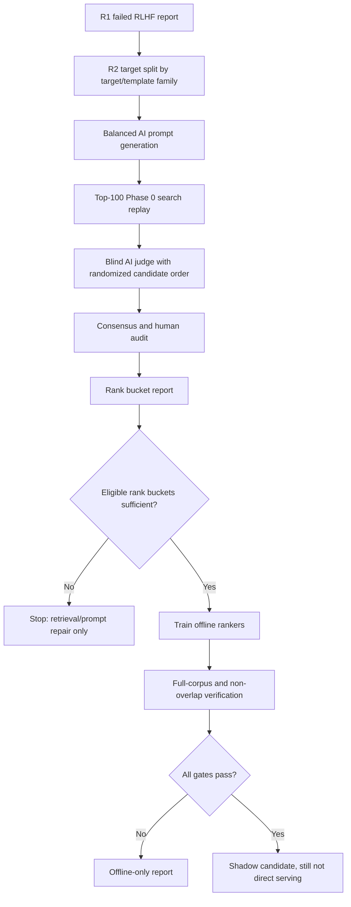
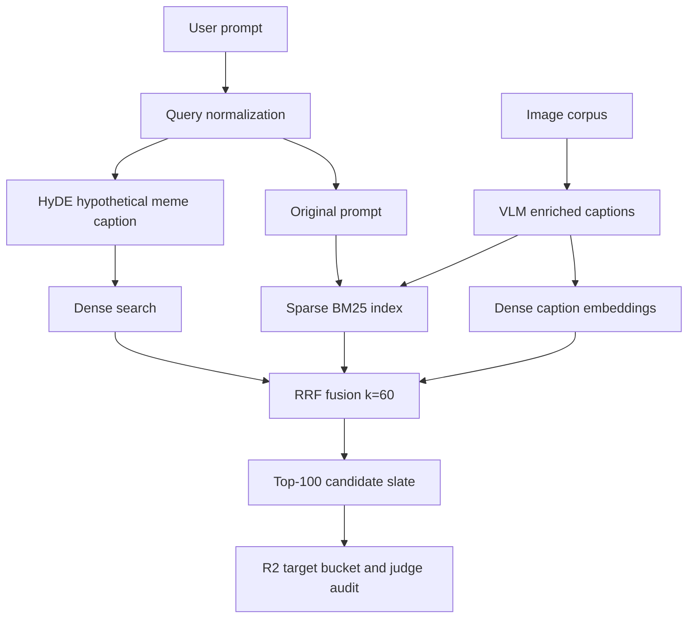

# R2 RLAIF-MemeRank Protocol

Experiment ID: `rlaif-memerank-r2`

R2 follows the R1 negative result documented in `docs/experiments/R1_FAILED_RLHF_EXPERIMENT.md`: preference reranking preserved recall but worsened top-rank ordering. R2 therefore uses RLAIF for supervision and diagnosis, while production serving remains retrieval plus conservative learning-to-rank only after full-corpus no-regression gates pass.

2026-04-29 revision: the current operational priority is retrieval-first self-learning, documented in `docs/RLAIF/SELF_LEARNING_CANONICAL_PLAN.md`. The LTR path in this protocol remains valid as background, but serving work should follow the canonical plan and first evaluate diagnostics, search latency, failure classification, HyDE query expansion, BM25/RRF, and VLM caption enrichment.

## Invariants

- `target_not_found` is retrieval repair data only and must never create preference pairs.
- `target_found_but_low_rank` is eligible learning-to-rank data after judge validation.
- `target_at_rank_1` is down-weighted stability evidence only.
- Splits are by target/template/near-duplicate/language group, never by prompt row.
- AI judges do not see original ranks, retrieval scores, rerank scores, learned scores, image IDs, or answer-leaking filenames.
- No learned ranker is enabled for serving unless full-corpus and non-overlap gates pass.
- No unbiased OPE, IPS, SNIPS, or doubly robust claims are made before controlled randomized exploration.
- Near-duplicate identity is not decided by AI-only consensus; it requires deterministic image ID, duplicate-cluster policy, or human review.
- Synthetic prompt floors are readiness diagnostics, not serving-promotion gates; held-out retrieval metrics decide.

## Workflow

## Retrieval-First Branches

These branches must be evaluated before treating another learned ranker as the main serving-improvement path.

## Canonical Prefixes

- `rlaif-r2-search`
- `rlaif-r2-train`
- `rlaif-r2-holdout`
- `rlaif-r2-judge-a`
- `rlaif-r2-judge-b`

## Promotion Gates

A ranker can only move beyond offline diagnostics if all of these pass:

- AI-human agreement `>= 0.85`.
- False-positive target-found rate `<= 0.03`.
- Position consistency across randomized judge order `>= 0.95`.
- Uncertain rate `<= 0.15`.
- `target_not_found` rows excluded from pairs.
- Rank-bucket floors met: `target_in_top_10_not_1 >= 50`, `target_in_top_20_not_10 >= 100`, exact/fuzzy eligible judgments `>= 50` each.
- Full-corpus non-overlap `top_1_hit_rate >= base`, `MRR >= base`, `nDCG@10 >= base`.
- `Recall@10` regression `<= 1pp`.
- Exact-text misses outside top 10 remain `0`.
- Latency p95 increase `< 50ms`.
- Blind changed-ranking review accepted.

If any gate fails, the ranker remains offline-only.
